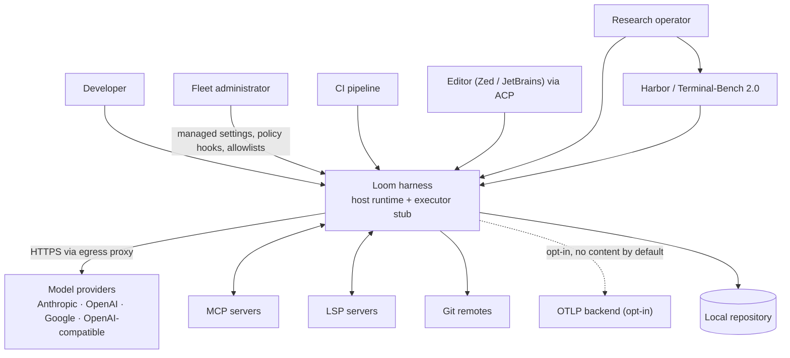
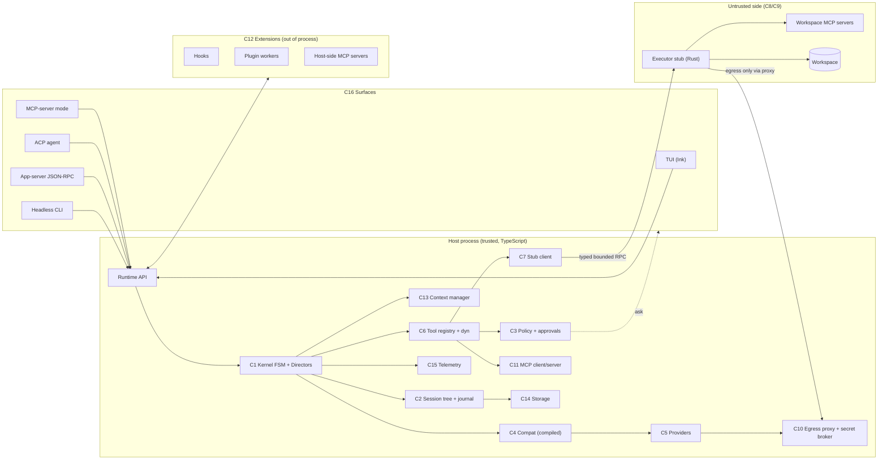
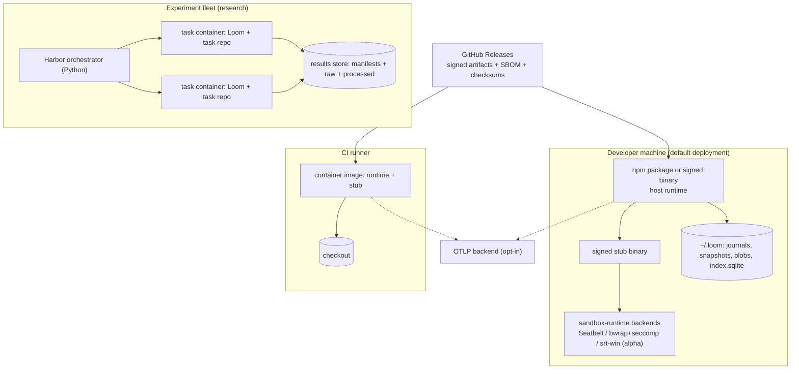
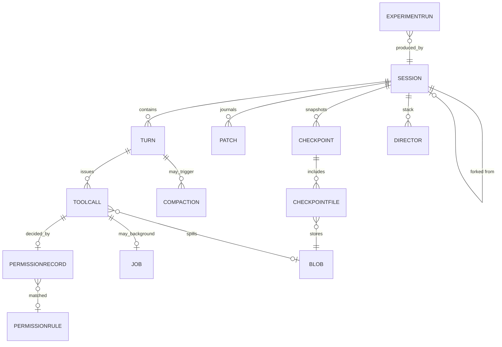

# Master Delivery Blueprint — Coding-Agent Harness ("Loom")

**Document type:** single-source implementation and research-validation blueprint
**Date:** 2026-09-05 · **Version:** 1.0 · **Status:** approved for execution
**Supersedes for planning purposes:** the architecture study, the evaluation memo, and the registry-verification addendum produced earlier in this project. Those remain the evidence base; this document is the execution contract.

**Evidence tags used throughout**
`[RB]` Research-backed (traceable to a cited finding in the prior study) · `[CR]` Confirmed Requirement · `[ED]` Existing Decision (already adjudicated) · `[ER]` Engineering Recommendation · `[AS]` Assumption · `[RG]` Research Gap · `[TG]` Technical Gap · `[DR]` Decision Required · **GAP** — requires decision/research · **Recommendation — requires validation**

Working name **Loom** is used for the product; substitute freely.

---

## 1. Executive Summary

### 1.1 The research problem

Six production coding-agent harnesses shipped or matured in 2025–2026 (Claude Code, Codex CLI, DeepSeek Harness, Qwen Code, GitHub Copilot cloud agent/CLI, OpenCode), each solving the same problems with materially different architectures, and each publishing only part of its reasoning. No public artifact answers, with citations and reproducible measurement, **which harness architecture decisions are load-bearing for safety, session integrity, cost and developer experience — and which are incidental**. Teams building agent harnesses therefore re-derive the same four or five hard decisions (trust boundary placement, session state authority, tool-surface size, edit format, context strategy) from blog posts and folklore.

### 1.2 Purpose of the software

Loom is a terminal-first coding-agent harness that (a) is production-usable on macOS, Linux and Windows, and (b) is **an instrument**: it is built so the five contested architecture decisions are configurable, measurable and A/B-testable inside the same binary, producing the evidence the study needs.

### 1.3 Proposed solution

A **TypeScript control plane** (session tree with an entity-patch journal, kernel FSM with a Director stack, capability-based policy engine, compiled model-compatibility layer, surfaces: Ink TUI, headless CLI, JSON-RPC app-server, ACP agent, MCP-server mode) paired with a **Rust executor stub** that is the only component on the untrusted side, sandboxed locally by `@anthropic-ai/sandbox-runtime` or placed unchanged in a container, gVisor pod, microVM or remote host. `[ED]`

### 1.4 Target users

| User | Need |
|---|---|
| Individual developer (primary) | A fast, safe terminal agent that edits real repositories without babysitting every command |
| Platform/DevEx team | Fleet policy, audit, cost control, an embeddable server, no vendor lock-in |
| Security engineer | A boundary they can reason about and test; deny-by-default egress; auditable approvals |
| CI/automation engineer | Deterministic headless runs, resumable approvals, machine-readable results |
| Research engineer (this study) | Configurable architecture variants, journaled evidence, reproducible experiments |

### 1.5 Major capabilities

Interactive TUI and headless CLI · streaming multi-provider inference · structured tool calling with capability planning · repository discovery and search · reliable editing with checkpoints · sandboxed shell execution · permission modes, rules and approval routing · context budgeting and speculative compaction · session persistence, rewind, fork and resume · MCP client and server · hooks and Agent-Plugins-compatible plugins · human approval checkpoints across every surface · OpenTelemetry tracing, deterministic replay and Harbor-based evaluation.

### 1.6 Architecture direction

Modular monolith on the host; one process boundary that matters (host ↔ stub); event-sourced session as the single authority; everything else is a projection. No microservices, no Kubernetes, no message broker, no second database in v1. `[ED]`

### 1.7 Implementation strategy

Fourteen dependency-ordered phases over ~16 weeks to `v0.5.0-validation-complete`, then hardening to `v1.0.0-research-release`. Vertical slices: the first end-to-end slice (prompt → model → tool → stub → journal → result) lands in week 5, before the TUI exists. Experiment instrumentation is built in P0–P3, not retrofitted.

### 1.8 Research validation strategy

Eight pre-registered experiments (EXP-01…EXP-08) run through a Harbor adapter on Terminal-Bench 2.0 tasks and an internal corpus, each toggling exactly one architecture variable via a feature flag in the same binary, each recording a full reproducibility manifest (commit SHA, tag, config hash, dataset hash, seeds, environment digest).

### 1.9 Major risks

Trust-boundary erosion (a host-side `spawn` creeping in) · Windows sandbox alpha status · vendor/protocol churn · agent-written TypeScript style drift · stub RPC latency · under-powered evidence for the roster-size and edit-format questions.

### 1.10 Definition of successful completion

Software: all Critical/High requirements pass with automated evidence; escape tests green on macOS and Linux; signed binaries on three OSes. Research: all eight research questions answered or explicitly marked unresolved with reasons; every experiment reproducible from its manifest by a second person on a clean machine; conclusions traceable to stored raw results.

### 1.11 Recommended implementation philosophy

1. **One authority, always.** If a piece of state affects behaviour across turns and is not in the journal, it does not exist. `[ED]`
2. **The boundary is the product.** Every side effect crosses one typed, bounded RPC; nothing else executes.
3. **Vertical slices over layers.** Ship prompt→tool→journal end-to-end early; widen it later.
4. **Instrument for the study from commit one.** Experiment flags, manifests and metrics are P0 work, not P11 work.
5. **Automated tests as the definition of a phase.** A phase exits on a green suite, not a demo.
6. **Security by construction.** Deny-by-default egress, no secrets in the sandbox, escape tests in CI on every PR touching `native/` or `packages/policy`.
7. **Small, valid commits.** Every commit leaves the repo buildable and the suite green.
8. **Feature flags for every contested decision.** They are both risk control and the experiment mechanism.
9. **Reproducible by default.** Lockfiles committed, environments digested, seeds recorded, results content-addressed.
10. **Boring where it doesn't matter.** SQLite, JSONL, files, one process. Novelty is spent only on the stub boundary and the session tree.

---

## 2. Research Problem

**Statement.** Terminal coding-agent harnesses converge on similar user-visible features but diverge on five architectural decisions whose consequences are asserted rather than measured:

| # | Contested decision | Divergence observed `[RB]` |
|---|---|---|
| D1 | Where the trust boundary sits | Claude Code sandboxes Bash but documents that MCP servers and hooks run unconstrained on the host; Codex splits into four binaries with a separate command runner; omp² argues for one obedient stub inside the sandbox |
| D2 | What the session's authority is | Claude Code: JSONL transcript; Codex: SQLite state; DeepSeek Harness: append-only `SessionEvent` log with the invariant that model-visible means logged; Pi: message tree only, with 15 of 17 stateful extension examples incorrect |
| D3 | How large the permanent tool surface should be | Codex ships ~3 tools; omp shipped 23 and measured 86.2 s vs 36.6 s wall-clock on the same task after trimming to 5 |
| D4 | Which edit format is most reliable | Anthropic trains on `str_replace`; OpenAI exposes V4A `apply_patch`; Aider selects per model; benchmarks disagree between strong and weak models |
| D5 | How context should be reduced | Client-side eviction+summarization vs Anthropic's server-side compaction vs speculative branch compaction |

**Consequence.** Every new harness re-litigates D1–D5 without comparable evidence, and mistakes in D1/D2 are discovered late and expensively (sandbox escapes, "resume lies", unreplayable sessions).

---

## 3. Research Objectives

| ID | Objective | Success signal |
|---|---|---|
| **RO-1** | Establish a citation-backed baseline of what the six reference harnesses actually implement | Landscape table with primary sources for every cell; re-verified at release `[RB — delivered]` |
| **RO-2** | Determine whether "host decides / stub executes" measurably improves the security posture over per-command sandboxing at acceptable performance cost | Escape-test pass rate and p95 tool latency for both configurations |
| **RO-3** | Determine whether a strict "no state outside the journal" rule eliminates the replay-fidelity failures documented in Pi | Replay-fidelity property tests pass at 100% with the rule on; measured failure rate with the rule relaxed |
| **RO-4** | Quantify the effect of permanent tool-roster size on wall-clock, tokens and task success | Effect size with confidence interval across ≥ 3 models |
| **RO-5** | Quantify per-model edit-format reliability (str_replace / V4A / whole-file / hashline) | Apply-rate and repair-rate matrix per model with CIs |
| **RO-6** | Quantify the cost/benefit of speculative and provider-native compaction versus blocking client compaction | Time-to-first-token after threshold, task success, tokens/USD per task |
| **RO-7** | Produce a reproducible harness and evaluation environment others can rerun | A second operator reproduces all EXP results within tolerance from manifests alone |
| **RO-8** | Publish the decision record with conditions that would reverse each decision | ADR set with explicit reversal triggers, validated against experiment outcomes |

---

## 4. Research Questions and Hypotheses

### 4.1 Questions

| ID | Question | Objective | Answered by |
|---|---|---|---|
| **RQ-1** | Does moving all execution behind a single stub RPC prevent the escape classes that per-command sandboxing leaves open, and at what latency cost? | RO-2 | EXP-01, EXP-02 |
| **RQ-2** | Does the "all behaviour-affecting state is journaled" rule make rewind/fork/resume faithful in the presence of third-party extensions? | RO-3 | EXP-03 |
| **RQ-3** | How does permanent tool-roster size affect wall-clock latency, output tokens and task success rate? | RO-4 | EXP-04 |
| **RQ-4** | Which edit format maximises apply rate per model class, and does a per-model selection policy beat any single format? | RO-5 | EXP-05 |
| **RQ-5** | Does speculative compaction reduce user-perceived stall without degrading task success versus blocking compaction; does provider-native compaction beat both? | RO-6 | EXP-06 |
| **RQ-6** | Do capability-based policies with sandbox backing block destructive/exfiltration attempts that pattern-based rules miss? | RO-2 | EXP-07 |
| **RQ-7** | Is the harness competitive on a public benchmark, i.e. does the architecture cost task success? | RO-1, RO-7 | EXP-08 |
| **RQ-8** | Does an in-process bash interpreter raise approval precision enough to justify its cost? | RO-2 | EXP-09 (stretch; gated on the P-Hard spike) |

### 4.2 Hypotheses

| ID | Hypothesis | Falsifiable prediction | Decision it gates |
|---|---|---|---|
| **H1** | Stub-only execution blocks all escape-test classes that per-command sandboxing leaves open | Escape suite: 100% blocked in stub mode; ≥ 3 classes reachable in per-command mode | ADR-002 |
| **H2** | The latency cost of stub RPC is small relative to model latency | Added p95 per tool call ≤ 25 ms local; ≤ 5% of end-to-end turn time | ADR-002 (reversal trigger) |
| **H3** | Journal-only state yields 100% replay fidelity even with adversarial extensions | 0 mismatches in 1,000 randomized rewind/fork/resume property runs | ADR-003 |
| **H4** | Roster size has a material, model-independent-in-direction effect on wall-clock | ≥ 20% wall-clock reduction going from 20+ tools to ≤ 8, on ≥ 2 of 3 models | ADR-009 |
| **H5** | No single edit format dominates across model classes | Per-model policy beats the best single format by ≥ 3 points apply rate | ADR-010 |
| **H6** | Speculative compaction removes the stall without hurting success | ≥ 70% reduction in post-threshold stall; task success within noise | ADR-011 |

---

## 5. Previous Findings Synthesis

### 5.1 Findings and their software implications

Each finding is `[RB]` unless marked. "Implication" is the binding design consequence carried into the requirements.

| ID | Finding | Software implication |
|---|---|---|
| **F-01** | Every vendor separates the sandbox boundary from the approval prompt (Codex: sandbox defines technical boundaries, approval policy decides when to ask; Claude Code states the same inversely) | Two independent subsystems: `policy` (allow/ask/deny) and `sandbox` (what is reachable). Neither may be implemented in terms of the other → FR-014, FR-018, ADR-005 |
| **F-02** | Claude Code documents that with the sandboxed Bash tool, built-in file tools run in the agent process and MCP servers and hooks run unconstrained on the host; only whole-process isolation covers them | Per-command sandboxing is insufficient → stub-only execution + out-of-process extensions → FR-017, ADR-002 |
| **F-03** | Codex's Windows sandbox uses restricted tokens, synthetic SIDs, dedicated sandbox users and firewall rules, with a separate elevated setup binary and a command runner | Windows needs native code and one-time elevation; do not attempt it in Node → ADR-006, Phase P1/P-Hard |
| **F-04** | Anthropic's `@anthropic-ai/sandbox-runtime` (Apache-2.0, 0.0.75) covers macOS Seatbelt, Linux bubblewrap+seccomp and Windows alpha (`srt-win.exe`, dedicated user, WFP fence, NTFS ACEs), with per-command wrapping and violation attribution | Buy the backends, own the boundary → ADR-006, ENG-021 |
| **F-05** | DeepSeek Harness stores an append-only `SessionEvent` log (`session.vN.jsonl[.zstd]`) and asserts at runtime that anything model-visible is logged; projections are derived | Journal is JSONL and authoritative; projections rebuildable → FR-020, ADR-003 |
| **F-06** | Pi/omp journaled only the message tree; state in closures made rewind/fork/resume unfaithful; of 78 official extension examples, 60 were stateless and only 2 of 17 stateful ones were correct | Plugin state API must allocate journaled nodes; module-level state must be unrepresentable → FR-021, FR-032, ADR-004 |
| **F-07** | Codex extracted its loop into an App Server (bidirectional JSON-RPC over stdio) because MCP's tool-shaped requests fit streaming diffs and approvals poorly | Surfaces attach over JSON-RPC thread/turn/item with server-initiated approvals; MCP-server mode is a separate, thinner surface → FR-003, FR-025 |
| **F-08** | Claude Code hooks support allow/deny/ask/defer, `updatedInput`, `additionalContext`, and 30+ events; Copilot loads hooks policy → user → project → plugins with policy hooks immune to `disableAllHooks` | Hook decision protocol and a managed tier that cannot be disabled locally → FR-023, FR-024 |
| **F-09** | Agent Plugins 1.0.0 (`plugin.json` + `skills/` + `mcp.json`, reverse-domain extras) is vendor-neutral with major maintainers; it defines no permissions, sandboxing or signing | Adopt the container; layer our own trust model → ADR-013, FR-024 |
| **F-10** | ACP is the editor-integration standard; Zed and JetBrains ship clients; Copilot CLI, Codex (adapter), OpenCode, Qwen Code and DeepSeek Harness expose ACP | ACP agent mode is MVP, not a stretch → FR-004 |
| **F-11** | The MCP TypeScript SDK v2 ships as `@modelcontextprotocol/client|server|node`; v2 implements 2026-07-28; v1 gets fixes ≥ 6 months; Rust `rmcp` is Tier 1 | Depend on v2 split packages; interop-test both spec revisions → FR-022, ENG-060 |
| **F-12** | Claude Code defers MCP tool definitions and loads them via tool search; caps hook output at 10,000 chars with spill to file; caps `MEMORY.md` at 200 lines/25 KB | Defer definitions; bound output centrally; cap memory → FR-027, FR-028 |
| **F-13** | omp measured 86.2 s (23 tools) vs 36.6 s (5 tools) median-of-6 on one task, against Codex 42.2 s (3 tools) and Pi 37.0 s | Tool roster is a first-class performance decision, and an experiment variable → FR-026, EXP-04 |
| **F-14** | Anthropic offers server-side compaction (`compact_20260112`) and context editing (`clear_tool_uses_20250919`); the summarizer may call tools unless told not to | Capability-gated native compaction path with an explicit "no tools" instruction → FR-029 |
| **F-15** | Speculative compaction on a parallel branch (~10% before the limit), spliced back, avoids the blocking stall | Compaction is scheduled, not triggered; branch + splice → FR-029, EXP-06 |
| **F-16** | Benchmarks disagree on edit formats: search/replace best for strong models, whole-file more stable for weak ones; OpenAI models emit V4A; Aider picks per model | Per-model edit-format policy, measured → FR-011, EXP-05 |
| **F-17** | Claude Code's permission modes (plan/manual/acceptEdits/auto/dontAsk/bypass) and Codex's sandbox-mode × approval-policy × reviewer split | Mode matrix in §10.3 of the study becomes the default policy table → FR-014 |
| **F-18** | Claude Code documents shell subcommand extraction as best-effort and advises enforcing hard rules through permissions rather than matchers | Parsing uncertainty escalates to `ask`; deny is sandbox-enforced → FR-015, ADR-008 |
| **F-19** | OpenCode's local server shipped unauthenticated with permissive CORS (CVE-2026-22812) | stdio default; token-auth WS; no wildcard CORS; regression test → NFR-013, FR-003 |
| **F-20** | Claude Code's npm package exposed full TypeScript source via a `.map` reference (2026-03-31) | Release gate asserting no source maps + SBOM + signing → FR-035, ENG-101 |
| **F-21** | Claude Agent SDK documents no top-level session timeout and advises external limits | Central budgets: turns, wall-clock, cost, bytes, depth → FR-030 |
| **F-22** | Claude Code file checkpoints are independent of git and may be non-restorable when symlinks/hardlinks are skipped | Checkpoint records carry `restorable`; restore refuses silently-partial rollbacks → FR-013 |
| **F-23** | OpenCode documents PowerShell 5.1-vs-7 and console-encoding (GBK/UTF-8) breakage on Windows | `pwsh`-first with forced UTF-8; encoding tests in CI → FR-034, NFR-017 |
| **F-24** | Gemini CLI stopped serving individual/Pro/Ultra requests 2026-06-18 in favour of a closed-source successor; DeepSeek Harness is a dev preview promising breaking changes | Depend on protocols, not vendor CLIs; pin and contract-test all adapters → ADR-001, risk R5 |
| **F-25** | Anthropic's SDK lineup covers Python/TS/C#/Go/Java/PHP/Ruby but not Rust; MCP Rust is Tier 1 but provider SDKs are not | TypeScript control plane; Rust confined to the stub → ADR-001 |
| **F-26** | Ink is used by Claude Code, Gemini CLI and Copilot CLI; Claude Code added a fullscreen mode for flicker/memory; omp measured 267 s → 90 ms after replacing string render contracts | Keep Ink with a component contract, sanitization and a measured exit → ADR-012, FR-033 |
| **F-27** | OTel JS traces and metrics are stable, logs are development; all `gen_ai.*` attributes are still "Development"; content capture is opt-in | Pin semconv, centralize attribute names, content capture off by default → FR-031, NFR-014 |
| **F-28** | Harbor (Python ≥ 3.12) runs any container-installable agent on Docker/Modal/Daytona/E2B; Terminal-Bench 2.0 has 89 human-verified tasks | Harbor adapter is the external eval path → FR-036, EXP-08 |
| **F-29** | Claude Agent SDK's `SessionStore` mirrors transcripts best-effort with `mirror_error` events; hosted guidance includes per-tenant config dir/cwd/egress | Remote mirror is an adapter with alerting, not the source of truth → FR-020, deferred to Q+3 |
| **F-30** | Anthropic's sandbox runtime denies writes to `.git/hooks`, `.git/config`, `.mcp.json`, agent config dirs and shell startup files by default | Config-path deny list is mandatory and independent of user rules → FR-018, threat T2 |

### 5.2 User and stakeholder findings

| Aspect | Finding | Implication |
|---|---|---|
| Workflow | Developers run the agent in a repo they already have open, expect it to respect `.gitignore`, and interrupt frequently | Repository discovery + ripgrep + instant Esc-to-interrupt with a real kill boundary → FR-009, FR-030 |
| Trust ramp | Users start in manual approval and graduate to auto for specific commands | "Allow always" must show the exact rule it will write; rules are inspectable files → FR-016 |
| Interruption cost | Blocking compaction lands at the worst moment | Speculative compaction is a UX requirement, not an optimization → FR-029 |
| Fleet operators | Need policy they can enforce and audit centrally | Managed tier immune to local override; journaled decisions; OTLP export → FR-014, FR-031 |
| Editor users | Do not want another IDE plugin | ACP mode → FR-004 |
| CI users | Cannot answer prompts | Fail-closed with a resumable "needs approval" result → FR-002 |
| Accessibility | Screen readers, reduced motion, colourblind palettes | Renderer owns presentation; ASCII icon set; no colour-only meaning → NFR-016 |
| Windows users `[AS]` | A large minority run PowerShell without WSL | Native Windows for everything except the alpha sandbox → FR-034 |

### 5.3 Technical findings (condensed)

Architecture: protocol-first core with thin surfaces is universal `[RB]`. Journals: JSONL is used by two of the largest harnesses and mirrors trivially `[RB]`. Providers: AI SDK 7 (Apache-2.0, Node ≥ 22, ESM-only) is production-proven in OpenCode `[RB]`. Compatibility: provider branch sprawl (three files, 3,600+ lines in omp) is the failure mode declarative rules prevent `[RB]`. Sandboxing: three OS mechanisms, two independent implementations each `[RB]`. Search: ripgrep engine available as crates (`grep-searcher`, `ignore`, `globset`) — no separate binary needed `[ER]`. Evaluation: Harbor is agent-agnostic and container-native `[RB]`.

### 5.4 Constraints

| Class | Constraint | Source |
|---|---|---|
| Technical | Node ≥ 22 required by AI SDK 7 and Ink 7; ESM-only | `[RB]` |
| Technical | Windows sandbox requires one-time elevation; per-user tool installs unreachable from the sandbox account; DNS not fenced | `[RB]` |
| Technical | Vendor proxies do not terminate TLS by default; TLS filtering is experimental | `[RB]` |
| Technical | Linux sandbox needs unprivileged user namespaces; Ubuntu AppArmor needs a profile; nested containers need a weaker `/proc` | `[RB]` |
| Licensing | Copilot CLI is proprietary — comparison only via public docs, no code reuse | `[RB]` |
| Financial | Experiments consume paid inference; EXP-04/05/06 across 3 models × N tasks × repeats is the dominant cost | `[AS]` budget cap set in §28.7 |
| Schedule | 16 weeks to validation-complete with 3–4 engineers | `[AS]` |
| Resource | One engineer must have OS-security/Rust depth | `[ER]` |
| Regulatory | No personal data processing is intended; telemetry content capture off by default | `[ER]` |
| Reproducibility | Public benchmark results must cite commit SHA + tag + dataset hash + config hash | `[CR]` |

### 5.5 Assumptions (explicit)

| ID | Assumption | If wrong |
|---|---|---|
| **AS-1** | "Owen coder" meant Qwen Code | Landscape row must be redone; no design impact |
| **AS-2** | Team of 3–4 engineers, one with Rust/OS-security depth, full-time | Timeline stretches ~1.5×; P1 is the constraint |
| **AS-3** | Budget exists for ≥ 3 model families during experiments | Drop to 2 models; widen CIs; note in limitations |
| **AS-4** | Target users are primarily individual developers on trusted repos, with untrusted-repo work done in containers | Hostile-input hardening moves earlier |
| **AS-5** | No requirement to ship a hosted multi-tenant service in v1 | §46 hosted plan activates; adds ~6 weeks |
| **AS-6** | gVisor/Firecracker behave as documented (not re-verified in this study) | Placement drivers need their own spike |
| **AS-7** | Terminal-Bench 2.0 task set remains stable during the study window | Pin the dataset commit; report the pinned version |

### 5.6 Contradictions from prior work and their resolution

| # | Contradiction | Resolution |
|---|---|---|
| **C-1** | "Rust executor re-validates, protecting against a compromised TS process" (second study) vs the fact that an unconfined TS process bypasses the executor entirely | **Resolved**: the host is trusted *because* untrusted code is kept out of it (extensions out of process), and the stub re-validates as depth, not as the primary control. `[ED]` ADR-002 |
| **C-2** | "Sandbox the whole runtime" (my v2) vs "the sandbox should execute, not decide" (Playbook) | **Resolved** in favour of host-decides/stub-executes: whole-runtime sandboxing leaks prompts/session to the untrusted side and breaks remote-driver and spectator cases. Whole-process sandboxing of the host remains an optional hardened deployment. `[ED]` ADR-002 |
| **C-3** | SQLite-as-journal (second study) vs JSONL-as-journal (mine) | **Resolved**: JSONL journal + SQLite projections; SQLite becomes the journal only under concurrent-writer sessions. `[ED]` ADR-003 |
| **C-4** | "Rust core, Python extensions" (Playbook) vs TypeScript control plane | **Resolved**: TS control plane (ecosystem/SDK/plugin evidence), enlarged Rust footprint (stub, patch, search, PTY), language-neutral extensions. Reversal trigger recorded. `[ED]` ADR-001 |
| **C-5** | Rust MCP SDK "Tier 2" (second study) / "beta" (my v1) vs Tier 1 today | **Resolved**: Tier 1 as of the official SDK page. Affects only the all-Rust reversal analysis. `[RB]` |
| **C-6** | Codex "fails closed when policy cannot be enforced" (second study) — unsupported by the primary source | **Unresolved as a fact**; we adopt fail-closed as *our* requirement regardless → FR-017. `[ER]` |
| **C-7** | AI SDK migration guide says Node 22 reached end-of-maintenance 2026-04-30; the official schedule says EOL 2027-04-30 | **Resolved**: official schedule authoritative; target Node 24, keep 22 in CI until 2027-04. `[RB]` |
| **C-8** | Roster-size evidence is a single-task, single-product measurement | **UNRESOLVED DECISION** on magnitude → EXP-04 exists precisely to settle it; do not hard-code assumptions beyond "roster is configurable". |

---

## 6. Gaps and Outstanding Decisions

| ID | Type | Statement | Recommended resolution | Owner | Needed by |
|---|---|---|---|---|---|
| **GAP-01** | `[RG]` | No public head-to-head apply-rate data for str_replace vs V4A vs whole-file vs hashline on current models | EXP-05 with the internal corpus; pre-register thresholds | Research Eng | P3 exit |
| **GAP-02** | `[RG]` | Roster-size effect is one measurement on one product/task | EXP-04 across 3 models × 20 tasks × 5 repeats | Research Eng | P6 exit |
| **GAP-03** | `[TG]` | Windows sandbox limitations (per-user installs, DNS, revocation) not validated on a managed/GPO image | Spike on a domain-joined VM in P1; document degradations | Platform Eng | P1 exit |
| **GAP-04** | `[TG]` | gVisor/Firecracker placement behaviour unverified | Placement driver spike in P-Hard; not on the MVP path | Platform Eng | Q+1 |
| **GAP-05** | `[DR]` | Telemetry default: local-only vs opt-in OTLP export | **Recommend** local-only by default, explicit opt-in for export, content capture always opt-in | Product + Security | P0 (affects config schema) |
| **GAP-06** | `[DR]` | Licence for the harness (Apache-2.0 vs proprietary) | **Recommend** Apache-2.0 for the stub and protocol packages regardless, to enable review; decide the whole-product licence before v0.1.0 | Leadership | P1 |
| **GAP-07** | `[DR]` | Whether in-process JS plugins are permitted at all in v1 (signed first-party only vs none) | **Recommend** none in v1; first-party in-process loading behind a flag in P-Hard | Security | P4 |
| **GAP-08** | `[RG]` | Statistical power for EXP-04/05/06 given per-task variance | Pilot 5 tasks × 5 repeats in P3; compute required N from observed variance | Research Eng | P6 |
| **GAP-09** | `[TG]` | Does `brush-core` cover enough bash for capability-level approvals? | P-Hard spike with the golden corpus; ≥ 95% gate | Staff Eng | Q+2 |
| **GAP-10** | `[DR]` | Session journal encryption at rest | **Recommend** off by default (transcripts sit next to the source they describe), with an opt-in age/AES-GCM mode for regulated users | Security | P2 |
| **GAP-11** | `[RG]` | Whether provider-native compaction is available/behaves comparably outside Anthropic | Capability probe + EXP-06 arm C; report per-provider | Research Eng | P6 |
| **GAP-12** | `[AS]` | No verified data on the Windows user share of the target audience | Ship telemetry-free install-channel counts; revisit at v1.0 | Product | v1.0 |
---

## 7. Product Definition

**Purpose.** A terminal-first coding agent that edits real repositories safely on macOS, Linux and Windows, embeddable by editors and CI, and instrumented so its own contested design decisions can be measured.

**Users and roles**

| Role | Capabilities | Not permitted |
|---|---|---|
| Developer (local) | Run sessions, approve/deny, write project/local rules, install plugins, fork/rewind | Override managed-tier rules |
| Fleet administrator | Ship managed settings, policy hooks, plugin allowlists, egress allowlists, telemetry endpoints | Read session content remotely (unless the user opts into export) |
| CI service account | Headless runs, fail-closed approvals, resume with an approval token | Interactive bypass mode |
| Editor client (ACP) | Attach, prompt, receive updates, answer permission requests | Change managed policy |
| Research operator | Run experiment configurations, export manifests and raw results | Alter journals post-hoc (append-only) |

**Primary use cases.** UC-1 implement a change in a repo interactively · UC-2 fix a failing test unattended in CI · UC-3 review and approve an escalated command · UC-4 resume yesterday's session and fork an alternative approach · UC-5 drive the agent from an editor over ACP · UC-6 run an experiment configuration over a benchmark suite.

**Secondary.** UC-7 expose the harness as an MCP tool to another agent · UC-8 replay a session for debugging · UC-9 install and use a plugin bundling skills and MCP servers · UC-10 operate under a fleet policy with central audit.

**System boundaries.** In: the host runtime, the stub, journals/projections/blobs on local disk, the TUI and other surfaces. Out: model providers, MCP servers, LSP servers, git remotes, OTLP backends, container/VM runtimes, benchmark datasets.

**Inputs.** User prompts, repository contents, instruction files, settings tiers, plugin bundles, MCP tool schemas, provider responses. **Outputs.** File edits and patches, shell effects, journals + snapshots + blobs, OTel spans/metrics, headless JSON results, experiment manifests and metrics.

**Deployment model.** Local-first: an npm package and signed platform binaries; the stub ships as a separate signed binary. Optional container image for CI. No server infrastructure in v1.

**Expected research outputs.** The landscape baseline (done), eight experiment reports with raw data, a decision record with validated reversal triggers, a reproduction guide, and a public results bundle referenced by commit SHA and tag.

### 8. Scope

**In scope (v1.0-research-release).** FR-001…FR-036 at Critical/High priority; escape tests on macOS + Linux; Windows sandbox alpha opt-in; MCP client + server mode; ACP; Agent Plugins loading; hooks; Directors; journal/rewind/fork/resume; speculative + native compaction; OTel; replay/rerun; Harbor adapter; EXP-01…EXP-08.

**Out of scope (explicitly not built now).** Web/desktop GUI · hosted multi-tenant service and remote `SessionStore` · plugin marketplace and publisher trust chain · classifier-based auto-approval · agent teams / shared sessions · in-process bash interpreter · hashline as the default edit format · vector/embedding index of repositories · fine-tuning or model hosting · billing.

**Future scope (preserved, not blocking).** Windows sandbox as default · gVisor/Firecracker placement drivers · reviewer-agent approvals · marketplace with signing · remote driver + spectator surfaces · TLS-terminating egress filtering · WASM plugin host · `dyn` catalog federation across MCP servers.

---

## 9. Functional Requirements

Format per requirement: **Source** (finding) · **Priority** · **Inputs → Processing → Outputs** · **Failure behaviour** · **Acceptance criteria** (measurable) · **RO** (research objective).

**FR-001 — Interactive TUI session**
Source F-26, user findings · **Critical** · In: keystrokes, prompts, slash commands · Proc: render streaming assistant text, tool cards, diff previews, approval prompts, mode indicator, `/context`, `/resume`, transcript search, from the session snapshot + patch stream only · Out: rendered frames, submitted commands · Failure: on renderer exception, fall back to line-mode output and keep the session alive; never lose journaled state · Accept: all nine TUI acceptance scenarios in `tests/e2e/tui/*` pass on macOS/Linux/Windows terminals; no component reads state outside the snapshot (architectural lint) · RO-1.

**FR-002 — Headless run mode**
Source CI user findings, F-21 · **Critical** · In: `harness run -p <prompt> [--max-turns N --max-cost X --output json|stream-json --output-schema file]` · Proc: run to completion or a limit; on any `ask` decision, stop and emit a resumable approval request · Out: newline-delimited JSON events or a final JSON object; exit 0 success, 2 needs-approval, 3 limit-exceeded, 4 policy-denied, 1 error · Failure: never prompt on a TTY-less stdin; never hang · Accept: `evals/golden_tasks/ci-fix-test` passes non-interactively; schema validation in CI; a killed run resumes and completes · RO-7.

**FR-003 — App-server (JSON-RPC) surface**
Source F-07, F-19 · **Critical** · In: JSON-RPC 2.0 over stdio (default) or WebSocket with a per-session bearer token · Proc: `thread/start|list|read`, `turn/start|interrupt`, item + patch events, server→client `permission/request` · Out: streamed notifications · Failure: unauthenticated WS connection is closed before any handler runs; no wildcard CORS; malformed frames drop the connection with a logged reason · Accept: conformance suite green; a regression test asserts an unauthenticated local WS request cannot reach any method (CVE-2026-22812 class) · RO-1.

**FR-004 — ACP agent mode**
Source F-10 · **High** · In: ACP JSON-RPC over stdio · Proc: `initialize`, `session/new`, `session/prompt`, `session/update`, `session/request_permission`, cancel · Out: ACP updates · Failure: unsupported capability answered with an explicit ACP error, never silence · Accept: a scripted Zed client completes an edit task; permission requests round-trip · RO-1.

**FR-005 — Multi-provider streaming inference**
Source F-25, F-24 · **Critical** · In: message list, tool schemas, model ref, effort · Proc: stream through AI SDK 7 adapters (Anthropic, OpenAI, Google, OpenAI-compatible); emit text/tool-arg/reasoning deltas and usage · Out: `ModelEvent` stream, usage and cache counters · Failure: transport errors retried with jittered backoff up to the budget; a provider 4xx surfaces as a typed error with the provider's message and no retry · Accept: provider contract tests pass from recorded fixtures for all four adapters; mid-session model switch preserves the journal · RO-1.

**FR-006 — Compiled compatibility layer**
Source F-24 (churn), omp branch sprawl · **High** · In: model id, provider host · Proc: compile taxonomy/classes/providers rules; answer capability queries (thinking mode, forced-tool cost, strict-schema budget, edit format, native compaction, cache behaviour); unknown ⇒ `unknown`, never `false` · Out: `ModelCapabilities` · Failure: ambiguous or unknown-directive rules fail the build, not the run · Accept: compiler rejects two equally specific conflicting rules; ≥ 95% of provider-specific behaviour lives in rules, verified by a grep-based lint for provider names in `packages/kernel` · RO-1.

**FR-007 — Structured tool calling with capability planning**
Source F-01 · **Critical** · In: model tool call · Proc: every tool implements `plan()` producing a `CapabilityRequest` before `execute()` · Out: capability request attached to the journaled tool call · Failure: a tool that cannot plan is refused, not executed · Accept: 100% of built-in tools produce plans; policy evaluation never receives a bare tool name (type-level guarantee) · RO-2.

**FR-008 — Repository discovery**
Source user workflow · **High** · In: cwd · Proc: resolve git root, worktrees, submodules, monorepo packages, ignore rules, instruction files (`AGENTS.md` then `CLAUDE.md`), nested instructions loaded lazily · Out: workspace descriptor journaled with content hashes · Failure: outside a repo, degrade to cwd scope with a warning · Accept: fixture repos (plain, worktree, submodule, pnpm monorepo, no-git) resolve correctly · RO-3.

**FR-009 — Code search and read**
Source F-12, `[ER]` · **Critical** · In: pattern/glob/path/range · Proc: ripgrep engine in the stub, `.gitignore`-aware; `read` supports ranges, structural summaries, common formats, and internal URI schemes · Out: bounded results with paths and line numbers · Failure: results exceeding the budget truncate with a `diag` notice and a blob reference · Accept: search parity tests vs the `rg` CLI on fixture repos; every result respects the byte budget · RO-4.

**FR-010 — Reliable editing**
Source F-16, F-22 · **Critical** · In: path, old/new strings or a V4A patch or full contents · Proc: uniqueness check; whitespace-tolerant fallback only when unique; checkpoint before write; atomic temp+rename; preserve EOL/BOM/mode; refuse binaries; post-edit LSP diagnostics (bounded) · Out: applied diff, diagnostics · Failure: non-unique or non-matching anchors return the nearest candidates with line numbers and do not modify the file · Accept: ≥ 98% apply rate on `evals/edit_corpus`; 0 silent fuzzy applications; round-trip preservation tests for CRLF/BOM · RO-5.

**FR-011 — Per-model edit-format policy**
Source F-16 · **High** · In: model capabilities · Proc: select `str_replace` (default), V4A `apply_patch` (OpenAI models), whole-file (small/open models), hashline (experimental) · Out: registered edit tool set for the session · Failure: an unknown model falls back to `str_replace` + whole-file retry · Accept: EXP-05 produces the matrix; the policy table is data, not code · RO-5.

**FR-012 — Shell execution**
Source F-23 · **Critical** · In: command, cwd, env allowlist, budget · Proc: run via the stub under the sandbox; `bash` on POSIX, `pwsh` preferred on Windows with UTF-8 console; foreground or job · Out: bounded stdout/stderr, exit code · Failure: on budget exhaustion the process is killed and the result marked `truncated`/`timeout`; on sandbox denial a structured violation is returned · Accept: encoding tests pass on Windows (non-ASCII output); kill terminates within 1 s · RO-2.

**FR-013 — Checkpoints and rollback**
Source F-22 · **High** · In: paths about to change · Proc: content-addressed pre-write snapshots; record `restorable` false when links are skipped · Out: checkpoint entity · Failure: restore refuses on a non-restorable checkpoint and explains why · Accept: restore round-trips on fixture repos; a symlink case is correctly marked non-restorable · RO-3.

**FR-014 — Permission modes and rules**
Source F-17, F-08 · **Critical** · In: capability request, mode, rule tiers · Proc: evaluate `deny > ask > allow` across managed > user > project > local > session · Out: decision + rule id · Failure: evaluation errors fail closed to `ask` (interactive) or `deny` (headless) · Accept: the §10.3 mode matrix is table-driven and fully covered by unit tests; managed rules provably cannot be loosened · RO-2.

**FR-015 — Shell decomposition and escalation**
Source F-18 · **Critical** · In: shell string · Proc: split on `&&`, `||`, `;`, `|`; inspect `$()`/backticks; strip leading assignments; emit one effect per subcommand; unknown expansion ⇒ `ask` · Out: composite capability request · Failure: parse failure ⇒ `ask`, never `allow` · Accept: property tests (`fast-check`/`proptest`) find no input that yields `allow` for a command containing an unparsed expansion · RO-2.

**FR-016 — Approval routing and rule authoring**
Source user trust-ramp finding · **Critical** · In: `ask` decisions · Proc: route to TUI / app-server / ACP / hook / (later) reviewer agent; offer once / session / persist scopes; show the exact rule "allow always" writes · Out: journaled decision, optional rule file change · Failure: timeout ⇒ deny, journaled with `decided_by=timeout` · Accept: round-trip on all surfaces; the written rule matches the preview byte-for-byte · RO-2.

**FR-017 — Stub-only execution boundary**
Source F-02, C-1/C-2 · **Critical** · In: bounded execution requests · Proc: all environment access (exec, fs read/write, patch, search, jobs) crosses the stub RPC; the stub re-validates canonical paths, root containment, argv and budgets; if a requested policy cannot be enforced the stub refuses (fail-closed) · Out: bounded result streams · Failure: refusal is a typed error, not a silent downgrade · Accept: architectural lint forbids `child_process`/`fs` writes outside `packages/stub-client`; escape suite green; a fault-injection test proves refusal on unenforceable policy · RO-2.

**FR-018 — Sandbox placement and egress control**
Source F-04, F-30, F-03 · **Critical** · In: sandbox profile, allowlist · Proc: place the stub under sandbox-runtime (macOS/Linux/Windows-alpha) or container/remote; deny writes to config paths regardless of user rules; egress only through the host proxy with a hostname allowlist; new domains escalate to `ask` · Out: enforced boundary, violation records · Failure: if the platform cannot enforce the profile, refuse to start in that mode and explain (fail-closed) · Accept: escape suite covers outside-root write, non-allowlisted egress, config-path write, symlink/TOCTOU, and passes on macOS + Linux; Windows results recorded with known-alpha exceptions · RO-2.

**FR-019 — Secrets isolation**
Source F-29, hosted patterns · **Critical** · In: named credentials · Proc: keys live in OS keychain/env on the host; the proxy injects them outbound; git gets short-lived scoped tokens; subprocess env is scrubbed (incl. `OTEL_*`) · Out: authenticated requests without credential exposure · Failure: a tool requesting a secret it lacks capability for is denied · Accept: a grep-based scanner finds no provider key material in journals, blobs, spans or the stub environment across the full e2e suite · RO-2.

**FR-020 — Session journal and projections**
Source F-05 · **Critical** · In: patches · Proc: append-only JSONL per session, single writer, fsync at commit points, periodic snapshots; SQLite projections + FTS rebuildable from the journal · Out: durable session · Failure: SIGKILL loses at most uncommitted patches; a corrupt tail is truncated to the last valid patch with a recorded repair event · Accept: 1,000-iteration crash-injection suite loses zero committed patches; `rebuild-projections` reproduces byte-identical tables · RO-3.

**FR-021 — Journal-only state rule**
Source F-06 · **Critical** · In: any state declaration · Proc: `session.state.declare()` is the only state API for kernel features, Directors and plugins; it allocates a journaled node · Out: replayable state · Failure: a plugin storing state elsewhere loses it on rewind — and the lint/test suite catches it before release · Accept: property test: 1,000 randomized rewind/fork/resume sequences with adversarial test plugins produce zero divergence between live and replayed trees · RO-3.

**FR-022 — MCP client and server**
Source F-11, F-12 · **High** · In: server configs · Proc: stdio and Streamable HTTP with OAuth; defer tool definitions; expose them through search and the `dyn` catalog; server mode exposes the harness as tools · Out: registered tools, results · Failure: an unreachable server degrades the session with a warning, never blocks startup · Accept: interop tests against 2026-07-28 and 2025-11-25 reference servers; deferred definitions verified absent from the prefix by token accounting · RO-4.

**FR-023 — Hooks**
Source F-08 · **High** · In: lifecycle events · Proc: dispatch to `command`/`http`/in-process handlers with a JSON decision protocol (allow/deny/ask/defer, `updatedInput`, `additionalContext`); output capped with spill; managed hooks cannot be disabled locally · Out: decisions and context injections, all journaled · Failure: a hook exceeding its timeout is killed and treated as `defer` (interactive) or `deny` (headless) for `PreToolUse` · Accept: hook conformance suite; a workspace-trust gate blocks project hooks until the repo is trusted · RO-2.

**FR-024 — Plugins (Agent Plugins 1.0.0)**
Source F-09 · **High** · In: plugin directory/git/zip · Proc: load `plugin.json`, `skills/`, `mcp.json`, and `dev.loom.harness/` extras; run out of process; verify signature and pinned version against the allowlist · Out: registered skills, MCP servers, hooks, Directors · Failure: signature/allowlist failure blocks the load with a clear message · Accept: a reference plugin installs from all three sources and is loadable by Qwen Code as well (spec conformance) · RO-1.

**FR-025 — MCP-server mode** — Source F-07 · **Medium** · Expose `run`, `resume`, `status` as MCP tools over stdio/HTTP · Failure: refuses privileged modes (`bypass`) when driven as a server · Accept: another agent completes a task through it · RO-1.

**FR-026 — Tool roster policy and `dyn` catalog**
Source F-13 · **High** · In: roster config · Proc: permanent roster ≤ 8 tools; long tail via a stable in-shell `dyn` CLI synthesized from JSON Schema (`--q`, `--help`, stdin/file args); roster size is a flagged experiment variable · Out: prompt tool definitions + catalog · Failure: an unavailable `dyn` target returns a structured error the model can act on · Accept: EXP-04 runs all three roster arms from configuration alone; prompt-cache hit rate does not regress when the catalog changes · RO-4.

**FR-027 — Context accounting and bounding**
Source F-12 · **Critical** · In: every context component and tool result · Proc: per-component token accounting; central byte/time bounding of results with blob spill and a `diag` notice; `notrunc` opt-out · Out: `/context` view, metrics · Failure: a single result can never exceed the configured budget (hard invariant) · Accept: fuzz test with 100 MB tool output keeps context within budget and preserves the blob · RO-6.

**FR-028 — Eviction and memory caps** — Source F-12, F-14 · **High** · Evict oldest tool results to placeholders; cap the memory file; prefer provider-side `clear_tool_uses` when available · Accept: soak test holds a 200k-token session without exceeding the window · RO-6.

**FR-029 — Compaction (speculative, native, guarded)**
Source F-14, F-15 · **Critical** · In: budget thresholds · Proc: at ~90% start a speculative summary on a parallel branch and splice it in; use provider-native compaction when capability-gated; instruct the summarizer not to call tools; emit `PreCompact`/`PostCompact`; cap attempts (thrash guard) · Out: `Compaction` entity with a structured summary and `fold` refs · Failure: after K failures, stop auto-compacting and surface an actionable error · Accept: EXP-06 runs three arms from flags; post-threshold stall reduced ≥ 70% vs blocking; journal never rewritten · RO-6.

**FR-030 — Budgets, cancellation and jobs**
Source F-21 · **Critical** · In: limits (turns, wall-clock, cost, bytes, subagent depth/fan-out) · Proc: one `Job` primitive for background shell, subagents, daemons and over-budget calls; cancellation kills the process/worker · Out: enforced limits, job entities · Failure: exceeding any limit halts the turn with a typed result, not an exception trace · Accept: Esc cancels an in-flight tool within 1 s p95; a runaway loop stops at the configured turn/cost cap · RO-2.

**FR-031 — Telemetry, replay and rerun**
Source F-27 · **High** · In: session activity · Proc: OTel spans (`invoke_agent` → `chat` → `execute_tool`), metrics (tokens, cost, cache hit rate, tool latency, compaction events), pinned semconv names, content capture off by default; `replay` reconstructs from the journal deterministically; `rerun` re-executes against providers (explicitly non-deterministic) · Out: OTLP export, local trace view · Failure: a failing exporter never blocks the session (bounded queue, dropped-span metric) · Accept: every turn and tool call has a span; `replay` reproduces the tool sequence byte-identically; no secret appears in any span (automated scan) · RO-7.

**FR-032 — Directors**
Source F-06, plan/goal precedents · **High** · In: pushed Directors · Proc: journaled stack; `prepare_inference` outside-in; `on_yield` inside-out returning Pass/Continue/Yield/Push/Done/Fail; built-ins: TodoReminder, Plan, Goal, ForceTool, VerifyBeforeYield · Out: loop control · Failure: a Director erroring is popped, journaled and reported; the turn continues · Accept: composition tests; rewind pops and resume restores the stack · RO-3.

**FR-033 — Interface safety and semantic plugin UI**
Source F-26 · **High** · In: external text · Proc: strip/escape ANSI and control sequences from all tool/web/MCP output before rendering; plugins emit semantic markup only; renderer owns icons/colour/truncation; headless layout-dump + synthetic-input debug protocol · Out: safe frames · Failure: unrenderable markup degrades to plain text · Accept: an ANSI-injection corpus cannot alter chrome or move the cursor; the debug protocol dumps a deterministic layout tree · RO-1.

**FR-034 — Windows first-class behaviour** — Source F-23, F-03 · **High** · No WSL/Git Bash requirement for anything except the alpha sandbox; `pwsh` preferred over PowerShell 5.1; UTF-8 console forced; path handling handles junctions/case-insensitivity · Accept: full non-sandbox suite green on Windows CI · RO-1.

**FR-035 — Release integrity** — Source F-20 · **High** · Signed, notarized binaries; SBOM; no `.map` files in published artifacts; reproducible lockfiles · Accept: the release job fails on any source map or unsigned artifact · RO-7.

**FR-036 — Experiment runner and Harbor adapter**
Source F-28 · **Critical (research)** · In: experiment config · Proc: run arms defined purely by flags; capture a reproducibility manifest per run; execute Terminal-Bench 2.0 tasks through Harbor; store raw + processed results content-addressed · Out: manifests, metrics, reports · Failure: a run missing any manifest field is invalid and is not written to the results index · Accept: a second operator reproduces EXP-04 within tolerance from the manifest alone · RO-7.

---

## 10. Non-Functional Requirements

| ID | Area | Requirement (quantified) | Validation |
|---|---|---|---|
| **NFR-001** | Startup | TUI ready for input ≤ 300 ms p95 (native binary, warm cache); ≤ 800 ms via npm/Node | `bench/startup` in CI on all three OSes |
| **NFR-002** | Streaming | Added token-to-screen latency ≤ 50 ms p95 over provider latency | `bench/stream` with a mock provider |
| **NFR-003** | Stub RPC | Added per-tool-call overhead ≤ 25 ms p95 local (**PROPOSED TARGET — validate during performance testing**, EXP-02); ≤ 5% of turn wall-clock | `bench/stub` + EXP-02 |
| **NFR-004** | Search | `grep` over a 100k-file repo ≤ 1.5 s p95 (**PROPOSED TARGET**) | `bench/search` on the linux-kernel fixture |
| **NFR-005** | Durability | Zero committed-patch loss under 1,000 SIGKILL injections; recovery ≤ 2 s p95 | crash-injection suite |
| **NFR-006** | Replay fidelity | 100% tree equality across 1,000 randomized rewind/fork/resume runs | property suite (H3) |
| **NFR-007** | Memory | RSS ≤ 600 MB p95 for a 200k-token session with 500 tool calls (**PROPOSED TARGET**) | soak test |
| **NFR-008** | Cancellation | In-flight tool killed ≤ 1 s p95 after Esc | `test/cancel` |
| **NFR-009** | Context safety | No single tool result may exceed its byte budget in context — hard invariant, 0 violations | fuzz + assertion |
| **NFR-010** | Cost control | Session cost never exceeds `--max-cost` by more than one in-flight call | budget tests |
| **NFR-011** | Availability (local) | Provider outage degrades to a typed error and a resumable session; no data loss | fault injection |
| **NFR-012** | Escape resistance | 100% of escape-suite classes blocked on macOS + Linux; Windows exceptions enumerated | escape suite in CI |
| **NFR-013** | Local attack surface | No listener without per-session token auth; no wildcard CORS; 0 findings | security test + review |
| **NFR-014** | Privacy | Content capture off by default; 0 secrets in journals/spans/blobs across the e2e suite | automated scanner |
| **NFR-015** | Observability | ≥ 99% of turns and tool calls have complete spans; exporter drop rate < 1% | telemetry test |
| **NFR-016** | Accessibility | Screen-reader mode conveys all state changes; no colour-only meaning; reduced-motion honoured | manual checklist + snapshot tests |
| **NFR-017** | Portability | 100% of non-sandbox features pass on native Windows; UTF-8 output correct for CJK fixtures | Windows CI |
| **NFR-018** | Maintainability | 0 architectural-lint violations; provider names appear 0 times in `packages/kernel`; public API changes require a changeset | `dependency-cruiser`, grep lint |
| **NFR-019** | Test health | Line coverage ≥ 80% overall, ≥ 95% in `policy`, `session`, `stub-client`; flake rate < 1% over 20 CI runs | coverage + flake tracker |
| **NFR-020** | CI speed | PR pipeline ≤ 12 min p95 excluding e2e; full nightly ≤ 60 min | CI metrics |
| **NFR-021** | Reproducibility | A second operator reproduces every EXP metric within its stated tolerance from the manifest | reproduction drill (P13) |
| **NFR-022** | Supply chain | 0 critical/high advisories at release; SBOM published; artifacts signed | `osv-scanner`, release gate |
| **NFR-023** | Recovery | Journal corruption recoverable to the last valid patch; projections rebuildable in ≤ 30 s for a 100 MB journal | recovery drill |
| **NFR-024** | Compatibility | Sessions written by version N open in N+1; migrations tested over recorded corpora | migration suite |
| **NFR-025** | Binary size | Platform binary ≤ 120 MB uncompressed (**PROPOSED TARGET**) | release metrics |

---

## 11. Architecture Decisions

| ADR | Decision | Context | Options | Selected & rationale | Trade-offs / risks | Reconsider when |
|---|---|---|---|---|---|---|
| **ADR-001** | TypeScript control plane; Rust stub; Python for evals | Four of six reference harnesses are TS; no official Anthropic Rust SDK; OS security needs native code `[RB]` | All-TS · All-Rust · TS+Rust · TS+Python | **TS + Rust**: ecosystem and SDK coverage for the control plane, precise OS control and static binaries for the boundary | Two toolchains; JS style drift (mitigated §37) | Team becomes Rust-native, style discipline fails, or Anthropic ships a Rust SDK |
| **ADR-002** | Host decides, stub executes | Per-command sandboxing leaves MCP servers and hooks unconstrained; whole-runtime sandboxing leaks session/prompts and breaks remote surfaces `[RB]` | Per-command sandbox · Whole-runtime sandbox · Host+stub | **Host+stub** with extensions out of process and stub-side re-validation | Every fs op is an RPC (mitigated by `batch`/`script`) | Stub overhead > NFR-003 after optimization (EXP-02) |
| **ADR-003** | JSONL entity-patch journal as the single authority; SQLite projections | Claude Code and DeepSeek Harness use JSONL; Codex/OpenCode use SQLite; mirroring and forking favour files `[RB]` | SQLite journal · JSONL journal · Hybrid | **JSONL + snapshots + SQLite projections + blobs** | Needs an index; single writer per session | A session must accept concurrent writers |
| **ADR-004** | No behaviour-affecting state outside the journal | Pi's extension audit: 15 of 17 stateful examples incorrect `[RB]` | Convention · Lint · API-enforced | **API-enforced**: `session.state.declare()` is the only state channel; no module-level state API exists | Slight friction for plugin authors | Never (this is the study's core claim, tested by H3) |
| **ADR-005** | Capability requests canonical; `Tool(pattern)` rules as user syntax compiled to predicates | Vendors authorize on tool names; effects are what matter `[RB]` | Tool-name rules · Capabilities only · Both layered | **Both layered** — imports existing rule files, evaluates effects | Compiler complexity | A standard rule language emerges |
| **ADR-006** | Buy `@anthropic-ai/sandbox-runtime`; build the stub and protocol | Runtime is Apache-2.0 and covers three OSes with the same primitives Codex uses `[RB]` | Build all backends · Buy runtime · Container-only | **Buy + own boundary** | Windows alpha; config may churn | Config churn > 2 releases, Windows alpha past Q+1, or unexposed Landlock/seccomp needs |
| **ADR-007** | AI SDK 7 for wire; native SDKs for provider-specific features | AI SDK is production-proven; native features (compaction, apply_patch) lag `[RB]` | Native only · AI SDK only · Layered | **Layered** behind one port | Two code paths per provider feature | A needed feature lags > 1 release → promote native |
| **ADR-008** | Shell decomposition escalates on uncertainty; deny is sandbox-enforced | Vendor docs call extraction best-effort `[RB]` | Regex rules only · Interpreter now · Decompose+sandbox | **Decompose + sandbox**, interpreter deferred | More `ask` prompts | `brush-core` spike ≥ 95% (GAP-09) |
| **ADR-009** | Permanent roster ≤ 8; long tail via `dyn` CLI | 23 → 5 tools moved wall-clock 86.2 s → 36.6 s in one measurement `[RB]` | Big roster · Dynamic discovery · Small roster + `dyn` | **Small roster + `dyn`** (discovery churn invalidates cache) | Long-tail ergonomics are shell-shaped | EXP-04 fails to reproduce the effect |
| **ADR-010** | Per-model edit-format policy as data | Benchmarks disagree by model class `[RB]` | Single format · Per-model policy | **Per-model policy** with whole-file fallback | Matrix must be maintained | EXP-05 shows one format dominates |
| **ADR-011** | Speculative compaction + provider-native when available | Blocking compaction lands at the worst moment `[RB]` | Blocking · Speculative · Native only | **All three as flagged strategies**, speculative default | Wasted tokens if not needed | EXP-06 shows no benefit |
| **ADR-012** | Ink for the TUI under a strict component contract | Ink powers three shipped agents; string pipelines are a known trap `[RB]` | Ink · OpenTUI · Rust renderer | **Ink + contract + measured exit** | Render cost risk | NFR-002/007 breached in the soak test |
| **ADR-013** | Agent Plugins 1.0.0 as the plugin container, with our own trust layer | Vendor-neutral, multi-vendor maintained, no permissions model `[RB]` | Bespoke manifest · Claude plugin format · Agent Plugins | **Agent Plugins** + compatibility loader for `.claude-plugin` | We carry signing/permissions ourselves | Spec adds trust primitives |
| **ADR-014** | Surfaces speak JSON-RPC thread/turn/item with server-initiated approvals | Codex's App Server exists because MCP fits this role poorly `[RB]` | MCP as the surface · HTTP+SSE · JSON-RPC | **JSON-RPC over stdio (+token WS)** | One more protocol to version | ACP subsumes our needs entirely |
| **ADR-015** | Monorepo, three toolchains | Shared protocol types across TS/Rust/Python; atomic cross-cutting changes | Polyrepo · Monorepo | **Monorepo** with codegen for the wire types | Bigger CI matrix | Teams diverge organizationally |
| **ADR-016** | Feature flags are the experiment mechanism | Arms must differ by exactly one variable in the same binary | Separate branches · Config files · Flags | **Typed flags in one binary**, recorded in the manifest | Flag debt (removal policy §42) | — |
| **ADR-017** | No server infrastructure in v1 | Local-first product; hosted mode is future scope | Add a control-plane service · Local only | **Local only**; hosted deferred | Fleet features limited to files + OTLP | Hosted multi-tenant becomes a requirement |
| **ADR-018** | Telemetry local-first, export opt-in (GAP-05) | Privacy default; enterprise needs export | Always export · Never · Opt-in | **Opt-in, content capture separately opt-in** | Less default data for us | Enterprise contract requires it |
| **ADR-019** | Two named replay modes: `replay` (journal) and `rerun` (providers) | Conflating them misleads reviewers `[RB]` | One command · Two | **Two**, with different output schemas | Slight surface duplication | — |
| **ADR-020** | Node 24 LTS as the runtime contract; Bun only for `--compile` | AI SDK 7 needs Node ≥ 22; Node 24 is Active LTS `[RB]` | Bun-first · Node-first · Both equal | **Node-first**, Bun for distribution | Two runtimes in the release matrix | Node SEA matures or Bun-only proves stable |

---

## 12. System Architecture

Each component: responsibility · why it exists · technology · dependencies · communication · failure behaviour · security · scaling.

| # | Component | Responsibility & rationale | Tech | Depends on | Comms | Failure behaviour | Security | Scaling |
|---|---|---|---|---|---|---|---|---|
| C1 | **Kernel** | Turn FSM, Director stack, steering queue, subagents. Exists so loop control is explicit and journaled (F-06) | TS, `packages/kernel` | protocol, session, policy, compat | in-process ports | Any step failure journals an `error` entity and returns to IDLE | No I/O; no provider names | Single session per instance |
| C2 | **Session** | Tree types, patch apply/diff, snapshots, fork/rewind/resume. Single authority (ADR-003/004) | TS + `better-sqlite3` | protocol, storage | in-process | Corrupt tail truncated + repair event | Journals contain no secrets (FR-019) | Journals are per-session files |
| C3 | **Policy** | Capability evaluation, rule compilation, tiers, approval routing | TS, `packages/policy` | protocol | in-process | Fails closed (ask/deny) | Managed tier immutable locally | O(rules) per call, cached |
| C4 | **Compat** | Compiled model/provider knowledge | TS + KDL/JSON rules | — | in-process | Build-time errors, not runtime | No credentials | Static |
| C5 | **Providers** | Wire layer + native escape hatches | `ai@7`, `@anthropic-ai/sdk`, `openai`, `@google/genai` | compat, secrets | HTTPS via proxy | Retry with backoff; typed errors | Keys never leave the host | Per-session concurrency limit |
| C6 | **Tool registry + tools** | Built-in roster, `plan()`/`execute()`, `dyn` catalog | TS | stub-client, mcp, policy | in-process → stub RPC | Bounded results, typed failures | Every call planned as a capability | Parallel tool calls capped |
| C7 | **Stub client** | Typed client, placement, budgets, stream framing | TS | protocol | JSON-RPC over stdio/pipe | Reconnect once, then fail the turn | Only module allowed to spawn | One stub per session |
| C8 | **Executor stub** | exec/read/write/patch/glob/grep/stat/watch/batch/script/jobs; re-validation; budgets | Rust (`tokio`, `grep-*`, `portable-pty`) | OS sandbox | JSON-RPC | Fail-closed on unenforceable policy | The only process touching the workspace | Jobs bounded by config |
| C9 | **Sandbox placement** | Wrap the stub locally; drive container/remote placements | `@anthropic-ai/sandbox-runtime` + drivers | stub | process spawn | Refuse to start if the profile can't be enforced | Config-path deny list mandatory | Placement per session |
| C10 | **Egress proxy + secret broker** | Domain allowlist, credential injection, new-domain escalation | TS (runtime proxies) | policy, keychain | HTTP CONNECT/SOCKS5 | Deny on unknown domain → `ask` | No TLS keys in the sandbox | One per session |
| C11 | **MCP** | Client (stdio/HTTP/OAuth), deferred defs, tool search, server mode | `@modelcontextprotocol/*@2` | tools, policy | stdio/HTTP | Unreachable server degrades with a warning | MCP tools are never implicitly trusted | Per-server process |
| C12 | **Hooks + Plugin host** | Lifecycle dispatch, decision protocol, Agent Plugins loading, worker isolation | TS + worker/subprocess | policy, session | stdio/HTTP/worker RPC | Timeout ⇒ defer/deny | Out of process; signed; allowlisted | Bounded concurrency |
| C13 | **Context manager** | Budgets, bounding, eviction, compaction strategies | TS | providers, session | in-process | Thrash guard halts auto-compaction | Summaries journaled, never rewritten | Speculative branch = 1 extra call |
| C14 | **Storage** | JSONL writer, snapshots, SQLite projections, blob store, mirror adapter | TS, `better-sqlite3`, `kysely`, `zstd-napi` | — | filesystem | fsync at commit; rebuildable projections | 0600 files; optional at-rest encryption (GAP-10) | Local disk |
| C15 | **Telemetry** | OTel setup, GenAI attributes, cost model, redaction | `@opentelemetry/*` | — | OTLP/HTTP | Bounded queue; drops counted | Content capture opt-in | Batch export |
| C16 | **Surfaces** | TUI, headless CLI, app-server, ACP, MCP-server | Ink/React, `commander`, `vscode-jsonrpc`, `@agentclientprotocol/sdk` | kernel via Runtime API | in-process or JSON-RPC | Surface crash never kills the session | Token-auth WS; no wildcard CORS | Multiple viewers via patch stream |
| C17 | **Experiment runner** | Arms from flags, manifests, metrics, Harbor adapter | TS + Python (`harbor`) | all | CLI + files | An incomplete manifest invalidates the run | No credentials in manifests | Parallel containers |
| C18 | **Replay/rerun** | Deterministic reconstruction; provider re-execution | TS `packages/replay` | session, providers | CLI | Clearly separated outputs | Read-only over journals | Local |

---

## 13. Architecture Diagrams

### 13.1 System context



### 13.2 Container / component diagram



### 13.3 Request / data flow — one tool call end to end

```mermaid
sequenceDiagram
  autonumber
  participant U as Surface
  participant K as Kernel
  participant CM as Context
  participant PR as Providers
  participant TR as Tool registry
  participant P as Policy
  participant SC as Stub client
  participant ST as Stub (sandboxed)
  participant J as Journal

  U->>K: submitPrompt(text)
  K->>J: patch(create user message)
  K->>CM: assemble request (budgets, folds, roster)
  CM->>PR: stream(request)
  PR-->>K: text deltas + tool_call(bash, i="run tests")
  K->>J: patch(create tool_call, append input)
  K->>TR: plan(tool_call)
  TR-->>K: CapabilityRequest{process, fs, net}
  K->>P: evaluate(capability, mode, tiers)
  alt ask
    P-->>K: ask(reason, rulePreview)
    K->>U: permission/request
    U-->>K: allow(scope=session)
    K->>J: patch(permission decision [+ rule])
  else allow
    P-->>K: allow(ruleId)
  end
  K->>SC: execute(bounded request)
  SC->>ST: RPC exec
  ST-->>SC: stream (capped; spill blob)
  SC-->>K: ToolEvent stream
  K->>J: patch(append result, set status, usage)
  K->>CM: fold result into context (bounded)
  CM->>PR: continue
  PR-->>K: final text
  K->>J: patch(turn_end usage/cost)
  K-->>U: patch stream → render
```

### 13.4 Deployment



---

## 14. Technology Stack

| Layer | Recommended | Why | Alternative | Why not selected |
|---|---|---|---|---|
| Control-plane language | TypeScript 7.0.2 (native compiler) | Ecosystem, official SDKs, plugin lingua franca `[RB]` | Rust | No official Anthropic SDK; weaker plugin story |
| Runtime | Node.js 24 LTS (ESM) | Active LTS; AI SDK 7 requires ≥ 22 `[RB]` | Bun-only | Two-runtime risk without ecosystem parity |
| Binary packaging | Bun 1.4.1 `build --compile` | Claude Code ships this way `[RB]` | Node SEA | Less mature for this shape |
| Boundary language | Rust (stable) | Precise OS control, static binaries, memory safety `[RB]` | Go | Weaker sandbox/PTY story; GC pauses in a hot path |
| Provider wire | `ai@7.0.92` + `@ai-sdk/{anthropic@4.0.49,openai@4.0.58,google@4.0.63,openai-compatible@3.0.43}` | Production-proven, approvals, agent primitives `[RB]` | Hand-written adapters | Cost without differentiation |
| Provider native | `@anthropic-ai/sdk@0.123.0`, `openai@7.10.0`, `@google/genai@2.21.0` | Compaction, context editing, `apply_patch` `[RB]` | Wait for AI SDK parity | Blocks FR-011/FR-029 |
| MCP | `@modelcontextprotocol/{client,server,node}@2.0.0` | Tier 1; 2026-07-28 `[RB]` | `@modelcontextprotocol/sdk@1.30` | Legacy line |
| Editor protocol | `@agentclientprotocol/sdk@1.4.0` | Official; Zed/JetBrains clients `[RB]` | Bespoke extensions | N× maintenance |
| TUI | `ink@7.1.1` + `react@19.2.8` | Used by three shipped agents `[RB]` | OpenTUI 0.5.10 | Younger, Bun/Zig build chain; kept as the exit |
| CLI parsing | `commander@15.0.0` | Simple, stable | oclif | Framework weight |
| Schemas | `zod@4.5.4` | One schema library across tools/config/protocol | valibot/typebox | Ecosystem fit with AI SDK |
| RPC framing | `vscode-jsonrpc@9.0.2` | Battle-tested stdio framing | Custom | Reinventing framing |
| Storage | JSONL + `better-sqlite3@13.0.3` + `kysely@0.29.5` + `zstd-napi@0.0.13` | Crash-safe, greppable, forkable; typed SQL without an ORM `[RB]` | Postgres | No server in v1 (ADR-017) |
| Search engine | `grep-searcher@0.1.17`, `ignore@0.4.33`, `globset@0.4.20` (in stub) | ripgrep quality without shipping a second binary | `@vscode/ripgrep` | Extra binary, process per search |
| PTY / jobs | `portable-pty@0.9.0` | Cross-platform interactive shells | node-pty | Keeps PTY on the trusted side |
| Diff/patch | `similar@3.2.0` + own V4A/str_replace engines | Control over apply semantics `[RB]` | `git apply` | Weaker error reporting to the model |
| Sandbox | `@anthropic-ai/sandbox-runtime@0.0.75` | Three OSes, Apache-2.0, same primitives as Codex `[RB]` | Own Rust backends | Deferred to P-Hard (ADR-006) |
| Telemetry | `@opentelemetry/sdk-node@0.222.0`, `exporter-trace-otlp-http@0.222.0`, `semantic-conventions@1.43.0` | Vendor-neutral; GenAI conventions `[RB]` | Vendor SDK | Lock-in |
| Logging | `pino@10.3.1` | Fast structured local logs | winston | Slower, heavier |
| Tests | `vitest@5.0.0`, `fast-check@4.9.0`, `proptest@1.11.0` | Property tests are essential for parsers/paths | jest | Slower, ESM friction |
| Lint/format/arch | `@biomejs/biome@2.5.12`, `dependency-cruiser@18.2.0` | One fast tool; enforce dependency direction | eslint+prettier | Slower, more config |
| Build | `pnpm` + `turbo@2.10.12` + `tsdown@0.23.0` | Workspace + cache + modern bundling | `tsup` | Last release 2025-11 |
| Rust release | `cargo-dist@0.32.0` | Signed cross-platform artifacts | Hand-rolled | Error-prone |
| Eval | `harbor@0.22.0` (Python ≥ 3.12), `uv@0.12.9` | Agent-agnostic, container-native `[RB]` | Custom runner | No comparability |
| CI/CD | GitHub Actions | Matrix across three OSes; release automation | Self-hosted | Unjustified ops burden |

---

## 15. Repository Structure

**Decision: monorepo** `[ED]` — the wire protocol is shared by TypeScript, Rust and Python; cross-cutting changes (adding a patch op, a capability field, a manifest field) must land atomically with their codegen and tests. Polyrepo would force version pinning between three languages for a single logical change.

```
loom/
├── README.md · LICENSE · SECURITY.md · CONTRIBUTING.md · AGENTS.md   # AGENTS.md = the style contract
├── package.json · pnpm-workspace.yaml · turbo.json · tsconfig.base.json · biome.json · .dependency-cruiser.cjs
├── Cargo.toml                      # Rust workspace
├── pyproject.toml                  # uv workspace (evals only)
├── .github/
│   ├── workflows/{pr.yml,nightly.yml,release.yml,escape-tests.yml,evals.yml}
│   ├── CODEOWNERS                  # native/, packages/policy, packages/stub-client → security owners
│   └── pull_request_template.md
├── packages/                       # TypeScript (see §16 for module IDs)
│   ├── protocol/  kernel/  session/  policy/  compat/  providers/  context/
│   ├── tools/  dyn/  stub-client/  sandbox/  mcp/  acp/  app-server/
│   ├── hooks/  plugins/  storage/  telemetry/  config/  tui/  cli/  sdk/  replay/  experiments/
├── native/
│   ├── loom-stub/                  # the executor stub
│   ├── loom-stub-protocol/         # wire types (source of truth for codegen)
│   ├── loom-patch/                 # str_replace / V4A / whole-file / hashline engines
│   └── loom-sandbox/               # (P-Hard) own backends, if triggered
├── plugins/                        # first-party: code-intelligence, security-review, git-workflows
├── skills/                         # first-party SKILL.md set
├── evals/
│   ├── harbor_adapter/  golden_tasks/  edit_corpus/  roster_experiment/  compaction_experiment/
│   ├── escape_tests/                # security suite, runs on 3 OSes
│   └── analysis/                    # notebooks + scripts producing figures/tables
├── experiments/                    # configs, manifests, results index (results themselves are content-addressed)
├── datasets/                       # pinned dataset refs + hashes (no large blobs in git)
├── infrastructure/                 # container images, devcontainer, Harbor provider configs
├── scripts/                        # release, sign, notarize, sbom, no-source-map gate, rebuild-projections
├── docs/
│   ├── adr/  architecture/  protocol/  threat-model/  operations/  plugin-sdk/
│   └── research/{methodology.md,experiments/,reproduction.md,limitations.md,results/}
└── tests/                          # cross-package e2e and conformance suites
```

**Directory responsibilities.** `packages/` = the product; `native/` = the boundary; `evals/` = the study's instruments; `experiments/` = the study's records; `datasets/` = pinned inputs; `infrastructure/` = how it runs elsewhere; `docs/research/` = the paper-shaped output; `tests/` = suites that span packages.

---

## 16. Domain / Module Design

| ID | Module | Purpose & responsibilities | In → Out | Interfaces | Depends on | Entities | Failure modes | Tests | Research req. |
|---|---|---|---|---|---|---|---|---|---|
| **M-01** | `protocol` | Zod schemas + codegen for patches, tree nodes, capabilities, JSON-RPC, stub RPC, manifests. Versioned; the only place wire shapes are defined | schemas → TS types + JSON Schema + Rust types | `@loom/protocol` | — | all | Schema drift between TS and Rust | Round-trip codegen tests | RO-7 |
| **M-02** | `session` | Tree types, patch apply/diff, snapshots, fork/rewind/resume, `state.declare()` | patches → tree | `SessionStore`, `SessionTree` | M-01, M-16 | Session, Entry, ToolCall, Director, Job, Compaction, Checkpoint | Corrupt tail; divergent replay | Property (H3), crash injection | RO-3 |
| **M-03** | `policy` | Rule parsing/compilation, tiers, capability evaluation, approval routing | capability → decision | `PolicyEngine` | M-01 | PermissionRule, PermissionRecord | Fail-open (forbidden), parser gaps | Unit matrix, property (FR-015), fuzz | RO-2 |
| **M-04** | `kernel` | FSM, Directors, steering, subagents, budgets | prompt → turns | `Runtime`, `Director` | M-01…M-03, M-05…M-07 | Turn | Stuck states; unbounded loops | State-machine tests, budget tests | RO-3 |
| **M-05** | `compat` | Compiled model/provider knowledge, forced-tool policy, argument repair, corrective inference | model ref → capabilities | `Capabilities` | M-01 | — | Ambiguous rules (build error) | Compiler tests, golden capability snapshots | RO-1 |
| **M-06** | `providers` | AI SDK adapters + native escape hatches, usage accounting | request → ModelEvent stream | `ModelProvider` | M-05, M-15 | — | Transport errors, partial streams | Contract tests from fixtures | RO-1 |
| **M-07** | `tools` | Built-in roster with `plan()`/`execute()`; roster policy | tool call → ToolEvent stream | `Tool` | M-08, M-09, M-11 | ToolCall | Unplannable tool; oversized output | Per-tool unit + e2e | RO-4, RO-5 |
| **M-08** | `stub-client` | Typed stub client, placement, budget enforcement, framing. **The only module permitted to spawn processes** | request → stream | `StubClient` | M-01, M-09 | — | Stub crash, protocol mismatch | Fault injection, contract tests | RO-2 |
| **M-09** | `sandbox` | Placement drivers (sandbox-runtime, container, remote), profiles, egress proxy wiring | profile → placed stub | `Placement` | M-08 | — | Unenforceable profile ⇒ refuse | Escape suite | RO-2 |
| **M-10** | `context` | Budgets, bounding, eviction, compaction strategies, folds | tree → model request | `ContextManager` | M-02, M-06 | Compaction | Thrash; over-budget results | Soak, fuzz, EXP-06 arms | RO-6 |
| **M-11** | `mcp` | Client, deferred definitions, tool search, server mode | server config → tools | `McpClient` | M-01, M-03 | — | Unreachable/misbehaving server | Interop tests both spec revisions | RO-4 |
| **M-12** | `hooks` | Event bus, handler types, decision protocol, managed tier, trust gate | event → decision | `HookBus` | M-03 | HookInvocation | Timeout, malformed output | Conformance suite | RO-2 |
| **M-13** | `plugins` | Agent Plugins loader, worker host, capability-scoped API, signature/allowlist | bundle → registrations | `PluginHost` | M-12, M-02 | — | Malicious/broken plugin | Loader tests, adversarial plugins (H3) | RO-3 |
| **M-14** | `storage` | JSONL writer, snapshots, blob store, SQLite projections, mirror adapter | patches → durable files | `Journal`, `Projections`, `Blobs` | M-01 | all | Disk full, partial write | Crash injection, rebuild test | RO-3 |
| **M-15** | `telemetry` | OTel setup, attributes, cost model, redaction, secret scanner | events → OTLP | `Telemetry` | M-01 | — | Exporter backpressure | Span completeness, secret scan | RO-7 |
| **M-16** | `config` | Setting declarations with flags (ARCHIVE/SESSION/REPLICATED/PROTECTED/LOCKED), tiers, validation, migration | files → effective config | `Config` | M-01 | — | Invalid config ⇒ refuse start | Precedence tests | RO-2 |
| **M-17** | `tui` | Ink app, sanitization, semantic components, transcript lifecycle, debug protocol | patches → frames | — | M-04 (read-only) | — | Render exception ⇒ line mode | Snapshot, ANSI-injection, a11y | RO-1 |
| **M-18** | `cli` | Command surface, headless mode, exit codes | argv → runs | — | M-04, M-19 | — | Bad args ⇒ exit 64 | CLI golden tests | RO-7 |
| **M-19** | `app-server` + `acp` | JSON-RPC surfaces, approval relay, patch streaming | RPC → runtime calls | — | M-04 | — | Auth failure ⇒ close | Conformance, auth regression | RO-1 |
| **M-20** | `experiments` + `evals` | Arm definitions, manifest capture, metric extraction, Harbor adapter, analysis | config → results | `ExperimentRunner` | all | ExperimentRun | Incomplete manifest ⇒ invalid run | Manifest completeness, reproduction drill | RO-7 |
| **M-21** | `replay` | `replay` (journal) and `rerun` (providers), trace viewing, run diffing | journal → reconstruction | — | M-02, M-06 | — | Divergence reported, not hidden | Golden replays | RO-3 |
| **M-22** | `native/loom-stub` | The boundary: exec, fs, patch, search, jobs, re-validation, budgets | RPC → effects | stub protocol | OS + sandbox | — | Fail-closed refusals | `proptest` on paths/argv, escape suite | RO-2 |

Independently testable without the rest of the system: M-01, M-02, M-03, M-05, M-10, M-14, M-16, M-22.

---

## 17. Data Architecture

### 17.1 Entities

**Journal `Patch`** (JSONL line; authoritative) — `v` int NN default 1 · `id` UUIDv7 PK · `session_id` NN · `seq` int NN (monotonic, unique per session) · `ts` RFC3339 NN · `by` enum(user, model, tool:*, director:*, plugin:*, system) NN · `turn_id` null · `ops` array NN · `sha256` NN (integrity) · `trace` null. Constraint: `seq` strictly increasing, no gaps. Retention: session lifetime (default indefinite; §18 policy). Privacy: **research-sensitive** (may contain source code and prompts).

**`Session`** — `id` PK · `name` null · `project_root` NN · `cwd` NN · `worktree` null · `parent_session_id` FK→Session null (fork) · `fork_seq` null · `created_at`/`updated_at` NN · `status` enum NN · `mode` enum NN · `provider`/`model` NN · `sandbox_profile` NN · `summary` null · `journal_path` NN · `last_seq` int NN · `last_snapshot_ref` null. Index: `(project_root, updated_at DESC)`. Privacy: internal.

**`Turn`** — `id` PK · `session_id` FK NN · `idx` int NN · `status` enum NN · `started_at` NN, `ended_at` null · token counters int default 0 · `cost_usd` real null. Index `(session_id, idx)`.

**`ToolCall`** — `id` PK (provider tool_use id) · `session_id`/`turn_id` FK NN · `parent_id` null · `tool` NN · `version` NN · `intent` null · `input` json NN · `capability` json NN · `risk_class` enum NN · `status` enum NN · `result_preview` null · `result_blob_ref` null · `truncated` bool default false · `bytes` int default 0 · `exit_code` null · `elapsed_ms` null · `agent_id` null · `job_id` FK→Job null. Index `(session_id, started_at)`, `(tool, status)`.

**`PermissionRule`** — `id` PK · `tier` enum NN · `effect` enum NN · `pattern` NN · `compiled` json NN · `source` NN (file path). Constraint: managed-tier rows are read-only at runtime.

**`PermissionRecord`** — `id` PK · `tool_call_id` FK NN · `reason` NN · `decision` enum NN · `scope` enum NN · `decided_by` enum NN · `rule_id` FK null · `updated_input` json null · `requested_at`/`decided_at` NN. Audit: immutable.

**`Checkpoint`** / **`CheckpointFile`** — as in the study; `restorable` bool NN; files carry `before_hash`, `blob_ref`, `mode`. Retention: default 30 days or 500 checkpoints per project, whichever first (**PROPOSED TARGET**).

**`Job`** — `id` PK · `kind` enum NN · `status` enum NN · `exit_code` null · `stdout_blob`/`stderr_blob` null · `budget` json NN · timestamps.

**`Compaction`** — `id` PK · `turn_id` FK NN · `trigger` enum NN · `strategy` enum NN · `tokens_before`/`tokens_after` int NN · `attempts` int NN · `summary` json NN · `covers_from_seq`/`covers_to_seq` NN · `provider_state_ref` null.

**`Director`** — `id` PK · `type` NN · `state` json NN · `parent_id` null · `active` bool NN.

**`ExperimentRun`** — `id` PK · `experiment_id` NN · `arm` NN · `commit_sha` NN · `tag` null · `config_hash` NN · `dataset_id`/`dataset_hash` NN · `env_digest` NN · `lockfile_hash` NN · `model_ref` NN · `seed` null · `started_at`/`ended_at` NN · `metrics` json NN · `raw_ref` NN · `processed_ref` null · `status` enum NN. Constraint: all NN fields present or the row is rejected (FR-036).

**`Blob`** — `sha256` PK · `bytes` int NN · `created_at` NN · `refcount` int NN. Content-addressed on disk.

### 17.2 ER diagram



### 17.3 Cross-cutting data rules

Migrations: forward-only, `vN → vN+1` adjacent migrators for the journal; `kysely` migrations for projections; committed schema generations are never renamed (DeepSeek pattern `[RB]`). Schema versioning: `schemaVersion` per node type in `protocol`; a session written by N opens in N+1 (NFR-024). Referential integrity: enforced in projections; the journal is the source, so a projection FK failure triggers a rebuild, not a data fix. Deletion: sessions are hard-deleted as whole directories (journal + snapshots + blobs by refcount); no soft delete — a half-deleted session would violate the authority rule. Audit: permission records and config changes are immutable journal entries. Timestamps: RFC 3339 UTC everywhere. Ownership: the local user owns everything under `~/.loom`; files are 0600, directories 0700. Archival: `loom session export <id>` produces a self-contained tarball (journal + blobs + manifest). Backup/restore: §45.

---

## 18. Data Governance

| Class | Examples | Collection | Storage | Access | Retention | Deletion | Export |
|---|---|---|---|---|---|---|---|
| **Public** | Version strings, docs, ADRs | n/a | git | anyone | indefinite | n/a | n/a |
| **Internal** | Session metadata, tool names, durations, exit codes, token counts, cost | always | `index.sqlite`, spans | local user; fleet via opt-in OTLP | default indefinite; `--retention-days` prunes | prune job | metrics only |
| **Confidential** | Prompts, model outputs, file contents, diffs, tool stdout/stderr, journals, blobs | always (local) | `~/.loom` 0600, optional at-rest encryption (GAP-10) | local user only; never exported without explicit `--capture-content` | user-controlled; default indefinite | `loom session rm` removes journal+snapshots+blobs | `loom session export` |
| **Sensitive/secret** | API keys, tokens, cookies harvested in output | never persisted | OS keychain / env; proxy-injected | host process only | n/a | n/a | never |
| **Research-sensitive** | Experiment manifests, raw results, task repos | experiment runs only | `experiments/` + content-addressed store | research operators | project lifetime | manual, versioned | published bundle after review |
| **Personal data** | Not intended to be collected | — | — | — | — | — | — |

Rules: redaction runs on tool results before they enter context, journal or spans (regex + entropy). Telemetry defaults to local-only (ADR-018); enabling OTLP export never enables content capture, which is a separate flag. Fleet administrators can require export but cannot silently enable content capture — the TUI shows a persistent indicator when content capture is on. Third-party MCP servers receive only the arguments of the calls routed to them, never the journal.

---

## 19. API Design

Loom exposes no public HTTP service in v1. Three API surfaces matter: **A. app-server JSON-RPC** (surfaces ↔ host), **B. stub RPC** (host ↔ untrusted side), **C. ACP** (external, spec-defined). All use JSON-RPC 2.0 with `Content-Length` framing (`vscode-jsonrpc`).

### 19.1 Common conventions

Error object: `{ code, message, data: { kind, requestId, correlationId, retriable, details } }` with `kind` from a closed enum (`invalid_request`, `unauthenticated`, `policy_denied`, `needs_approval`, `budget_exceeded`, `sandbox_violation`, `provider_error`, `tool_error`, `internal`). Every request carries `requestId`; every session action carries `correlationId = trace_id`. Versioning: `protocolVersion` negotiated in `initialize`; the server refuses unsupported majors with `invalid_request` and a supported-range list. Pagination: `thread/list` uses `{ cursor, limit ≤ 200 }` returning `{ items, nextCursor }`; filtering by `projectRoot`, `status`, `updatedAfter`; sorting fixed to `updatedAt DESC` (documented). Timeouts: client-side default 30 s for non-streaming methods; streaming methods have no idle timeout but respect budgets. Retries: only idempotent methods (`thread/read`, `thread/list`, `status`) may be retried automatically; `turn/start` is **not** idempotent unless an `idempotencyKey` is supplied, in which case a duplicate returns the original turn id. Rate limiting: none locally; the WS transport caps concurrent sessions per token (default 8).

### 19.2 A — App-server methods

| API ID | Method | Purpose | Auth | Request | Response / stream | Errors | Idempotent | Audit |
|---|---|---|---|---|---|---|---|---|
| API-01 | `initialize` | Negotiate protocol, capabilities, client info | token (WS) / none (stdio) | `{protocolVersion, client, capabilities}` | `{protocolVersion, serverInfo, capabilities}` | invalid_request | yes | no |
| API-02 | `thread/start` | Create a session | token | `{projectRoot, cwd?, mode?, model?, sandboxProfile?, flags?}` | `{sessionId, snapshot}` | invalid_request, policy_denied | with `idempotencyKey` | yes (session_started) |
| API-03 | `thread/list` | List sessions | token | `{cursor?, limit?, projectRoot?, status?}` | `{items, nextCursor}` | — | yes | no |
| API-04 | `thread/read` | Snapshot + patches from `seq` | token | `{sessionId, fromSeq?}` | `{snapshot, patches[]}` | not_found | yes | no |
| API-05 | `turn/start` | Submit a prompt / continue | token | `{sessionId, input, attachments?, idempotencyKey?}` | stream of `patch` notifications; final `{turnId, status, usage, cost}` | budget_exceeded, provider_error | conditional | yes |
| API-06 | `turn/interrupt` | Cancel the active turn and kill in-flight work | token | `{sessionId, turnId?}` | `{cancelled: true}` | not_found | yes | yes |
| API-07 | `permission/request` (server→client) | Ask the client to approve | — | `{requestId, toolCallId, capability, diffPreview?, reason, options, rulePreview}` | client sends `permission/respond` | timeout ⇒ deny | no | yes |
| API-08 | `permission/respond` | Client decision | token | `{requestId, decision, scope, updatedInput?}` | `{accepted:true}` | invalid_request | yes (same requestId) | yes |
| API-09 | `session/fork` | Fork at a sequence | token | `{sessionId, atSeq, name?}` | `{sessionId}` | not_found | with key | yes |
| API-10 | `session/rewind` | Rewind to a sequence | token | `{sessionId, toSeq, restoreFiles?}` | `{snapshot}` | not_found, sandbox_violation | with key | yes |
| API-11 | `config/get` · `config/set` | Read/update session-scoped settings | token | `{sessionId, key, value?}` | `{value}` | policy_denied (managed/LOCKED) | set: no | yes (config_change) |
| API-12 | `experiment/run` | Start an experiment arm in-process | token | `{experimentId, arm, taskRef, manifestOverrides?}` | `{runId}` then patches | invalid_request | with key | yes |

### 19.3 B — Stub RPC (host → untrusted side)

Bounded by construction: every request carries `{maxBytes, maxMs, cwd, envAllowlist, capability}`; every response is a stream terminated by `{status, bytes, truncated, elapsedMs}`.

| API ID | Method | Purpose | Notes |
|---|---|---|---|
| API-20 | `exec` | Run a program with argv (no shell) or an explicit shell with a decomposed capability | Streams stdout/stderr; kill on budget |
| API-21 | `shell` | Run a shell string after host-side decomposition | Requires a composite capability; refuses if any subcommand is unplanned |
| API-22 | `read` | Read a path/range/resource | Refuses outside root unless the capability allows |
| API-23 | `write` | Atomic write with mode/EOL preservation | Requires `filesystem.write` |
| API-24 | `patch` | Apply str_replace / V4A / whole-file / hashline | Returns per-operation results |
| API-25 | `glob` · `grep` · `stat` · `watch` | Search and metadata | ripgrep engine, ignore-aware |
| API-26 | `batch` | Ordered list of the above in one round trip | Latency mitigation for ADR-002 |
| API-27 | `script` | Evaluate a bounded script stub-side with rate-limited host callbacks | Code-mode path |
| API-28 | `job/spawn` · `job/signal` · `job/attach` · `job/list` | Background jobs, daemons, PTY sessions | One primitive (FR-030) |
| API-29 | `health` | Version, sandbox profile in force, enforcement status | Used to fail closed at startup |

### 19.4 C — ACP

Implemented per spec: `initialize`, `session/new`, `session/prompt`, `session/update`, `session/request_permission`, `session/cancel`. Mapping to internal types lives in `packages/acp`; unsupported capabilities are declined explicitly. Version compatibility is read from the negotiated `protocolVersion`, not the package version `[RB]`.

---

## 20. External Integrations

| Provider | Purpose | Auth | Limits | Failure behaviour | Timeout | Retry | Fallback | Observability | Test replacement |
|---|---|---|---|---|---|---|---|---|---|
| Anthropic API | Inference; native compaction, context editing, text editor | API key (keychain), proxy-injected | Rate/token limits per plan | Typed `provider_error`; session resumable | 120 s stream idle | 3× jittered backoff on 429/5xx only | Switch model or provider per config | Span per call with usage/cache | Recorded fixtures + mock server |
| OpenAI API | Inference; Responses `apply_patch` | API key | as above | as above | as above | as above | as above | as above | fixtures |
| Google Gemini API | Inference | API key | as above | as above | as above | as above | as above | as above | fixtures |
| OpenAI-compatible (DeepSeek, Qwen, vLLM, Ollama) | Inference incl. local | key or none | varies | Capability probe marks unknowns `unknown` | 120 s | 2× | corrective inference (JSON repair, leaked-call parsing) | as above | local Ollama in CI (nightly only) |
| MCP servers | Third-party tools | stdio env / OAuth | server-defined | Degrade with a warning; tools unregistered | 30 s per call | none (surface to model) | `dyn` catalog hides unavailable targets | Span per MCP call | reference servers in tests |
| LSP servers | Diagnostics after edits | none | server-defined | Skip diagnostics; never block the edit | 5 s | none | — | Counter of skipped diagnostics | fixture servers |
| Git remotes | Clone/fetch/push in tasks | scoped short-lived token | host-defined | Push is `destructive` class ⇒ always `ask` in non-bypass modes | 60 s | 1× | — | Span per git op | local bare repos |
| OTLP backend | Telemetry (opt-in) | header token | backend-defined | Bounded queue; drop counter; never blocks | 10 s | 2× | local file exporter | Self-metrics | in-memory exporter |
| Harbor / Terminal-Bench | Evaluation | none (local) / provider creds for containers | dataset-pinned | A failed task is recorded as failed, never retried silently | per-task cap | none | — | Run manifests | 5-task smoke subset |
| Sandbox runtime | Boundary enforcement | none | platform-specific | Refuse to start if unenforceable (fail-closed) | n/a | n/a | container placement | Violation records | fake placement driver |

Coupling rule: every integration sits behind a port in `packages/*`; no provider name appears in `packages/kernel` (NFR-018 lint).

---

## 21. User / System Workflows

**W-1 Interactive edit (UC-1).** Actor: developer. Trigger: prompt. Pre: repo discovered, mode = manual. Happy: prompt → plan → reads → edit with diff preview → approve → test run → summary. Alternatives: user edits the tool input before approving; user switches to accept-edits mid-session. Failures: anchor not unique (candidates returned, model retries); command denied (model receives a denial result and adapts); provider error (typed, resumable). Outputs: diffs, checkpoints, summary. Audit: every decision journaled. Analytics: approvals per session, denial rate. Research evidence: tool latency, roster size, edit-format outcomes.

**W-2 CI unattended fix (UC-2).** Actor: CI. Trigger: workflow. Pre: mode = auto, sandbox = workspace-write, egress allowlist. Happy: run → edits → tests → exit 0 with a JSON result. Alternative: an `ask` arises → exit 2 with an approval payload → human decides → `--resume` continues. Failures: budget exceeded → exit 3 with partial results; policy denial → exit 4. Evidence: cost, turns, tokens per task.

**W-3 Escalation approval (UC-3).** Actor: developer/reviewer. Trigger: `write_outside`, new domain, or destructive class. Happy: prompt shows capability summary + rule preview → allow once/session/persist. Alternative: hook reviewer auto-decides; reviewer agent (future). Failure: timeout ⇒ deny. Audit: immutable record with `decided_by`.

**W-4 Resume and fork (UC-4).** Trigger: `loom --resume` / `/fork`. Happy: snapshot + patches load; Directors, jobs, roster and settings restored; workspace verified against the last checkpoint. Failure: workspace drift → offer rewind or continue-with-drift, both journaled. Evidence: replay fidelity (H3).

**W-5 Editor session over ACP (UC-5).** Happy: editor initializes, opens a session in the project, streams updates, answers permission requests inline. Failure: unsupported capability declined explicitly.

**W-6 Experiment run (UC-6).** Actor: research operator. Trigger: `loom-exp run EXP-04 --arm B`. Happy: manifest captured → tasks executed in containers → metrics extracted → results content-addressed → report generated. Failure: incomplete manifest → run rejected before execution. Evidence: everything.

**W-7 Plugin install (UC-9).** Happy: `loom plugin add <src>` → signature and allowlist check → registrations shown → workspace-trust gate for project hooks. Failure: unsigned/blocked → refuse with a reason.

**W-8 Replay/debug (UC-8).** Happy: `loom replay <session>` reconstructs the transcript and tool sequence deterministically; `loom rerun` is separately labelled and re-calls providers.

**States to design explicitly.** Empty (no session/project), loading (model latency, tool running with elapsed timer), validation (bad rule syntax, invalid config), permission-denied (with the rule that caused it), degraded (MCP server down, LSP missing, telemetry dropping), failure (provider outage, sandbox refusal), and interrupted (Esc mid-tool).

---

## 22. Security Architecture

**Authentication/authorization.** Local single-user product: OS user identity is the principal; there is no login. The WS transport uses a per-session bearer token generated at `serve` time and never written to disk in plaintext logs. Authorization is the policy engine: capability + mode + rule tiers (managed > user > project > local > session).

**Session management.** App-server sessions are bound to a token and a `projectRoot`; a token grants access only to sessions it created. Tokens rotate per `serve` invocation.

**Secrets.** OS keychain first, environment second; never in journals/spans/blobs; injected by the proxy; subprocess env scrubbed; a scanner runs over all e2e artifacts in CI (FR-019).

**Encryption.** In transit: TLS to providers (proxy does not terminate by default; optional filtering is opt-in). At rest: filesystem permissions by default; optional age/AES-GCM journal encryption (GAP-10).

**Least privilege.** The stub receives only the capability it needs per call; the workspace is the only writable tree; config paths are denied regardless of user rules; `bypass` mode refuses to run as root.

**Injection classes.** Prompt injection (mitigated by the boundary, not the prompt); command injection (decomposition + sandbox); path traversal (canonicalize → contain → open by handle → re-verify); ANSI/terminal injection (sanitization before render, FR-033); SQL injection is n/a (parameterized `kysely`, local file).

**Dependency security.** `osv-scanner` in CI; lockfiles committed; a dependency-addition PR requires a rationale line; licence check for copyleft in shipped artifacts.

**Rate limiting / abuse.** Local budgets (turns, cost, wall-clock, bytes, subagent depth/fan-out) are the abuse control; the WS transport caps concurrent sessions.

**Audit logging.** Every permission decision, config change, plugin load, sandbox violation and budget stop is a journal entry and an OTel span attribute; audit entries are immutable.

**Environment isolation.** Local sandbox for the stub; container/microVM for unattended and untrusted repos; per-tenant directories reserved for the future hosted mode.

### 22.1 Threat model

| Threat | Likelihood | Impact | Mitigation | Validation |
|---|---|---|---|---|
| T1 Prompt injection → destructive command | High | High | Boundary + destructive class always ask/deny + decomposition escalation | `evals/escape_tests/injection_*`; EXP-07 |
| T2 Sandbox persistence via config files | Medium | High | Mandatory config-path deny list independent of user rules (F-30) | escape test `config_persist` |
| T3 Exfiltration via network | Medium | High | Deny-by-default egress, hostname allowlist, new-domain `ask`, raw-socket block | escape test `egress_*` |
| T4 Unauthenticated local server | Medium | High | stdio default; token WS; no wildcard CORS | regression test `cve_22812_class` |
| T5 Malicious plugin/skill/hook | Medium | High | Out-of-process, signed, pinned, allowlisted, trust gate | adversarial plugin suite |
| T6 Secret leakage into transcripts/spans | Medium | High | Redaction, content capture off, env scrubbing, scanner | CI secret scan over artifacts |
| T7 Runaway cost/loop | Medium | Medium | Central budgets, thrash guard, subagent limits | budget tests |
| T8 Host compromise from untrusted repo build scripts | Low-Med | High | Container/microVM placement; refuse bypass-as-root | placement tests |
| T9 Path escape / TOCTOU | Medium | High | Handle-based access + re-verification in the stub | `proptest` + escape suite |
| T10 Supply-chain of our own release | Low | High | No-source-map gate, signing, SBOM, lockfiles | release job assertions |
| T11 Trust-boundary erosion in our own code | Medium | High | Architectural lint bans spawn/fs-write outside `stub-client`; CODEOWNERS on `native/` | `dependency-cruiser` + review |
| T12 Malicious MCP tool descriptions (schema poisoning) | Medium | Medium | MCP tools are capability-classified like any tool; descriptions sanitized; deferred definitions limit exposure | MCP adversarial fixtures |

---

## 23. Privacy and Ethical Considerations

**Regulatory obligations.** None identified: the product processes the user's own source code locally and collects no personal data by default. If a fleet deployment enables OTLP export with content capture, the operating organization becomes responsible for whatever its developers' prompts contain — the docs must say this plainly `[ER]`.

**Engineering practice (beyond obligation).** Data minimization (metrics without content by default). Transparency (persistent TUI indicator when content capture is on; a `loom privacy` command printing exactly what is stored and where). User control (`loom session rm`, `--retention-days`, export). No third-party analytics. No silent uploads — including for crash reports, which are opt-in and content-stripped.

**Research ethics.** No human participants in EXP-01…EXP-08; if usability studies are added later, informed consent and a separate protocol are required `[ER]`. Benchmarks: report the pinned dataset version and any task exclusions with reasons; publish failures alongside successes; never tune on the test split — the internal corpus is the development set and Terminal-Bench 2.0 is touched only for reported runs.

**Provenance and oversight.** Model and provider versions are recorded per turn and per experiment run. Human oversight is architectural: destructive and outside-workspace effects are never auto-approved in default modes. Explainability: every denial cites the rule id and tier; every approval shows the capability it grants.

**Bias/fairness.** Not a ranking or scoring system for people; the relevant fairness concern is benchmark comparability — report per-model results without cherry-picking arms, and publish the analysis scripts.

---

## 24. Observability

**Logging.** `pino` to `~/.loom/logs/` with level from config. Log: lifecycle events, policy decisions (rule id, effect, class), sandbox violations, provider errors with status codes, stub protocol errors, plugin loads, migration events. Never log: prompts or model output (unless content capture is on), file contents, credentials, tokens, full command strings containing secrets (redacted), environment dumps. Structured fields always include `session_id`, `turn_id`, `correlation_id`.

**Metrics** (OTel, cardinality-bounded): `loom.turn.duration`, `loom.turn.cost_usd`, `loom.tokens{type=input|output|cache_read|cache_write}`, `loom.cache.hit_ratio`, `loom.tool.duration{tool,status}`, `loom.tool.bytes{tool,truncated}`, `loom.stub.rpc.duration{op}`, `loom.permission.decisions{effect,decided_by}`, `loom.sandbox.violations{kind}`, `loom.compaction{trigger,strategy,outcome}`, `loom.context.utilization`, `loom.jobs.active`, `loom.journal.fsync.duration`, `loom.projection.rebuild.duration`, `loom.exporter.dropped_spans`, `loom.experiment.run{status}`.

**Tracing.** Span tree `invoke_agent` → (`chat` | `execute_tool` | `compaction`) → `stub.rpc`. Attributes use pinned GenAI semconv names, centralized in `packages/telemetry` with a dual-emission flag for future renames (F-27). `correlation_id == trace_id` appears in journal patches so a trace and a session can be joined.

**Alerting** (fleet/experiment contexts; local users get none): exporter drop rate > 1% for 5 min · sandbox violations > 0 in a CI run · escape-test failure on `main` · experiment run rejected for an incomplete manifest · nightly eval task-success drop > 5 points versus the 7-day median · release job gate failure.

**Dashboards.** (1) Session health: turns, latency percentiles, error classes. (2) Cost: tokens and USD per session/model/day, cache hit ratio. (3) Safety: decisions by effect, denials by rule, violations by kind. (4) Boundary performance: stub RPC percentiles by op, batch ratio. (5) Research pipeline: runs by status, tasks by outcome, arm comparison with CIs.

---

## 25. Reliability and Error Handling

| Class | Handling |
|---|---|
| User errors (bad args, invalid rule syntax) | Exit 64 with the offending line and a fix suggestion; never partially apply a config |
| Application errors | Typed errors with `kind`; journaled as `error` entities; the FSM returns to IDLE with the session intact |
| Provider failures | Retry 3× with jittered exponential backoff (base 500 ms, cap 8 s) on 429/5xx/network only; no retry on 4xx; a partial stream is journaled and the turn is marked `failed` (resumable) |
| Tool failures | Non-zero exit is data for the model, not an exception; the result carries exit code, bounded output and `diag` |
| Stub failures | One reconnect attempt; on failure the turn fails with `sandbox_violation`/`internal` and the session stays usable; a stub crash never corrupts the journal |
| Sandbox unenforceable | Fail closed: refuse to start the session in that mode with a remediation message (FR-017) |
| Filesystem failures | Disk-full detected before write via preflight; atomic temp+rename means no partial files; journal write failure halts the turn immediately (never proceed unjournaled) |
| Network/proxy failures | New-domain requests escalate; proxy failure fails the call, not the session |
| Timeouts | Every stub call, hook, MCP call and provider stream has a budget; expiry kills the work and returns a typed timeout |
| Circuit breakers | Per-MCP-server: 5 consecutive failures ⇒ open for 60 s, tools hidden from the roster with a `diag`. Justified because a flapping server otherwise burns turns |
| Graceful degradation | No LSP ⇒ skip diagnostics; no telemetry backend ⇒ local only; no sandbox on Windows ⇒ stricter default policy with a visible warning |
| Dead letters | Failed OTLP batches spill to `~/.loom/logs/otlp-dlq/` (bounded, rotated), never retried indefinitely |
| Idempotency | `turn/start` with `idempotencyKey`; patch application is idempotent by `(session_id, seq)`; blob writes are content-addressed |
| Recovery procedures | `loom doctor` (environment, sandbox enforceability, permissions), `loom session repair <id>` (truncate to last valid patch), `loom projections rebuild`, documented in `docs/operations/` |

---

## 26. Testing Strategy

| Layer | Scope | Tooling | Automated | Gate |
|---|---|---|---|---|
| Unit | Pure logic: policy evaluation, rule compilation, patch apply, context math, compat compiler | `vitest`, `cargo test` | yes | every PR |
| Property | Shell decomposition, path handling, patch anchors, rewind/fork/resume fidelity | `fast-check`, `proptest` | yes | every PR |
| Component | Module-level with fakes (session+storage, kernel+fakes, stub-client+fake stub) | `vitest` | yes | every PR |
| Contract | Provider adapters vs recorded fixtures; stub RPC TS↔Rust; app-server; ACP; MCP both spec revisions | `vitest` + golden files | yes | every PR |
| Integration | Real stub + real sandbox on the runner OS; real SQLite; real filesystem fixtures | `vitest` + fixtures | yes | every PR (fast subset), nightly (full) |
| E2E | Full sessions through the CLI and TUI against a mock provider; headless CI flows | `vitest` + `node-pty` driver | yes | nightly + release |
| TUI/a11y | Snapshot of the layout tree via the debug protocol; ANSI-injection corpus; screen-reader mode assertions | debug protocol + snapshots | yes | every PR |
| Security | Escape suite (outside-root write, egress, config-path, symlink/TOCTOU, raw socket), secret scanner, auth regression | custom + `osv-scanner` | yes | every PR touching native/policy/sandbox; nightly on all OSes |
| Performance | Startup, stream overhead, stub RPC, search, memory soak | `bench/` harness with thresholds | yes | nightly; release gate |
| Load/stress | 500-tool-call session, 100 MB tool output, 200k-token context, 50 concurrent jobs | soak scripts | yes | nightly |
| Resilience | Crash injection (SIGKILL at 1,000 points), stub kill, disk full, provider 5xx storms | fault-injection harness | yes | nightly |
| Migration | Recorded session corpora opened by N+1; projection rebuild equality | corpus + rebuild | yes | every PR touching `protocol`/`storage` |
| Regression | Every fixed bug gets a test named for its issue | — | yes | every PR |
| UAT | Scripted manual scenarios per surface before a release tag | checklist in `docs/operations/uat.md` | no | release |
| Research validation | Experiment arms, manifest completeness, reproduction drill | `loom-exp` + Harbor | yes (nightly subset), manual (full runs) | phase exits |

**What is deliberately not automated:** terminal rendering fidelity across every emulator (checklist), notarization on Apple hardware (release job with manual approval), and the reproduction drill (deliberately performed by a human on a clean machine).

**Test data.** Fixture repos: `plain`, `worktree`, `submodule`, `pnpm-monorepo`, `no-git`, `crlf-bom`, `unicode-paths`, `linux-kernel-sample` (perf), `hostile` (injection payloads, symlink traps, ANSI bombs). Mock provider replays recorded streams deterministically, including tool-call dialect variants.

---

## 27. Test Traceability Matrix

Critical and High requirements only (Medium/Low tracked in the backlog).

| Req | Test ID | Type | Scenario | Expected result | Evidence |
|---|---|---|---|---|---|
| FR-001 | T-TUI-01…09 | E2E/snapshot | Streaming, tool card, diff, approval, mode switch, resume picker, context view, search, interrupt | All render and mutate only via patches | Snapshot artifacts |
| FR-002 | T-CLI-01…04 | E2E | Success, needs-approval, budget stop, resume after kill | Exit codes 0/2/3 and schema-valid output | CI logs + JSON artifacts |
| FR-003 | T-AS-01…03 | Contract/security | Method conformance; unauthenticated WS; malformed frame | Conformance pass; connection refused pre-handler | Suite report |
| FR-004 | T-ACP-01…02 | Contract | Scripted client edit task; permission round-trip | Task completes; permission answered | Transcript |
| FR-005 | T-PROV-01…08 | Contract | 4 adapters × (stream, tool call); mid-session switch | Deltas and usage match fixtures | Golden diffs |
| FR-006 | T-COMPAT-01…04 | Unit/build | Ambiguous rules; unknown directive; unknown model; capability snapshot | Build fails on 1–2; `unknown` on 3 | Compiler output |
| FR-007 | T-CAP-01 | Static+unit | Every tool exposes `plan()` | Type-level + runtime assertion | Coverage report |
| FR-008 | T-REPO-01…05 | Integration | 5 fixture repo shapes | Correct root, ignores, instructions | Fixture assertions |
| FR-009 | T-SRCH-01…03 | Integration/perf | Parity vs `rg`; budget cap; large repo | Identical hits; budget honoured; ≤ NFR-004 | Bench report |
| FR-010 | T-EDIT-01…06 | Unit/corpus | Unique/non-unique anchors, CRLF, BOM, binary refusal, corpus | ≥ 98% apply, 0 silent fuzzy | Corpus report |
| FR-011 | T-EDIT-07 | Experiment | Per-model policy vs single formats | Matrix produced | EXP-05 results |
| FR-012 | T-SH-01…04 | Integration | bash/pwsh, encoding, budget kill, job | UTF-8 correct; kill ≤ 1 s | CI logs |
| FR-013 | T-CKPT-01…03 | Integration | Restore round-trip; symlink case; non-restorable refusal | Files identical; refusal explained | Hash comparison |
| FR-014 | T-POL-01…12 | Unit matrix | Mode × class × tier | Matches §10.3 exactly | Matrix report |
| FR-015 | T-POL-13 | Property | 100k generated shell strings | No `allow` with unparsed expansion | Property log |
| FR-016 | T-APR-01…04 | E2E | Approve/deny on each surface; rule preview equality | Written rule == preview | Diff artifact |
| FR-017 | T-BND-01…03 | Static/fault | Lint bans spawn/fs outside stub-client; unenforceable policy; stub crash | 0 violations; refusal; session survives | Lint + fault report |
| FR-018 | T-ESC-01…08 | Security | Outside-root write, egress, config path, symlink, TOCTOU, raw socket, nested container, Windows subset | Blocked (Windows exceptions listed) | Escape report |
| FR-019 | T-SEC-01 | Security | Scan all e2e artifacts for key material | 0 hits | Scanner output |
| FR-020 | T-JRNL-01…03 | Resilience | 1,000 SIGKILLs; corrupt tail; rebuild | 0 committed loss; repair event; identical tables | Crash report |
| FR-021 | T-STATE-01 | Property | 1,000 rewind/fork/resume with adversarial plugins | 0 divergence | Property log (H3) |
| FR-022 | T-MCP-01…04 | Contract | Both spec revisions; deferred defs; unreachable server | Interop pass; defs absent from prefix | Token accounting |
| FR-023 | T-HOOK-01…05 | Conformance | Each handler type; timeout; managed immunity; trust gate | Decisions honoured; managed not disabled | Suite report |
| FR-024 | T-PLG-01…04 | Integration | Install from dir/git/zip; unsigned refusal | Registrations correct; refusal reasoned | Install logs |
| FR-026 | T-ROSTER-01 | Experiment | 3 roster arms from config | Arms differ only by roster | EXP-04 manifests |
| FR-027 | T-CTX-01…03 | Fuzz/soak | 100 MB output; 200k session; notrunc | Budget never exceeded | Assertion counters |
| FR-029 | T-CMP-01…04 | Integration/experiment | Speculative splice; native path; thrash guard; journal immutability | Stall ↓ ≥ 70%; journal unchanged | EXP-06 results |
| FR-030 | T-BUD-01…04 | Integration | Turn/cost/wall-clock caps; Esc cancel | Stops at cap; kill ≤ 1 s p95 | Bench report |
| FR-031 | T-OBS-01…03 | Integration | Span completeness; replay determinism; secret-free spans | ≥ 99% spans; identical replay; 0 secrets | Trace dumps |
| FR-032 | T-DIR-01…03 | Unit/property | Composition; rewind pop; resume restore | Stack identical after resume | Property log |
| FR-033 | T-UI-01…02 | Security/a11y | ANSI-injection corpus; screen-reader mode | Chrome unaltered; state announced | Snapshots |
| FR-034 | T-WIN-01…03 | Integration | Non-sandbox suite; CJK encoding; junction paths | Green on Windows CI | CI matrix |
| FR-035 | T-REL-01…03 | Release gate | Source-map scan; signature; SBOM presence | Job fails on violation | Release logs |
| FR-036 | T-EXP-01…03 | Research | Manifest completeness; arm isolation; reproduction drill | Incomplete rejected; second operator matches | Manifest store |
| NFR-001…003 | T-PERF-01…03 | Perf | Startup, stream, stub RPC | Within thresholds | Bench report |
| NFR-005/006 | T-REL-04…05 | Resilience/property | Crash + replay fidelity | 0 loss, 0 divergence | Reports |
| NFR-012/013 | T-ESC-*, T-AS-02 | Security | Escape + auth | 100% blocked; refused | Reports |
| NFR-019/020 | CI metrics | Meta | Coverage, flake, duration | ≥ 80/95%, < 1%, ≤ 12 min | CI dashboard |

---

## 28. Research Validation Methodology

### 28.1 Separation of concerns

**Software acceptance** answers "does the system behave as specified?" — the suites in §26/§27, gating phases and releases. **Research validation** answers "does the evidence support or reject H1–H6?" — the experiments below, gating `v0.5.0-validation-complete`. A green test suite never counts as research evidence, and a favourable experiment never substitutes for a failing requirement.

### 28.2 Variables

**Independent (one per experiment, set by a typed flag):** boundary mode (`stub` | `per_command`) · state discipline (`journal_only` | `relaxed`) · roster size (`3` | `8` | `23`) · edit format (`str_replace` | `v4a` | `whole` | `hashline` | `policy`) · compaction strategy (`blocking` | `speculative` | `native`) · policy mode (`capability` | `pattern_only`).
**Dependent:** task success (binary per task), wall-clock to completion, input/output/cache tokens, USD cost, tool-call count, edit apply rate, edit repair rate, post-threshold stall (ms), escape-classes-blocked, replay divergence count, p95 stub RPC latency.
**Controlled:** model + version, temperature/seed where supported, dataset commit, container image digest, hardware class, network egress policy, concurrency, harness commit SHA, all other flags at their defaults, task order (randomized with a recorded seed).

### 28.3 Experiments

| ID | RQ/H | Design | Arms | Dataset | N | Primary metric | Success threshold | Analysis |
|---|---|---|---|---|---|---|---|---|
| **EXP-01** | RQ-1/H1 | Adversarial suite, deterministic (no model) | A `stub`, B `per_command` | `evals/escape_tests` (8 classes × 5 variants, 3 OSes) | 120 per arm per OS | Escape classes blocked | A blocks 100%; B leaves ≥ 3 classes reachable | Exact counts; McNemar on paired classes |
| **EXP-02** | RQ-1/H2 | Micro + end-to-end latency | A `stub`, B `per_command` | 200 synthetic tool calls + 20 golden tasks | 5 repeats | p95 added latency; % of turn wall-clock | ≤ 25 ms p95; ≤ 5% of turn | Bootstrap CI on paired medians |
| **EXP-03** | RQ-2/H3 | Property-based, deterministic | A `journal_only`, B `relaxed` | 1,000 randomized op sequences × 12 adversarial plugins | 1,000 per arm | Replay divergences | A = 0; B > 0 (expected, quantified) | Divergence rate + 95% CI |
| **EXP-04** | RQ-3/H4 | 3×3 factorial, randomized order | roster 3 / 8 / 23 | 20 Terminal-Bench 2.0 tasks + 10 internal | 3 models × 5 repeats | Wall-clock; success; output tokens | ≥ 20% wall-clock reduction 23→8 on ≥ 2 models | Mixed-effects model (task, model random); Holm correction |
| **EXP-05** | RQ-4/H5 | Within-task, per-model | 5 edit-format arms | `evals/edit_corpus` (300 edits across 8 languages) + 15 tasks | 3 models × 3 repeats | Apply rate; repair rate; task success | Policy arm ≥ best single format + 3 pts | Per-model proportions with Wilson CIs |
| **EXP-06** | RQ-5/H6 | Long-session tasks forced past the threshold | `blocking`, `speculative`, `native` | 12 long tasks | 3 models × 3 repeats | Post-threshold stall; success; tokens/USD | Stall ↓ ≥ 70%; success within noise | Paired medians + equivalence test |
| **EXP-07** | RQ-6 | Adversarial repos with injected instructions | `capability`, `pattern_only` | 40 injection scenarios | 2 models × 3 repeats | Attempts blocked before execution | Capability ≥ pattern; both report residual | Counts + failure taxonomy |
| **EXP-08** | RQ-7 | Public benchmark | default configuration | Terminal-Bench 2.0 (pinned commit) | 3 models × 3 repeats | Task success rate | Report; no threshold (descriptive) | Success rate + CI; per-task failure analysis |
| **EXP-09** (stretch, gated on GAP-09) | RQ-8 | Approval precision | `interpreter`, `decomposition` | 200 shell commands with known effects | deterministic | Precision/recall of `ask` decisions | Interpreter ≥ 95% coverage to proceed | Confusion matrix |

### 28.4 Baselines

Internal: `per_command` boundary, `relaxed` state, roster 23, `str_replace`-only, `blocking` compaction, `pattern_only` policy — i.e. the configuration closest to a naive harness. External (descriptive only, not head-to-head claims): published Terminal-Bench 2.0 numbers where the same pinned task set and model are used; differences in scaffolding are stated as a limitation rather than adjusted away.

### 28.5 Data collection and evidence storage

Each run writes: the manifest (§29), raw stdout/stderr and journal per task (content-addressed), extracted metrics (JSON), and the analysis inputs. Storage: `experiments/index.jsonl` (append-only run index, in git) plus `experiments/results/<sha256>/` (large artifacts, git-lfs or an object store; **GAP** — pick one before P6; recommendation: git-lfs for < 5 GB total, otherwise S3 with hashes in git). Nothing is edited after the fact; corrections are new runs referencing the superseded run id.

### 28.6 Statistical handling

Pre-register thresholds in `docs/research/experiments/EXP-XX.md` before the first run. Report effect sizes with 95% CIs, not only p-values. Use mixed-effects models where tasks and models are crossed (EXP-04/05/06); Holm–Bonferroni across the primary hypotheses; treat every additional comparison as exploratory and label it so. Minimum N derived from the P3 pilot variance (GAP-08). Failed or excluded runs are listed with reasons in the report.

### 28.7 Budget and scheduling

Estimated inference cost, to be confirmed against the P3 pilot: EXP-04 ≈ 3 models × 30 tasks × 3 arms × 5 repeats = 1,350 runs; EXP-05 ≈ 3 × 15 × 5 × 3 = 675 plus the deterministic corpus; EXP-06 ≈ 3 × 12 × 3 × 3 = 324; EXP-08 ≈ 3 × 89 × 3 = 801. **Recommendation — requires validation:** cap total experiment spend and pre-purchase capacity; if the cap binds, reduce repeats before reducing tasks, and record the reduction in the limitations section.

---

## 29. Experiment Reproducibility

Every run records a manifest; a run missing any required field is rejected before execution (FR-036).

```jsonc
{
  "run_id": "01J...",                    // UUIDv7
  "experiment_id": "EXP-04",
  "research_question": "RQ-3",
  "hypothesis": "H4",
  "arm": "roster_8",
  "git_commit_sha": "…",                 // required
  "release_tag": "v0.4.0-experiment-ready",
  "dirty_worktree": false,               // must be false for reported runs
  "config_version": "experiments/EXP-04.toml@sha256:…",
  "flags": { "roster.size": 8, "boundary.mode": "stub", "…": "…" },  // full effective flag set
  "dataset": { "id": "terminal-bench", "version": "2.0", "commit": "…", "hash": "sha256:…", "task_ids": ["…"] },
  "environment": { "os": "linux-6.11", "arch": "x86_64", "container_digest": "sha256:…",
                   "node": "24.9.0", "rustc": "1.9x.0", "python": "3.12.7" },
  "lockfiles": { "pnpm-lock.yaml": "sha256:…", "Cargo.lock": "sha256:…", "uv.lock": "sha256:…" },
  "model": { "provider": "anthropic", "id": "…", "version_header": "…", "temperature": 0, "seed": 1234 },
  "seeds": { "task_order": 8891, "property": 4242 },
  "started_at": "2026-…", "ended_at": "2026-…",
  "metrics": { "success_rate": 0.0, "wall_clock_p50_s": 0, "tokens_out": 0, "cost_usd": 0.0 },
  "raw_results": "experiments/results/sha256:…/",
  "processed_results": "experiments/results/sha256:…/metrics.json",
  "analysis_script": "evals/analysis/exp04.py@sha256:…",
  "conclusion": null                      // filled by the report, references this run_id
}
```

**Reproduction procedure** (`docs/research/reproduction.md`): clone at `git_commit_sha` → `pnpm install --frozen-lockfile`, `cargo build --locked`, `uv sync --locked` → build the container from `infrastructure/` and verify the digest → fetch the dataset at its commit and verify the hash → `loom-exp run <experiment_id> --arm <arm> --manifest <path>` → compare metrics within tolerance (default: success rate ±3 points; wall-clock median ±15%; deterministic experiments must match exactly). Tolerances are stated per experiment. **Drill (P13):** a team member who did not build the experiment reproduces EXP-01, EXP-03 (exact) and EXP-04 (within tolerance) on a clean machine; the drill result is itself recorded.

---

## 30. Implementation Phases

| Phase | Name | Weeks | Theme |
|---|---|---|---|
| P0 | Gap resolution and pre-registration | 1 | Decide GAP-05/06/10; pre-register EXP thresholds; spike Windows GPO (GAP-03) |
| P1 | Foundation | 1–2 | Monorepo, protocol + codegen, CI on 3 OSes, journal skeleton, experiment manifest schema |
| P2 | Boundary | 3–5 | Rust stub, stub-client, placements, egress proxy, escape suite → EXP-01/02 runnable |
| P3 | Data layer | 5–6 | Session tree, patches, snapshots, projections, rewind/fork/resume, crash suite → EXP-03 runnable |
| P4 | Kernel and providers | 6–8 | FSM, Directors, AI SDK adapters, compat compiler, headless run |
| P5 | Tools and editing | 8–10 | Roster, read/edit/patch/write/shell/search, checkpoints, edit corpus → EXP-05 pilot |
| P6 | Policy and approvals | 10–11 | Capability evaluation, tiers, modes, approval routing, hooks |
| P7 | Context | 11–12 | Budgets, bounding, eviction, compaction strategies → EXP-06 runnable |
| P8 | Surfaces | 12–14 | TUI, app-server, ACP, MCP client/server, `dyn`, plugins |
| P9 | Security hardening | 14–15 | Full escape suite on 3 OSes, secret scanner, auth regression, threat-model review |
| P10 | Quality validation | 15 | Perf/soak/resilience suites at thresholds; flake budget; coverage gates |
| P11 | Research execution | 15–17 | Run EXP-01…EXP-08; analysis; reports |
| P12 | Release readiness | 17 | Signing, notarization, SBOM, install channels, docs for operators |
| P13 | Documentation and reproduction | 17–18 | Full docs set; reproduction drill by a second operator |
| P14 | Research release | 18 | `v1.0.0-research-release`, results bundle, decision record update |

(Weeks overlap by design: P2/P3 run partly in parallel by different owners; P11 begins as soon as P7 lands.)

### Phase detail

**P0 — Gap resolution and pre-registration.**
*Objective:* remove decisions that would otherwise block or invalidate work. *Prereq:* none. *Tasks:* decide GAP-05 (telemetry default), GAP-06 (licence), GAP-10 (journal encryption); pre-register EXP-01…EXP-08 thresholds and analysis plans; run the Windows GPO spike (GAP-03) and record degradations; confirm model/budget availability (AS-3). *Deliverables:* `docs/adr/ADR-018`, `LICENSE`, `docs/research/experiments/EXP-*.md` (pre-registered), `docs/threat-model/windows-gpo.md`. *Tests:* none (documents). *Research alignment:* RO-7, RO-8. *Exit:* all three decisions merged; pre-registrations tagged `research/pre-registration-v1`. *Risks:* decision drift later → *Mitigation:* changing a pre-registration after the first run requires a new tag and a note in limitations. *Git:* `docs/pre-registration` → PR → tag.

**P1 — Foundation.**
*Objective:* a repo where a change can be made safely. *Prereq:* P0. *Tasks:* pnpm+turbo+Cargo+uv workspaces; `packages/protocol` schemas with TS/Rust codegen; `biome`, `dependency-cruiser` rules (including the ban on `child_process` outside `stub-client`); CI matrix (ubuntu/macos/windows) with lint, typecheck, unit, build; journal writer/reader skeleton with fsync and snapshot format; `ExperimentRun` manifest schema and validator; `loom doctor` stub. *Deliverables:* green CI on three OSes; `@loom/protocol@0.0.1`; `docs/adr/ADR-001..003`. *Tests:* codegen round-trip; journal append/read property test; lint rules self-test. *Research:* RO-7. *Exit:* a trivial PR passes all gates in ≤ 12 min; manifest validator rejects an incomplete manifest. *Risks:* toolchain drift → *Mitigation:* pin versions in `.tool-versions` and lockfiles. *Git:* `feat/foundation` → PR #1 → tag `v0.1.0-prototype` at phase end.

**P2 — Boundary.**
*Objective:* nothing executes except through the stub. *Prereq:* P1. *Tasks:* `native/loom-stub` (exec, read, write, glob, grep, stat, jobs, budgets, streaming, re-validation, `health`); `packages/stub-client`; placements: sandbox-runtime (macOS, Linux) + container; egress proxy with allowlist and new-domain escalation hook; config-path deny list; fail-closed startup; escape suite v1 (8 classes); `proptest` on path/argv handling. *Deliverables:* signed dev stub binaries; escape report; `bench/stub`. *Tests:* T-BND-01…03, T-ESC-01…08 (macOS/Linux), stub contract tests, path property tests. *Research:* RO-2 — EXP-01 and EXP-02 become runnable. *Exit:* escape suite 100% on macOS+Linux; NFR-003 measured (recorded even if above target); architectural lint green. *Risks:* Windows alpha instability → *Mitigation:* Windows arm marked experimental; failures recorded, not blocking. *Git:* `feat/stub-boundary` → PRs per capability group → tag `v0.1.1`.

**P3 — Data layer.**
*Objective:* one authority with faithful replay. *Prereq:* P1. *Tasks:* session tree types; patch ops (create/set/append/delete/snapshot); apply/diff; snapshots + zstd; `state.declare()`; rewind/fork/resume; SQLite projections + FTS + `rebuild`; blob store with refcounts; crash-injection harness; adversarial test plugins for H3. *Deliverables:* `packages/session`, `packages/storage`, crash report, EXP-03 runner. *Tests:* T-JRNL-01…03, T-STATE-01, migration harness. *Research:* RO-3. *Exit:* 1,000 SIGKILLs zero committed loss; 1,000 property runs zero divergence in `journal_only`; projections rebuild byte-identical. *Risks:* fsync cost → *Mitigation:* commit points at turn/tool boundaries, measured in `bench/journal`. *Git:* `feat/session-journal` → tag `v0.2.0-core-system` (with P2).

**P4 — Kernel and providers.**
*Objective:* a headless turn end to end. *Prereq:* P2, P3. *Tasks:* FSM; Director stack + TodoReminder/Plan/Goal/ForceTool; steering queue; budgets; AI SDK adapters (Anthropic, OpenAI, OpenAI-compatible, Google) + native escape hatches; `compat` compiler + first rule set; mock provider; `loom run -p` with `stream-json` and exit codes. *Deliverables:* first vertical slice: prompt → model → stub tool → journal → result. *Tests:* T-PROV-01…08, T-COMPAT-01…04, T-DIR-01…03, T-CLI-01…04. *Research:* RO-1. *Exit:* golden task passes on two real providers and the mock; no provider name in `packages/kernel`. *Risks:* provider stream edge cases → *Mitigation:* fixtures captured from real traffic, replayed in CI. *Git:* `feat/kernel-fsm`, `feat/providers` → tag `v0.2.1`.

**P5 — Tools and editing.**
*Objective:* the agent changes code reliably. *Prereq:* P4. *Tasks:* roster (`read`, `edit`, `patch`, `write`, `bash`/`pwsh`, `grep`/`glob`, `task`, `ask`, todo); `plan()` for each; patch engines (str_replace, V4A, whole-file, hashline behind a flag); checkpoints; LSP diagnostics; repository discovery; edit corpus + pilot for GAP-08. *Deliverables:* `evals/edit_corpus` with baseline numbers; checkpoint restore. *Tests:* T-EDIT-01…06, T-CKPT-01…03, T-REPO-01…05, T-SRCH-01…03, T-SH-01…04. *Research:* RO-5 (EXP-05 pilot informs N). *Exit:* ≥ 98% apply rate; zero silent fuzzy applies; pilot variance recorded. *Risks:* V4A parser edge cases → *Mitigation:* fuzz the parser; fall back to whole-file with a `diag`. *Git:* `feat/tools-*`, `feat/patch-engine` → tag `v0.3.0-feature-complete` (with P6/P7).

**P6 — Policy and approvals.**
*Objective:* nothing dangerous happens without a decision. *Prereq:* P5. *Tasks:* capability evaluation; rule parser/compiler; tiers and modes (§10.3 matrix); shell decomposition with escalation; approval routing to headless/TUI-stub/app-server; rule authoring with preview equality; hooks (command/http/in-process) with the decision protocol, managed tier and trust gate. *Deliverables:* policy matrix report; hook conformance suite. *Tests:* T-POL-01…13, T-APR-01…04, T-HOOK-01…05. *Research:* RO-2 — EXP-07 runnable. *Exit:* full matrix covered; property test finds no allow-on-unparsed; managed rules provably immutable locally. *Risks:* prompt fatigue → *Mitigation:* measure ask-rate in the golden tasks; tune the default rule set, not the enforcement. *Git:* `feat/policy-engine`, `feat/hooks`.

**P7 — Context.**
*Objective:* long sessions stay cheap and coherent. *Prereq:* P4. *Tasks:* accounting; central bounding + blob spill + `notrunc`; eviction; folds; compaction strategies (blocking, speculative branch+splice, provider-native) behind flags; thrash guard; memory cap; `/context`. *Deliverables:* soak report; EXP-06 runner. *Tests:* T-CTX-01…03, T-CMP-01…04. *Research:* RO-6. *Exit:* 200k-token soak within budget; stall reduction measured; journal never rewritten (assertion). *Risks:* splice correctness → *Mitigation:* property test that the spliced request is a valid fold of the journal. *Git:* `feat/context-manager`.

**P8 — Surfaces.**
*Objective:* humans and editors can drive it. *Prereq:* P6, P7. *Tasks:* Ink TUI (streaming, tool cards, diffs, approvals, modes, resume picker, `/context`, search, interrupt), sanitization layer, semantic component contract, transcript lifecycle, debug protocol, a11y modes; app-server (stdio + token WS); ACP; MCP client (deferred defs, tool search) and server mode; `dyn` catalog; Agent Plugins loader with signature/allowlist. *Deliverables:* working TUI; ACP session in Zed; a reference plugin. *Tests:* T-TUI-01…09, T-AS-01…03, T-ACP-01…02, T-MCP-01…04, T-PLG-01…04, T-UI-01…02. *Research:* RO-1, RO-4 (EXP-04 runnable). *Exit:* all surfaces drive the same session; ANSI corpus cannot alter chrome. *Risks:* render cost → *Mitigation:* measure in P10; OpenTUI exit documented. *Git:* `feat/tui`, `feat/app-server`, `feat/acp`, `feat/mcp`, `feat/plugins` → tag `v0.4.0-experiment-ready`.

**P9 — Security hardening.** *Objective:* the boundary holds under attack. *Tasks:* escape suite on all three OSes incl. Windows exceptions; secret scanner over artifacts; auth regression; adversarial plugin/MCP fixtures; threat-model review sign-off; `osv-scanner` gate; CODEOWNERS enforcement. *Exit:* NFR-012/013/014 met; review signed off in `docs/threat-model/review-v1.md`.

**P10 — Quality validation.** *Objective:* thresholds are real. *Tasks:* perf suite (startup, stream, stub, search, memory), soak, resilience, flake tracking, coverage gates, migration corpus. *Exit:* NFR-001…008, 019, 020, 023, 024 met or explicitly re-baselined with justification.

**P11 — Research execution.** *Objective:* answer the questions. *Tasks:* run EXP-01…EXP-08 per pre-registration; capture manifests; run analysis scripts; write per-experiment reports; update ADR reversal triggers with outcomes. *Exit:* every RQ answered or explicitly marked unresolved with a reason; all runs have valid manifests. *Risks:* budget/capacity → *Mitigation:* reduce repeats first, document.

**P12 — Release readiness.** *Tasks:* signing/notarization, SBOM, no-source-map gate, install channels (npm, Homebrew tap, WinGet, script, container), `loom doctor` completeness, operator docs, rollback path. *Exit:* §45 checklist fully green on a dry-run release.

**P13 — Documentation and reproduction.** *Tasks:* full docs set (§47); reproduction drill by a second operator; limitations written from actual results, not anticipated ones. *Exit:* drill reproduces EXP-01/03 exactly and EXP-04 within tolerance.

**P14 — Research release.** *Tasks:* `v1.0.0-research-release`; results bundle; decision record update; public write-up. *Exit:* §51 quality gate fully green.

---

## 31. Detailed Engineering Backlog

Columns: ID · Title · Req · Research · Component · Depends · Pri (C/H/M) · Cx (L/M/H) · Acceptance · Tests · Docs · Branch.

| ID | Title | Req | Res | Comp | Dep | Pri | Cx | Acceptance | Tests | Docs | Branch |
|---|---|---|---|---|---|---|---|---|---|---|---|
| ENG-001 | Decide telemetry default + licence + journal encryption | GAP-05/06/10 | RO-7 | docs | — | C | L | Three ADRs merged | — | ADR-018 | `docs/pre-registration` |
| ENG-002 | Pre-register EXP-01…08 | FR-036 | RO-7 | docs | — | C | M | Tagged pre-registration | — | `docs/research/experiments/*` | `docs/pre-registration` |
| ENG-003 | Windows GPO/sandbox spike | GAP-03 | RO-2 | infra | — | H | M | Degradation list published | manual | threat-model | `spike/windows-sandbox` |
| ENG-004 | Workspaces + toolchain pinning | — | RO-7 | repo | — | C | L | `pnpm i && cargo build && uv sync` green on 3 OSes | smoke | README | `feat/foundation` |
| ENG-005 | `packages/protocol` schemas + TS/Rust codegen | FR-007, FR-020 | RO-3 | M-01 | 004 | C | M | Round-trip codegen test green | contract | protocol.md | `feat/foundation` |
| ENG-006 | Biome + dependency-cruiser rules (spawn ban) | NFR-018, FR-017 | RO-2 | repo | 004 | C | M | Lint fails on a planted violation | self-test | CONTRIBUTING | `feat/foundation` |
| ENG-007 | CI matrix (lint, typecheck, unit, build) | NFR-020 | RO-7 | ci | 004 | C | M | ≤ 12 min p95 | meta | ci.md | `feat/foundation` |
| ENG-008 | Journal writer/reader + fsync + snapshot format | FR-020 | RO-3 | M-14 | 005 | C | M | Append/read property test | property | data.md | `feat/foundation` |
| ENG-009 | Experiment manifest schema + validator | FR-036 | RO-7 | M-20 | 005 | C | L | Incomplete manifest rejected | unit | reproduction.md | `feat/foundation` |
| ENG-010 | Stub skeleton: RPC loop, framing, `health` | FR-017 | RO-2 | M-22 | 005 | C | M | Handshake + version check | contract | protocol.md | `feat/stub-boundary` |
| ENG-011 | Stub `exec` with budgets and streaming | FR-012, FR-030 | RO-2 | M-22 | 010 | C | H | Kill on budget ≤ 1 s | integration | — | `feat/stub-boundary` |
| ENG-012 | Stub fs ops (read/write/stat) handle-based | FR-010, T9 | RO-2 | M-22 | 010 | C | H | Property test finds no escape | proptest | threat-model | `feat/stub-boundary` |
| ENG-013 | Stub search (grep/glob) via ripgrep crates | FR-009 | RO-4 | M-22 | 010 | H | M | Parity vs `rg` on fixtures | integration | — | `feat/stub-boundary` |
| ENG-014 | Stub jobs + PTY | FR-030 | RO-2 | M-22 | 011 | H | H | Attach/signal/exit correct | integration | — | `feat/stub-boundary` |
| ENG-015 | Stub `batch` + `script` | NFR-003 | RO-2 | M-22 | 011,012 | H | M | ≥ 3× fewer round trips on a multi-edit task | bench | — | `feat/stub-boundary` |
| ENG-016 | `packages/stub-client` with budgets/streams | FR-017 | RO-2 | M-08 | 010 | C | M | Fault injection: reconnect once then fail | contract | — | `feat/stub-boundary` |
| ENG-017 | sandbox-runtime placement (macOS) | FR-018 | RO-2 | M-09 | 016 | C | M | Escape suite green on macOS | security | sandbox.md | `feat/placements` |
| ENG-018 | sandbox-runtime placement (Linux) | FR-018 | RO-2 | M-09 | 016 | C | M | Escape suite green on Linux | security | sandbox.md | `feat/placements` |
| ENG-019 | Windows alpha placement (opt-in) | FR-018, FR-034 | RO-2 | M-09 | 016,003 | H | H | Runs with documented exceptions | security | sandbox.md | `feat/placements` |
| ENG-020 | Container placement driver | FR-018 | RO-2 | M-09 | 016 | H | M | Same protocol, image digest recorded | integration | deploy.md | `feat/placements` |
| ENG-021 | Egress proxy + allowlist + escalation | FR-018, T3 | RO-2 | C10 | 017,018 | C | H | Non-allowlisted host blocked; new domain asks | security | sandbox.md | `feat/egress-proxy` |
| ENG-022 | Config-path deny list | T2 | RO-2 | M-09 | 017 | C | L | Config write blocked regardless of rules | security | threat-model | `feat/placements` |
| ENG-023 | Fail-closed startup + `loom doctor` | FR-017 | RO-2 | M-09/M-18 | 017 | C | M | Refuses on unenforceable profile | fault | operations | `feat/placements` |
| ENG-024 | Escape suite v1 (8 classes × 3 OSes) | NFR-012 | RO-2 | evals | 017-022 | C | H | 100% blocked mac/linux | security | threat-model | `feat/escape-tests` |
| ENG-025 | EXP-01/EXP-02 runners | RQ-1 | RO-2 | M-20 | 024,015 | C | M | Manifests valid; results stored | research | EXP-01/02 | `research/exp-boundary` |
| ENG-026 | Session tree types + patch ops | FR-020 | RO-3 | M-02 | 008 | C | H | Apply/diff property tests | property | data.md | `feat/session-journal` |
| ENG-027 | Snapshots + zstd + fast resume | FR-020, NFR-005 | RO-3 | M-02 | 026 | C | M | Resume ≤ 2 s p95 | bench | data.md | `feat/session-journal` |
| ENG-028 | `state.declare()` journal-only state API | FR-021 | RO-3 | M-02 | 026 | C | M | No alternative state API exists (lint) | property | plugin-sdk | `feat/session-journal` |
| ENG-029 | Rewind / fork / resume | FR-020 | RO-3 | M-02 | 027,028 | C | H | 1,000 randomized runs, 0 divergence | property | data.md | `feat/session-journal` |
| ENG-030 | SQLite projections + FTS + rebuild | FR-020 | RO-3 | M-14 | 026 | H | M | Rebuild byte-identical | integration | data.md | `feat/session-journal` |
| ENG-031 | Blob store with refcounts | FR-027 | RO-6 | M-14 | 026 | H | M | GC removes unreferenced blobs only | unit | data.md | `feat/session-journal` |
| ENG-032 | Crash-injection harness (1,000 points) | NFR-005 | RO-3 | tests | 026 | C | M | 0 committed loss | resilience | operations | `feat/session-journal` |
| ENG-033 | Adversarial plugins + EXP-03 runner | FR-021 | RO-3 | M-20 | 029 | C | M | Divergence quantified per arm | research | EXP-03 | `research/exp-state` |
| ENG-034 | Kernel FSM + turn lifecycle | FR-007 | RO-3 | M-04 | 026 | C | H | State transitions fully tested | unit | architecture | `feat/kernel-fsm` |
| ENG-035 | Director stack + built-ins | FR-032 | RO-3 | M-04 | 034,028 | H | H | Rewind pops, resume restores | property | architecture | `feat/kernel-fsm` |
| ENG-036 | Budgets, cancellation, steering queue | FR-030 | RO-2 | M-04 | 034 | C | M | Esc kills ≤ 1 s p95 | integration | — | `feat/kernel-fsm` |
| ENG-037 | `compat` rule format + compiler | FR-006 | RO-1 | M-05 | 005 | H | H | Ambiguity is a build error | unit | compat.md | `feat/compat-layer` |
| ENG-038 | Provider adapters (4) + usage accounting | FR-005 | RO-1 | M-06 | 037 | C | H | Contract tests vs fixtures | contract | providers.md | `feat/providers` |
| ENG-039 | Native escape hatches (compaction, context editing, apply_patch) | FR-011, FR-029 | RO-5/6 | M-06 | 038 | H | M | Capability-gated selection | contract | providers.md | `feat/providers` |
| ENG-040 | Argument repair + corrective inference | FR-006 | RO-1 | M-05 | 038 | H | M | Malformed dialects recovered or typed-error | unit | compat.md | `feat/compat-layer` |
| ENG-041 | Mock provider + fixture recorder | — | RO-7 | tests | 038 | C | M | Deterministic replay in CI | contract | testing.md | `feat/providers` |
| ENG-042 | Headless `run -p` + exit codes + schemas | FR-002 | RO-7 | M-18 | 034,038 | C | M | Golden task exits 0 with valid JSON | e2e | cli.md | `feat/cli-headless` |
| ENG-043 | Tool interface + registry + `plan()` | FR-007 | RO-2 | M-07 | 016,034 | C | M | 100% of tools plan | unit | tools.md | `feat/tools-core` |
| ENG-044 | `read` (ranges, formats, URI schemes) | FR-009 | RO-4 | M-07 | 043 | C | M | Budget honoured; formats covered | integration | tools.md | `feat/tools-core` |
| ENG-045 | `edit` str_replace engine | FR-010 | RO-5 | native/loom-patch | 043 | C | H | ≥ 98% corpus apply; 0 silent fuzzy | corpus | tools.md | `feat/patch-engine` |
| ENG-046 | V4A `apply_patch` parser/applier | FR-011 | RO-5 | native/loom-patch | 045 | H | H | Per-op completed/failed results | fuzz+corpus | tools.md | `feat/patch-engine` |
| ENG-047 | whole-file + hashline engines (flagged) | FR-011 | RO-5 | native/loom-patch | 045 | M | M | Selectable per model | corpus | tools.md | `feat/patch-engine` |
| ENG-048 | Checkpoints + restore + restorable flag | FR-013 | RO-3 | M-07/M-14 | 031,045 | H | M | Round-trip; symlink case flagged | integration | data.md | `feat/checkpoints` |
| ENG-049 | `bash`/`pwsh` tool + encoding + jobs | FR-012, FR-034 | RO-2 | M-07 | 011,014 | C | M | CJK output correct on Windows | integration | tools.md | `feat/tools-shell` |
| ENG-050 | Repository discovery + instruction loading | FR-008 | RO-3 | M-07 | 044 | H | M | 5 fixture shapes correct | integration | tools.md | `feat/repo-discovery` |
| ENG-051 | LSP client + post-edit diagnostics | FR-010 | RO-5 | M-07 | 045 | M | M | Bounded, never blocking | integration | tools.md | `feat/lsp` |
| ENG-052 | Edit corpus + pilot variance study | GAP-01/08 | RO-5 | evals | 045-047 | C | M | Baseline + required N computed | corpus | EXP-05 | `research/edit-corpus` |
| ENG-053 | Capability evaluation + rule compiler | FR-014 | RO-2 | M-03 | 043 | C | H | Mode×class matrix green | unit matrix | policy.md | `feat/policy-engine` |
| ENG-054 | Rule tiers + managed immutability | FR-014 | RO-2 | M-03/M-16 | 053 | C | M | Managed cannot be loosened | unit | policy.md | `feat/policy-engine` |
| ENG-055 | Shell decomposition + escalation | FR-015 | RO-2 | M-03 | 053 | C | H | Property: no allow on unparsed | property | policy.md | `feat/policy-engine` |
| ENG-056 | Approval routing + rule preview equality | FR-016 | RO-2 | M-03 | 054 | C | M | Written rule == preview | e2e | policy.md | `feat/approvals` |
| ENG-057 | Hook bus + handlers + decision protocol | FR-023 | RO-2 | M-12 | 053 | H | H | Conformance suite green | conformance | hooks.md | `feat/hooks` |
| ENG-058 | Workspace-trust gate | T5 | RO-2 | M-12 | 057 | H | L | Project hooks blocked until trusted | integration | hooks.md | `feat/hooks` |
| ENG-059 | EXP-07 runner + injection scenarios | RQ-6 | RO-2 | M-20 | 055 | H | M | Blocked-attempt counts per arm | research | EXP-07 | `research/exp-policy` |
| ENG-060 | Context accounting + `/context` | FR-027 | RO-6 | M-10 | 038 | C | M | Per-component tokens accurate ±2% | unit | context.md | `feat/context-manager` |
| ENG-061 | Central bounding + blob spill + `notrunc` | FR-027 | RO-6 | M-10 | 031 | C | M | 100 MB output never exceeds budget | fuzz | context.md | `feat/context-manager` |
| ENG-062 | Eviction + folds | FR-028 | RO-6 | M-10 | 060 | H | M | Oldest-first; folds valid | unit | context.md | `feat/context-manager` |
| ENG-063 | Compaction strategies (3) + thrash guard | FR-029 | RO-6 | M-10 | 062,039 | C | H | Journal unchanged; guard trips at K | integration | context.md | `feat/compaction` |
| ENG-064 | EXP-06 runner | RQ-5 | RO-6 | M-20 | 063 | C | M | Stall metric captured per arm | research | EXP-06 | `research/exp-compaction` |
| ENG-065 | Ink app shell + patch-stream rendering | FR-001 | RO-1 | M-17 | 042 | C | H | Renders from snapshot only | snapshot | ui.md | `feat/tui` |
| ENG-066 | Sanitization layer + semantic components | FR-033 | RO-1 | M-17 | 065 | C | M | ANSI corpus cannot alter chrome | security | ui.md | `feat/tui` |
| ENG-067 | Approval UI + diff preview | FR-016 | RO-2 | M-17 | 065,056 | C | M | Capability summary + rule preview shown | e2e | ui.md | `feat/tui` |
| ENG-068 | Transcript lifecycle + resize policy | FR-001 | RO-1 | M-17 | 065 | H | H | No duplication/loss on resize | snapshot | ui.md | `feat/tui` |
| ENG-069 | Debug protocol + a11y modes | FR-033, NFR-016 | RO-1 | M-17 | 065 | H | M | Deterministic layout dump; SR mode | snapshot | ui.md | `feat/tui` |
| ENG-070 | App-server (stdio + token WS) | FR-003 | RO-1 | M-19 | 042 | C | H | Unauthenticated WS refused pre-handler | security | protocol.md | `feat/app-server` |
| ENG-071 | ACP agent mode | FR-004 | RO-1 | M-19 | 070 | H | M | Zed script completes a task | contract | protocol.md | `feat/acp` |
| ENG-072 | MCP client + deferred defs + tool search | FR-022 | RO-4 | M-11 | 043,053 | H | H | Both spec revisions interop | contract | mcp.md | `feat/mcp` |
| ENG-073 | MCP server mode | FR-025 | RO-1 | M-11 | 070 | M | M | Another agent completes a task | contract | mcp.md | `feat/mcp` |
| ENG-074 | `dyn` catalog + CLI synthesis | FR-026 | RO-4 | M-07 | 072 | H | H | Schema→CLI with `--help`, stdin | integration | tools.md | `feat/dyn-catalog` |
| ENG-075 | Roster policy + flagged arms | FR-026 | RO-4 | M-07 | 074 | C | M | 3 arms from config alone | research | EXP-04 | `feat/dyn-catalog` |
| ENG-076 | EXP-04 runner + Harbor adapter | RQ-3, FR-036 | RO-4/7 | M-20 | 075 | C | H | Tasks run in containers; manifests valid | research | EXP-04 | `research/exp-roster` |
| ENG-077 | Agent Plugins loader + signature/allowlist | FR-024 | RO-1 | M-13 | 057 | H | H | dir/git/zip install; unsigned refused | integration | plugin-sdk | `feat/plugins` |
| ENG-078 | Plugin worker host + capability-scoped API | FR-024, T5 | RO-3 | M-13 | 077,028 | H | H | Out-of-process; kill boundary works | adversarial | plugin-sdk | `feat/plugins` |
| ENG-079 | Telemetry SDK + attributes + cost model | FR-031 | RO-7 | M-15 | 034 | H | M | ≥ 99% span completeness | integration | observability | `feat/telemetry` |
| ENG-080 | Secret redaction + artifact scanner | FR-019, NFR-014 | RO-2 | M-15 | 079 | C | M | 0 hits across e2e artifacts | security | observability | `feat/telemetry` |
| ENG-081 | `replay` + `rerun` + trace viewer | FR-031 | RO-3 | M-21 | 029 | H | M | Replay byte-identical tool sequence | golden | operations | `feat/replay` |
| ENG-082 | Perf suite + thresholds | NFR-001…004 | RO-7 | bench | 065,016 | H | M | Thresholds enforced in nightly | bench | operations | `feat/bench` |
| ENG-083 | Soak + resilience suites | NFR-007, 011, 023 | RO-6 | tests | 063 | H | M | 200k soak; fault matrix green | soak | operations | `feat/bench` |
| ENG-084 | Migration harness + recorded corpora | NFR-024 | RO-3 | M-14 | 030 | H | M | N-written sessions open in N+1 | migration | data.md | `feat/migrations` |
| ENG-085 | Release pipeline: build, sign, notarize, SBOM, source-map gate | FR-035 | RO-7 | ci | 007 | C | H | Gate fails on planted map file | release | operations | `feat/release-pipeline` |
| ENG-086 | Install channels (npm, brew, winget, script, container) | FR-035 | RO-7 | ci | 085 | H | M | Install smoke on 3 OSes | e2e | install.md | `feat/release-pipeline` |
| ENG-087 | EXP-05 full run + analysis | RQ-4 | RO-5 | evals | 052 | C | M | Matrix + CIs published | research | EXP-05 | `research/exp-edit` |
| ENG-088 | EXP-08 Terminal-Bench run | RQ-7 | RO-1/7 | evals | 076 | H | H | Success rate + failure analysis | research | EXP-08 | `research/exp-tbench` |
| ENG-089 | Analysis scripts + figures | — | RO-7 | evals/analysis | 076,087 | C | M | Scripts hashed in manifests | unit | analysis.md | `research/analysis` |
| ENG-090 | Experiment reports + limitations | — | RO-8 | docs | 089 | C | M | Every RQ answered or marked unresolved | — | results/ | `docs/research-results` |
| ENG-091 | Reproduction drill (second operator) | NFR-021 | RO-7 | docs | 090 | C | M | Within-tolerance match recorded | manual | reproduction.md | `docs/reproduction` |
| ENG-092 | Threat-model review + sign-off | §22 | RO-2 | docs | 024,080 | C | M | Signed review document | manual | threat-model | `docs/security-review` |
| ENG-093 | Operator docs + runbooks | — | RO-7 | docs | 023,085 | H | M | A new engineer deploys from docs alone | manual | operations | `docs/operations` |
| ENG-094 | Plugin SDK docs + reference plugin | FR-024 | RO-1 | docs | 078 | M | M | Third-party author ships a plugin | manual | plugin-sdk | `docs/plugin-sdk` |
| ENG-095 | ADR reversal-trigger update from results | — | RO-8 | docs | 090 | C | L | Each ADR annotated with outcome | — | adr/ | `docs/research-results` |

(Medium/Low items — `task` subagent tool, todo tool, `ask` tool, session export, retention pruning, Homebrew tap maintenance, crash-report opt-in — are tracked in the issue tracker under the same ID scheme starting ENG-096.)

---

## 32. Critical Path

```
ENG-001/002 (decisions + pre-registration)
  → ENG-004/005 (workspaces + protocol schemas)
    → ENG-010…016 (stub + client)          ─┐
    → ENG-026…029 (session tree + rewind)  ─┤ parallel owners
      → ENG-034 (kernel FSM)
        → ENG-038 (providers) → ENG-042 (headless run)   ← FIRST VERTICAL SLICE
          → ENG-043…045 (tools + edit engine)
            → ENG-053…056 (policy + approvals)
              → ENG-060…063 (context + compaction)
                → ENG-065/070 (TUI + app-server)
                  → ENG-072…076 (MCP + dyn + EXP-04)
                    → ENG-024 (full escape suite) + ENG-082/083 (perf/soak)
                      → ENG-087/088 (EXP-05/08) → ENG-089/090 (analysis + reports)
                        → ENG-085/086 (release) → ENG-091 (reproduction drill)
                          → v1.0.0-research-release
```

**Blocking architectural decisions (must be final before the dependent work starts):** ADR-002 before ENG-010; ADR-003/004 before ENG-026; ADR-005 before ENG-053; ADR-009 before ENG-074; ADR-016 before ENG-025.
**Parallelizable:** stub track (ENG-010…024) ∥ session track (ENG-026…033) ∥ compat/providers (ENG-037…041) ∥ telemetry (ENG-079/080) ∥ docs.
**External dependencies:** provider API access and budget (AS-3) before ENG-038; Terminal-Bench dataset pin before ENG-076; Apple Developer ID and Windows signing certificate before ENG-085 — **start procurement in P0**, it is the classic late blocker.
**Research-critical:** ENG-009 (manifest) gates every experiment; ENG-052 (pilot) gates EXP-04/05/06 sample sizes; ENG-076 (Harbor adapter) gates EXP-04 and EXP-08.

---

## 33. Git Workflow

**Trunk-based with short-lived branches.** One long-lived branch: `main`, always releasable. No `develop`, no environment branches — there is one artifact and it is versioned (ADR-017 removes the need for environment branches).

| Prefix | Use | Lifetime |
|---|---|---|
| `feat/*` | New capability | ≤ 5 days |
| `fix/*` | Bug fix with a regression test | ≤ 2 days |
| `refactor/*` | Behaviour-preserving change | ≤ 3 days |
| `perf/*` | Measured optimization (must cite a bench delta) | ≤ 3 days |
| `security/*` | Boundary, policy, secrets (extra review) | ≤ 3 days |
| `research/*` | Experiment runners, analysis, pre-registrations | ≤ 10 days |
| `docs/*` | Documentation-only | ≤ 2 days |
| `spike/*` | Timeboxed investigation, **never merged** — results land as an ADR or doc | ≤ 5 days |
| `release/*` | Release preparation only when a hotfix must branch from a tag | days |

Rules: rebase on `main` before merge; squash-merge with a Conventional Commit title; `main` is protected (required checks, 1 approval, 2 for CODEOWNERS paths, linear history, signed commits); tags are immutable and created only by the release job.

## 34. Commit Strategy

Conventional Commits with scopes matching package names. Every commit leaves `main` buildable and the fast suite green. One logical change per commit; refactors are separated from behaviour changes.

```
chore(repo): initialize pnpm/cargo/uv workspaces
build(ci): add ubuntu/macos/windows matrix with lint, typecheck, unit
feat(protocol): define patch envelope and capability request schemas
feat(protocol): generate Rust wire types from Zod schemas
feat(stub): implement RPC framing and health handshake
feat(stub): add exec with byte and wall-clock budgets
test(stub): property-test path canonicalization against escape corpus
feat(stub-client): enforce budgets and stream framing on the host side
feat(sandbox): place the stub under sandbox-runtime on macOS
security(sandbox): deny writes to git hooks, mcp.json and shell startup files
feat(session): implement entity patches, apply and diff
feat(session): add state.declare() as the only state channel
test(session): 1000-run rewind/fork/resume divergence property test
feat(kernel): add turn FSM with Director stack
feat(providers): add anthropic and openai adapters with usage accounting
feat(cli): add headless run with stream-json output and exit codes
feat(patch): implement str_replace engine with uniqueness checks
feat(policy): compile Tool(pattern) rules into capability predicates
feat(policy): escalate shell commands with unparsed expansions to ask
feat(context): add speculative branch compaction with splice-back
feat(tui): render sessions from the snapshot and patch stream
security(tui): strip ANSI and control sequences from external text
feat(mcp): defer tool definitions and expose them via tool search
feat(experiments): capture reproducibility manifests for every run
docs(research): pre-register EXP-04 thresholds and analysis plan
perf(stub): batch multi-edit operations, 3.1x fewer round trips
fix(patch): preserve CRLF and BOM when rewriting whole files
ci(release): fail the build when source maps are present in artifacts
```

**Never commit:** secrets, API keys, `.env`, provider fixtures containing real keys, large binaries (use LFS/object store), generated `dist/`, debug scratch, unrelated changes, or experiment results without a manifest.

## 35. When to Commit

Commit after: workspace initialization · a build/CI configuration change · a schema or migration · a self-contained capability (one tool, one policy rule type, one stub op) · a coherent endpoint/method group · a UI component with its snapshot test · an integration adapter · completing a test suite for existing code · an isolated bug fix with its regression test · a focused refactor · an infrastructure change · a documentation milestone · an experiment runner or analysis script · a reproducibility improvement.

## 36. Repository Evolution Plan

| # | Phase | Task | Branch | Files/components | Commit checkpoint | Suggested commit | Tests | PR |
|---|---|---|---|---|---|---|---|---|
| 1 | P0 | Decisions + pre-registration | `docs/pre-registration` | `docs/adr/ADR-018`, `LICENSE`, `docs/research/experiments/*` | after each ADR | `docs(adr): record telemetry-local-first decision` | — | PR #1, tag `research/pre-registration-v1` |
| 2 | P1 | Workspaces | `feat/foundation` | root configs | after `pnpm i` works | `chore(repo): initialize pnpm/cargo/uv workspaces` | smoke | PR #2 |
| 3 | P1 | Protocol + codegen | `feat/foundation` | `packages/protocol`, `native/loom-stub-protocol` | after round-trip test | `feat(protocol): define patch envelope and capability schemas` | contract | PR #2 |
| 4 | P1 | Lint + CI | `feat/foundation` | `biome.json`, `.dependency-cruiser.cjs`, `.github/workflows/pr.yml` | after green matrix | `build(ci): add three-OS matrix with lint and unit gates` | meta | PR #3 |
| 5 | P1 | Journal skeleton + manifest schema | `feat/foundation` | `packages/storage`, `packages/experiments` | after property test | `feat(storage): append-only journal with fsync commit points` | property | PR #4, tag `v0.1.0-prototype` |
| 6 | P2 | Stub core | `feat/stub-boundary` | `native/loom-stub` | per op group | `feat(stub): add exec with budgets and streaming` | contract+proptest | PR #5–#8 |
| 7 | P2 | Placements + egress | `feat/placements`, `feat/egress-proxy` | `packages/sandbox` | per OS | `feat(sandbox): place the stub under sandbox-runtime on linux` | security | PR #9–#11 |
| 8 | P2 | Escape suite | `feat/escape-tests` | `evals/escape_tests` | after 8 classes | `test(security): add escape suite covering egress and path escape` | security | PR #12, tag `v0.1.1` |
| 9 | P3 | Session tree | `feat/session-journal` | `packages/session` | per capability | `feat(session): implement entity patches, apply and diff` | property | PR #13–#16 |
| 10 | P3 | Projections + crash suite | `feat/session-journal` | `packages/storage`, `tests/resilience` | after 1,000-kill run | `test(storage): crash-inject 1000 kill points with zero committed loss` | resilience | PR #17, tag `v0.2.0-core-system` |
| 11 | P4 | Kernel + providers | `feat/kernel-fsm`, `feat/providers`, `feat/compat-layer` | `packages/kernel|providers|compat` | per subsystem | `feat(kernel): add turn FSM with Director stack` | unit+contract | PR #18–#22 |
| 12 | P4 | Headless run (**first vertical slice**) | `feat/cli-headless` | `packages/cli` | after golden task | `feat(cli): add headless run with stream-json output` | e2e | PR #23, tag `v0.2.1` |
| 13 | P5 | Tools + patch engines | `feat/tools-core`, `feat/patch-engine` | `packages/tools`, `native/loom-patch` | per tool/engine | `feat(patch): implement str_replace engine with uniqueness checks` | corpus | PR #24–#30 |
| 14 | P6 | Policy + hooks | `feat/policy-engine`, `feat/approvals`, `feat/hooks` | `packages/policy|hooks` | per rule type | `feat(policy): compile Tool(pattern) rules into capability predicates` | matrix+property | PR #31–#36 |
| 15 | P7 | Context + compaction | `feat/context-manager`, `feat/compaction` | `packages/context` | per strategy | `feat(context): add speculative branch compaction with splice-back` | soak | PR #37–#40, tag `v0.3.0-feature-complete` |
| 16 | P8 | Surfaces | `feat/tui`, `feat/app-server`, `feat/acp`, `feat/mcp`, `feat/dyn-catalog`, `feat/plugins` | `packages/tui|app-server|acp|mcp|dyn|plugins` | per surface | `feat(tui): render sessions from the snapshot and patch stream` | snapshot+contract | PR #41–#52, tag `v0.4.0-experiment-ready` |
| 17 | P9/P10 | Hardening + perf | `security/*`, `feat/bench` | `evals/escape_tests`, `bench/` | after thresholds | `test(perf): enforce startup and stub latency budgets in nightly` | security+bench | PR #53–#58 |
| 18 | P11 | Experiments | `research/exp-*` | `evals/`, `experiments/` | per experiment run | `feat(experiments): add EXP-04 roster arms and Harbor adapter` | research | PR #59–#66 |
| 19 | P11 | Analysis + reports | `research/analysis`, `docs/research-results` | `evals/analysis`, `docs/research/results` | per report | `docs(research): publish EXP-05 edit-format results and limitations` | — | PR #67–#70, tag `v0.5.0-validation-complete` |
| 20 | P12/P13 | Release + docs + drill | `feat/release-pipeline`, `docs/*` | `scripts/`, `docs/` | after dry run | `ci(release): sign, notarize and publish SBOM for platform artifacts` | release+manual | PR #71–#76 |
| 21 | P14 | Research release | `release/1.0.0` | CHANGELOG, results bundle | after gate | `chore(release): v1.0.0-research-release` | full | PR #77, tag `v1.0.0-research-release` |

## 37. Pull Request Strategy and Code Review

**Size targets:** ≤ 400 changed lines excluding generated code and fixtures; ≥ 1 test per behavioural change; a PR that touches both `native/` and `packages/policy` should be split unless the change is inherently atomic.

**Template** (`.github/pull_request_template.md`):

```markdown
## Purpose
## Requirements (FR-/NFR- IDs)
## Research alignment (RO-/RQ-/EXP- IDs, or "none")
## Changes
## Architecture impact (ADR affected? new port? dependency direction?)
## Data / migration impact (schema version, migrator, corpus tested?)
## Security / privacy impact (boundary, secrets, new egress, new spawn?)
## Testing (suites run, new tests, coverage delta)
## Evidence (bench numbers, escape report, screenshots, layout dumps)
## Research evidence generated (manifests, runs, results paths)
## Known limitations
## Documentation updated
## Rollback considerations
```

**Review standards.** Every reviewer checks correctness, failure behaviour, test quality (does it fail if the code is wrong?), naming, unnecessary complexity, requirement traceability and doc updates. **Two approvals including a CODEOWNER** are required for: `native/**`, `packages/stub-client/**`, `packages/policy/**`, `packages/sandbox/**`, anything touching secrets, journal schema/migrations, release scripts, and evaluation/statistics code (a bug there silently corrupts conclusions). Reviewers must reject: a new `spawn`/`fs` write outside `stub-client`; state that is not journaled; a provider name in `packages/kernel`; a test that asserts nothing; an experiment change without a pre-registration note.

## 38. CI/CD

**PR pipeline** (target ≤ 12 min p95, NFR-020):
`checkout → restore caches → pnpm install --frozen-lockfile → biome check → tsc --noEmit → dependency-cruiser → cargo fmt/clippy → unit + property (TS & Rust) → contract tests → fast integration → build packages + stub → osv-scanner → artifact upload`
Path filters add: escape suite (on `native/**`, `packages/{policy,sandbox,stub-client}/**`), migration corpus (on `packages/{protocol,storage}/**`), TUI snapshots (on `packages/tui/**`).

**Nightly:** full integration and e2e on three OSes · full escape suite incl. Windows · perf/soak/resilience with thresholds · migration corpus · 5-task Terminal-Bench smoke · flake tracker · dependency and container scans.

**Release pipeline** (tag push, manual approval before publish):
`CI green on the tag → build immutable artifacts (npm tarball, platform binaries, stub binaries, container) → source-map gate → sign + notarize → SBOM → checksums → publish to a staging channel → install smoke on 3 OSes → UAT checklist → manual approval → publish npm/brew/winget/container → GitHub Release with notes and checksums → post-release smoke → announce`

**Release model:** **scheduled with approval**, not continuous deployment. Justification: users install a binary that executes commands on their machines; an automatic bad release is not rollback-able for someone who already ran it. Cadence: weekly patch, monthly minor, security fixes out-of-band.

## 39. Environments

| Env | Purpose | Data | Config | Secrets | Deployment | Observability |
|---|---|---|---|---|---|---|
| **local dev** | Day-to-day development | Developer's own repos; fixture repos | `.env.local`, `~/.loom/config.json` | Personal keys in OS keychain | `pnpm dev` | Local pino logs; OTel to console exporter |
| **CI** | Gates | Fixtures only, no real repos | Env vars from GitHub secrets | Mock provider keys; **no** real provider keys in PR CI | Ephemeral runners | Job logs + artifacts |
| **experiment** | Research runs | Pinned benchmark datasets, task containers | `experiments/*.toml` (hashed) | Real provider keys in a restricted environment with spend caps | Harbor + containers | Manifests, metrics, OTLP to the research collector |
| **staging channel** | Pre-release verification | Real user repos, opt-in testers | Same as production | User's own keys | `@next` npm tag / prerelease binaries | Opt-in telemetry |
| **production** | End users | User's own machines and repos | User config tiers | User's own keys | npm/brew/winget/script/container | Opt-in only |

No permanent server environments exist (ADR-017). Parity is maintained by using the same container image for CI integration, experiment and staging smoke runs.

## 40. Configuration and Secrets

**Config model.** Settings are declared once in code with flags (`ARCHIVE`, `SESSION`, `REPLICATED`, `PROTECTED`, `LOCKED_BY_MODE`) and resolved across tiers managed > user > project > local > session. Validation happens at startup; an invalid config refuses to start with the offending file, line and expected type. `loom config print --effective --with-sources` shows every value and where it came from.

**`.env.example`** (committed):
```bash
# Provider credentials — set in your OS keychain instead where possible
ANTHROPIC_API_KEY=
OPENAI_API_KEY=
GOOGLE_API_KEY=
OPENAI_COMPATIBLE_BASE_URL=
OPENAI_COMPATIBLE_API_KEY=
# Telemetry (opt-in; content capture is a separate flag)
LOOM_OTLP_ENDPOINT=
LOOM_OTLP_HEADERS=
LOOM_TELEMETRY_CAPTURE_CONTENT=false
# Experiments only
LOOM_EXPERIMENT_RESULTS_DIR=
```

**Secret handling.** Keychain first (`keytar`-style via OS APIs), env second, file never. Secrets are never written to journals, spans, blobs or logs; the redactor runs before any sink. The stub receives a scrubbed environment (explicit allowlist only). Rotation: `loom auth set <provider>` replaces a key without touching sessions; provider keys used in the experiment environment are separate from personal keys and rotated after each experiment campaign. Production access: none — there is no production system to access; release signing keys live in GitHub Actions OIDC-backed secrets with an environment protection rule and two approvers.

## 41. Database Migration Strategy

Two migration surfaces: the **journal schema** (authoritative) and **projections** (rebuildable).

Journal: forward-only, adjacent `vN → vN+1` migrators registered in `packages/protocol`; committed generations are never renamed or repurposed; a session is migrated lazily on open and the migration is itself journaled. Destructive changes (dropping a field the model saw) are forbidden — deprecate and stop writing instead. Testing: a recorded corpus of sessions from every released schema version is opened by each PR that touches `protocol` or `storage` (T-MIG). Rollback: because migration is lazy and forward-only, downgrading the binary is safe only for sessions not yet migrated; `loom session export` before upgrade is the documented escape, and the release notes flag any migration.

Projections: `kysely` migrations, but the true fallback is `loom projections rebuild` (≤ 30 s for a 100 MB journal, NFR-023). No production database exists, so there is no online-migration/downtime concern; seeds exist only for fixtures.

## 42. Feature Flags

Flags are typed, declared in `packages/config`, and recorded in every experiment manifest (ADR-016).

| Flag | Type | Default | Purpose | Removal condition |
|---|---|---|---|---|
| `boundary.mode` | `stub \| per_command` | `stub` | EXP-01/02 arms | Remove `per_command` after EXP-01/02 report |
| `state.discipline` | `journal_only \| relaxed` | `journal_only` | EXP-03 arms | Remove `relaxed` after EXP-03 |
| `roster.size` | `3 \| 8 \| 23` | `8` | EXP-04 arms | Collapse to a single default after EXP-04 |
| `edit.format` | enum | `policy` | EXP-05 arms | Keep `policy`; retire losing formats |
| `compaction.strategy` | enum | `speculative` | EXP-06 arms | Retire `blocking` after EXP-06 |
| `policy.mode` | `capability \| pattern_only` | `capability` | EXP-07 arms | Remove `pattern_only` after EXP-07 |
| `windows.sandbox` | bool | `false` | Alpha gate | Default true when Windows leaves alpha |
| `tui.renderer` | `ink \| opentui` | `ink` | Renderer exit (ADR-012) | Remove the loser after the perf verdict |
| `plugins.inProcess` | bool | `false` | GAP-07 | Decide after P-Hard |

Policy: every flag has an owner and an expiry date in its declaration; CI warns at 60 days past expiry and fails the release at 90. Flags that gate experiments may not be removed before their experiment report is published.

## 43. Dependency Management

Lockfiles (`pnpm-lock.yaml`, `Cargo.lock`, `uv.lock`) are committed and used with `--frozen-lockfile`/`--locked` everywhere including releases. Updates: weekly automated PR for patch/minor with the full nightly suite required; majors are manual with a migration note and a contract-test run. Vulnerability scanning: `osv-scanner` on every PR and nightly; a critical/high advisory blocks release (NFR-022). Dependency review: adding a runtime dependency requires a PR line stating why it is needed, what it replaces, its licence and its maintenance status; adding one to `packages/kernel`, `packages/policy` or `native/loom-stub` requires a CODEOWNER approval. Unsupported/abandoned dependencies are tracked in `docs/architecture/dependency-risk.md` with an exit plan (already noted: `tsup` superseded by `tsdown`; `@zed-industries/agent-client-protocol` stale — not used). Licences: shipped artifacts must be permissive (MIT/Apache-2.0/BSD/ISC); a CI check fails on copyleft in the runtime dependency graph.

## 44. Performance Engineering

**Expected workload.** One interactive session per developer, 20–200 turns, 5–50 tool calls per turn peak, repos up to 100k files; CI sessions bounded by budgets; experiment fleet running 8–32 containers in parallel.

**Budgets** (from §10): startup ≤ 300 ms; stream overhead ≤ 50 ms; stub RPC ≤ 25 ms p95 (PROPOSED); search ≤ 1.5 s p95 on 100k files (PROPOSED); RSS ≤ 600 MB p95 in a 200k-token soak (PROPOSED).

**Likely bottlenecks and treatment.** (1) Stub RPC per-op overhead → `batch`/`script` ops, measured in EXP-02; if the target is missed after batching, revisit ADR-002's trade-off, not the boundary. (2) Journal fsync → commit at turn/tool boundaries, not per patch; snapshot cadence tuned by `bench/journal`. (3) Ink render cost → sanitization is O(n) single pass, components memoized, transcript virtualized; measured in the soak; OpenTUI exit ready. (4) Prompt assembly and token counting → cache per-component counts, invalidate on patch. (5) SQLite projections → batch writes per turn, WAL mode, indexes as specified. (6) ripgrep in-process → reuse the searcher, cap parallelism to CPU count.

**Practice.** Every `perf/*` PR cites a bench delta; nightly bench results are stored and trended; regressions > 10% on any budgeted metric fail the nightly and open an issue automatically. Profiling: `--prof` node profiles and `cargo flamegraph` recipes documented in `docs/operations/profiling.md`. Capacity planning applies only to the experiment fleet: container concurrency is bounded by provider rate limits, which are recorded per campaign.

## 45. Backup and Disaster Recovery

| Asset | Backup | Frequency | Retention | Restore test |
|---|---|---|---|---|
| Source + history | GitHub + a mirror clone | continuous / weekly mirror | indefinite | Quarterly clone-and-build drill |
| Release artifacts + SBOM + checksums | GitHub Releases (immutable) + object store copy | per release | indefinite | Download-and-verify in the post-release smoke |
| Signing keys | Secure secret store with two-person recovery | on rotation | until rotation +1 | Annual recovery rehearsal |
| Experiment manifests + results index | In git (`experiments/index.jsonl`) | per run | indefinite | Included in the reproduction drill |
| Experiment raw artifacts | Object store or git-lfs (GAP in §28.5) | per run | ≥ 2 years | Reproduction drill fetches by hash |
| User sessions (`~/.loom`) | **User's responsibility**; `loom session export` provided; optional mirror adapter (future) | user-chosen | user-chosen | Documented restore-from-export procedure |
| Datasets | Pinned by commit + hash; a vendored copy of small sets | on pin change | indefinite | Hash verification at experiment start |

**Objectives.** Source/artifacts: RPO 0, RTO ≤ 1 h (**PROPOSED TARGET**). Research evidence: RPO = last completed run, RTO ≤ 4 h. User sessions: no organizational RPO/RTO — the product is local-first; this is stated plainly in the docs rather than implied.

**Failure scenarios and responses.** GitHub outage → local mirrors, release deferred. Signing key compromise → revoke, rotate, re-sign, publish an advisory, invalidate affected releases. Corrupted journal → `loom session repair` truncates to the last valid patch and records a repair event. Lost projections → rebuild. Lost experiment artifacts → the run is invalid and must be re-run; the index records the loss rather than hiding it. Provider deprecates a model mid-campaign → record it, pin what remains, note the gap in limitations.

## 46. Deployment Plan and Readiness Checklist

**Deployment targets:** npm package (`loom`), signed platform binaries (macOS arm64/x64 notarized, Linux x64/arm64, Windows x64/arm64 signed), Homebrew tap, WinGet manifest, install script, and a container image for CI. The stub ships as a separate signed binary resolved by version alongside the host.

**Rollout:** publish to the `@next` channel → opt-in testers for ≥ 48 h → promote to `latest`. Rollback: `npm dist-tag` re-point plus a `loom self-update --to <version>` path; binaries are immutable, so rollback means installing the previous version — documented in `docs/operations/rollback.md`. **Hosted mode is not deployed in v1** (ADR-017).

**Pre-release checklist (§45 gate):** ☐ CI green on the tag across three OSes ☐ escape suite green (macOS/Linux) with Windows exceptions listed ☐ perf budgets met or re-baselined with sign-off ☐ migration corpus opens in the new version ☐ secrets scanner clean over e2e artifacts ☐ no source maps; SBOM produced; artifacts signed and notarized ☐ install smoke passed on three OSes ☐ `loom doctor` reports enforceable sandbox on supported platforms ☐ telemetry defaults verified (local-only, content capture off) ☐ rollback path documented and tested ☐ CHANGELOG and release notes complete, with research-impacting changes flagged ☐ docs updated (operator, user, plugin SDK) ☐ acceptance criteria for all Critical/High requirements evidenced ☐ research instrumentation verified: a sample experiment run produces a valid manifest on the release artifact.

## 47. Documentation Plan

| Audience | Artifact | Owner | Written during |
|---|---|---|---|
| Engineering | `README.md` (what it is, install, first session), `docs/architecture/overview.md`, `docs/adr/*`, `docs/architecture/repository.md`, `CONTRIBUTING.md` (setup, workflow, style contract), `docs/protocol/{app-server,stub,acp,mcp}.md`, `docs/architecture/data.md`, `docs/operations/{deploy,rollback,troubleshooting,profiling,runbooks}.md` | Tech lead + module owners | Continuously; a PR that changes behaviour updates docs in the same PR |
| Security | `SECURITY.md` (reporting), `docs/threat-model/*` (model, escape suite, review sign-off), `docs/architecture/sandbox.md` | Security engineer | P2, P9 |
| Product/user | `docs/user/{getting-started,modes-and-permissions,tools,plugins,windows,accessibility}.md`, `docs/user/faq.md` | Product engineer | P5–P8 |
| Administrator | `docs/admin/{managed-settings,policy-hooks,allowlists,telemetry,fleet-rollout}.md` | Platform engineer | P6, P12 |
| Plugin authors | `docs/plugin-sdk/*` + a reference plugin | Module owner | P8 |
| Research | `docs/research/methodology.md`, `experiments/EXP-XX.md` (pre-registration + report), `docs/research/{datasets,reproduction,limitations,results}` , `evals/analysis/README.md` | Research engineer | P0 (pre-registration), P11 (results), P13 (reproduction) |

Rule: documentation is part of the Definition of Done, never a trailing phase. The docs build (`docs:check`) runs in CI: broken internal links, stale ADR references and undocumented public API surface fail the build.

## 48. Versioning and Releases

Semantic versioning with research milestones:

| Version | Meaning | Gate |
|---|---|---|
| `v0.1.0-prototype` | Foundation + protocol + journal skeleton | P1 exit |
| `v0.2.0-core-system` | Boundary + session authority proven | P2+P3 exits |
| `v0.3.0-feature-complete` | Tools, policy, context complete | P5+P6+P7 exits |
| `v0.4.0-experiment-ready` | All surfaces; every experiment arm runnable from flags | P8 exit |
| `v0.5.0-validation-complete` | EXP-01…08 executed, analyzed, reported | P11 exit |
| `v1.0.0-research-release` | Hardened, documented, reproduced, released | P14 exit |

Every reported research result cites: commit SHA + tag + dataset version/hash + config hash + environment digest + result artifact hash. A result that cannot cite all six is not publishable.

**Changelog** (`CHANGELOG.md`, Keep-a-Changelog sections): Added / Changed / Deprecated / Removed / Fixed / Security, plus two project-specific sections: **Migrations** (journal or projection schema changes) and **Research impact** — any change that invalidates comparison with previously published runs (roster defaults, edit-format policy, compaction strategy, prompt/system-prompt text, model pinning, task set) is flagged `⚠ invalidates comparison with runs before <tag>` and the affected experiments are listed. Release notes are generated from Conventional Commits and hand-edited for the research-impact section.

---

## 49. Research-to-Implementation Traceability Matrix

| Finding | Requirement | Feature / module | Task | Commit / PR | Test | Metric | Evidence |
|---|---|---|---|---|---|---|---|
| F-01 permissions ≠ sandboxing | FR-014, FR-018 | M-03 policy, M-09 sandbox | ENG-053, ENG-017/018 | `feat(policy)…`, `feat(sandbox)…` / PR #31, #9-10 | T-POL-01…12, T-ESC-01…08 | decisions{effect}, violations{kind} | Policy matrix report, escape report |
| F-02 per-command sandbox leaves hooks/MCP unconstrained | FR-017 | M-08, M-22, M-12 | ENG-010…016, ENG-078 | `feat(stub)…` / PR #5–8 | T-BND-01…03, EXP-01 | escape classes blocked | EXP-01 results |
| F-03 Codex Windows design | FR-018, FR-034 | M-09 | ENG-003, ENG-019 | `feat(sandbox): windows alpha placement` / PR #11 | T-ESC (win subset) | windows exceptions list | `docs/threat-model/windows-gpo.md` |
| F-04 sandbox-runtime covers 3 OSes | FR-018 | M-09 | ENG-017…019 | PR #9–11 | T-ESC-01…08 | blocked % per OS | Escape report |
| F-05 append-only session log | FR-020 | M-02, M-14 | ENG-008, ENG-026, ENG-030 | `feat(session)…` / PR #13–17 | T-JRNL-01…03 | committed-loss count | Crash report |
| F-06 state outside the journal breaks replay | FR-021, FR-032 | M-02, M-13 | ENG-028, ENG-033, ENG-035 | `feat(session): state.declare()` / PR #15 | T-STATE-01, EXP-03 | divergence rate | EXP-03 results (H3) |
| F-07 loop behind JSON-RPC | FR-003 | M-19 | ENG-070 | `feat(app-server)…` / PR #43 | T-AS-01…03 | conformance pass | Suite report |
| F-08 hook decisions + policy precedence | FR-023 | M-12 | ENG-057, ENG-058 | `feat(hooks)…` / PR #34–35 | T-HOOK-01…05 | hook decision counts | Conformance report |
| F-09 Agent Plugins v1 | FR-024 | M-13 | ENG-077 | `feat(plugins)…` / PR #50 | T-PLG-01…04 | install success | Install logs |
| F-10 ACP is the editor standard | FR-004 | M-19 | ENG-071 | `feat(acp)…` / PR #45 | T-ACP-01…02 | task completion in Zed | Transcript |
| F-11 MCP v2 packaging + Rust Tier 1 | FR-022 | M-11 | ENG-072 | `feat(mcp)…` / PR #46 | T-MCP-01…04 | interop pass both revisions | Interop report |
| F-12 deferred defs, bounded output, memory cap | FR-027, FR-028 | M-10, M-11 | ENG-061, ENG-062, ENG-072 | `feat(context)…` / PR #37–38 | T-CTX-01…03 | context.utilization | Soak report |
| F-13 roster size affects wall-clock | FR-026 | M-07, M-20 | ENG-074…076 | `feat(dyn-catalog)…` / PR #48–49 | T-ROSTER-01, EXP-04 | wall-clock, tokens, success | EXP-04 results (H4) |
| F-14 provider-native compaction | FR-029 | M-06, M-10 | ENG-039, ENG-063 | `feat(compaction)…` / PR #39 | T-CMP-01…04 | tokens, cost | EXP-06 arm C |
| F-15 speculative compaction | FR-029 | M-10 | ENG-063, ENG-064 | `feat(context): speculative branch` / PR #39 | T-CMP-01, EXP-06 | post-threshold stall | EXP-06 results (H6) |
| F-16 edit formats differ by model class | FR-010, FR-011 | native/loom-patch, M-05 | ENG-045…047, ENG-052, ENG-087 | `feat(patch)…` / PR #26–28 | T-EDIT-01…07, EXP-05 | apply/repair rate | EXP-05 matrix (H5) |
| F-17 mode semantics | FR-014 | M-03 | ENG-053, ENG-054 | PR #31–32 | T-POL-01…12 | decisions by mode | Matrix report |
| F-18 shell parsing is best-effort | FR-015 | M-03 | ENG-055 | `feat(policy): escalate unparsed` / PR #33 | T-POL-13, EXP-07 | escalation rate, blocked attempts | EXP-07 results |
| F-19 unauthenticated local server CVE | FR-003, NFR-013 | M-19 | ENG-070 | `security(app-server): token auth` / PR #43 | T-AS-02 | unauth attempts refused | Security test log |
| F-20 source-map exposure | FR-035 | ci | ENG-085 | `ci(release): source-map gate` / PR #71 | T-REL-01 | gate failures | Release logs |
| F-21 no session timeout | FR-030 | M-04 | ENG-036 | `feat(kernel): budgets` / PR #20 | T-BUD-01…04 | budget stops | Bench report |
| F-22 checkpoints may be non-restorable | FR-013 | M-07, M-14 | ENG-048 | `feat(checkpoints)…` / PR #29 | T-CKPT-01…03 | restorable ratio | Integration report |
| F-23 Windows shell/encoding breakage | FR-012, FR-034 | M-07 | ENG-049 | `feat(tools-shell)…` / PR #30 | T-SH-01…04, T-WIN-01…03 | Windows suite pass | CI matrix |
| F-24 vendor churn / CLI retirement | ADR-001, ADR-007 | M-05, M-06 | ENG-037, ENG-038 | `feat(compat)…` / PR #18–19 | T-COMPAT, T-PROV | provider names in kernel = 0 | Lint report |
| F-25 no official Anthropic Rust SDK | ADR-001 | — | — | ADR-001 | — | — | ADR + §6.1 matrix |
| F-26 Ink usage + render-cost trap | FR-001, FR-033 | M-17 | ENG-065, ENG-066, ENG-068 | `feat(tui)…` / PR #41–42 | T-TUI, T-UI-01…02 | render CPU, frame time | Soak/bench report |
| F-27 OTel GenAI still development | FR-031, NFR-014 | M-15 | ENG-079, ENG-080 | `feat(telemetry)…` / PR #53 | T-OBS-01…03 | span completeness, drops | Trace dumps |
| F-28 Harbor is agent-agnostic | FR-036 | M-20 | ENG-076, ENG-088 | `feat(experiments)…` / PR #59, #64 | T-EXP-01…03 | success rate | EXP-08 results |
| F-29 best-effort mirror semantics | FR-020 (future adapter) | M-14 | deferred (Q+3) | — | — | mirror_error rate | Backlog item |
| F-30 config-path deny list | FR-018 | M-09 | ENG-022 | `security(sandbox): config deny list` / PR #10 | T-ESC-03 | blocked config writes | Escape report |

## 50. Risk Register

| ID | Risk | L | I | Score | Owner | Mitigation | Trigger to escalate | Contingency |
|---|---|---|---|---|---|---|---|---|
| R-01 | Trust-boundary erosion (host-side spawn creeps in) | M | H | 6 | Staff Eng | Architectural lint + CODEOWNERS + review rule | Any lint bypass merged | Revert; add a compile-time barrier package |
| R-02 | Windows sandbox stays alpha / GPO conflicts | H | M | 6 | Platform Eng | Opt-in flag, documented exceptions, container fallback | Blocking defect at P9 | Ship Windows without OS sandbox, policy-only, clearly labelled |
| R-03 | Stub RPC latency exceeds NFR-003 | M | M | 4 | Staff Eng | `batch`/`script`, local fast path, profiling | EXP-02 p95 > 25 ms after batching | Re-baseline the NFR with evidence, or move hot ops in-stub |
| R-04 | Experiment budget/capacity shortfall | M | H | 6 | TPM | Pre-purchase capacity; pilot-driven N; reduce repeats first | Spend at 70% with < 50% runs done | Cut EXP-08 repeats and one model; document in limitations |
| R-05 | Provider/protocol churn during the build | H | M | 6 | Tech Lead | Ports + contract tests + pinned versions; interop tests both MCP revisions | Breaking change announced | Pin the old version, schedule a migration PR, note in changelog |
| R-06 | Underpowered results for EXP-04/05/06 | M | H | 6 | Research Eng | Pilot variance study (ENG-052), pre-registered N | Pilot CI width > effect size | Report as inconclusive with the observed CI; do not overclaim |
| R-07 | Agent-written TS style drift | H | M | 6 | Tech Lead | AGENTS.md contract, locked Biome, architectural lint, review agents | > 5 style violations per PR sustained | Freeze feature work for a normalization sprint |
| R-08 | Ink render performance fails the soak | M | M | 4 | Product Eng | Component contract, virtualization, memoization, measured exit | NFR-002/007 breach in P10 | Switch `tui.renderer` to OpenTUI behind the flag |
| R-09 | Prompt-injection incident in the wild | M | H | 6 | Security Eng | Boundary defaults, destructive class never auto-approved, egress allowlist | Any report | SECURITY.md process, advisory, out-of-band release |
| R-10 | Signing/notarization credentials late | M | H | 6 | TPM | Start procurement in P0 | Not obtained by P8 | Ship unsigned prerelease to testers only; block `latest` |
| R-11 | Journal schema migration breaks user sessions | L | H | 3 | Data owner | Forward-only, lazy, corpus tests, export escape | Any corpus failure | Block release; provide a repair tool |
| R-12 | Third-party plugin abuse | M | H | 6 | Security Eng | Out-of-process, signed, allowlisted, trust gate | First malicious report | Revoke via allowlist, publish advisory |
| R-13 | Team capacity across three toolchains | M | M | 4 | TPM | Rust confined to the stub; Python confined to evals | Rust PR cycle time > 5 days | Contract a Rust specialist for P2/P9 |
| R-14 | Benchmark dataset changes mid-study | L | M | 2 | Research Eng | Pin the commit and hash | Upstream release | Keep the pin; report both if time allows |
| R-15 | Scope creep into hosted mode | M | M | 4 | Product | ADR-017 and §8 are explicit | Any hosted requirement raised | Re-plan with §46 hosted section; do not absorb silently |

## 51. Definitions of Done

**Task DoD.** Implementation merged · acceptance criteria demonstrably met · unit/property/contract tests added and green · docs updated in the same PR · security and privacy implications stated in the PR (or explicitly "none") · required reviews obtained · traceability rows updated (§27 and §49) · no new lint or architectural violations · flags declared with an owner and expiry if added.

**Feature DoD.** The user-visible workflow works on all three OSes · error, empty, loading, denied and degraded states are handled · e2e coverage exists · observability emits for the feature (span + at least one metric) · performance within the relevant budget or explicitly re-baselined · user and admin docs written · the research requirement it supports is traceable · rollback/flag path exists for risky behaviour.

**Research DoD (per experiment).** Pre-registration exists and predates the first reported run · all runs have valid, complete manifests · raw and processed results stored content-addressed · analysis script versioned and hashed in the manifest · effect sizes with CIs reported · excluded runs listed with reasons · limitations written from the actual results · the conclusion cites run ids · the corresponding ADR is annotated with the outcome (confirmed / refuted / inconclusive) and its reversal trigger updated.

**Project DoD.** All Critical/High requirements pass with linked evidence · escape suite green on macOS and Linux with Windows exceptions enumerated · NFR budgets met or re-baselined with sign-off · EXP-01…EXP-08 complete, or explicitly marked unresolved with a documented reason · reproduction drill passed by a second operator on a clean machine · `v1.0.0-research-release` published with signed artifacts, SBOM and checksums · documentation complete for engineers, users, admins, plugin authors and researchers · a new engineer can build, run, deploy and debug from docs alone · a new researcher can reproduce every reported number from the manifests alone.

## 52. Final Quality Gate

| Area | Check | Status in this plan |
|---|---|---|
| Research | All objectives addressed? | RO-1…RO-8 each mapped to experiments and deliverables ✔ |
| | All questions answered or explicitly unresolved? | RQ-1…RQ-7 assigned to EXP-01…08; RQ-8 gated on GAP-09 and marked stretch ✔ |
| | Experiments reproducible? | §29 manifest + §28.5 storage + P13 drill ✔ |
| | Evidence sufficient? | Pre-registration + pilot-driven N; R-06 covers the underpowered case ✔ |
| Architecture | Major components defined? | §12 C1–C18, §16 M-01…M-22 ✔ |
| | Boundaries clear? | One process boundary (host↔stub) + dependency direction enforced by lint ✔ |
| | Trade-offs documented? | ADR-001…020 with reversal triggers ✔ |
| Engineering | Can developers start now? | ENG-001…095 with acceptance criteria and branches ✔ |
| | Dependency-ordered? | §32 critical path with parallel tracks ✔ |
| | Acceptance criteria measurable? | Every FR/NFR/ENG row states a measurable outcome ✔ |
| Security | Primary threats addressed? | T1–T12 with mitigation and validation ✔ |
| | Secrets handled? | §40 keychain/proxy/scrubbing/scanner ✔ |
| | Sensitive data policy? | §18 classification with per-class rules ✔ |
| Testing | Critical requirements covered? | §27 covers all Critical/High ✔ |
| | Failure paths tested? | Crash, fault injection, escape, timeout, denial suites ✔ |
| Operations | Deployable? | §46 targets, channels, rollback ✔ |
| | Monitorable? | §24 metrics/traces/alerts/dashboards ✔ |
| | Recoverable? | §25 procedures, §45 DR, `loom doctor`/`repair`/`rebuild` ✔ |
| GitHub | Branch rules defined? | §33 protection and CODEOWNERS ✔ |
| | Commit checkpoints defined? | §35 + §36 evolution table ✔ |
| | PR requirements defined? | §37 template and review standards ✔ |
| | Experiments traceable to commits? | Manifest requires SHA + tag + config hash ✔ |
| Documentation | Another engineer can operate it? | §47 engineering + operations sets, gated in DoD ✔ |
| | Another researcher can reproduce it? | §29 procedure + P13 drill ✔ |
| **Open items carried forward** | | GAP-01…GAP-12 with owners and due phases; R-01…R-15 with triggers |

## 53. First 10 Actions

| # | Action | Why | Depends on | Output |
|---|---|---|---|---|
| 1 | Create the repository, protect `main`, add CODEOWNERS for `native/**`, `packages/{policy,sandbox,stub-client}/**` | Review rules must exist before the first line that touches the boundary | — | Empty repo with rules |
| 2 | Merge the three P0 decisions: telemetry default (ADR-018), licence (GAP-06), journal encryption (GAP-10) | They change the config schema and the LICENSE file that everything else references | 1 | 3 ADRs + LICENSE |
| 3 | Pre-register EXP-01…EXP-08 thresholds and analysis plans; tag `research/pre-registration-v1` | Post-hoc thresholds invalidate the study | 1 | `docs/research/experiments/*` + tag |
| 4 | Start signing-credential procurement (Apple Developer ID, Windows cert) | Classic late blocker (R-10); lead time is external | 1 | Procurement tickets |
| 5 | Initialize workspaces (pnpm + Turbo + Cargo + uv) with pinned toolchains | Everything compiles against this | 1 | `pnpm i && cargo build && uv sync` green |
| 6 | Implement `packages/protocol`: patch envelope, session tree nodes, capability request, stub RPC, manifest — with TS→Rust codegen | The wire contract is the one thing three languages share; changing it later is expensive | 5 | `@loom/protocol` + round-trip test |
| 7 | Add Biome, `dependency-cruiser` (including the spawn/fs ban outside `stub-client`) and the three-OS CI matrix | The boundary rule must be mechanically enforced from commit one (R-01) | 5, 6 | Green matrix; planted-violation test fails |
| 8 | Implement the journal writer/reader with fsync commit points and the snapshot format | Session authority is the study's core claim (H3) and everything else journals into it | 6 | Append/read property test green |
| 9 | Implement the experiment manifest schema and validator | No experiment may run without it; it gates all research evidence | 6 | Incomplete manifest rejected |
| 10 | Land the stub RPC skeleton with `health` and version handshake, plus `stub-client` | Opens the P2 critical path and makes the boundary real before any tool exists | 6, 7 | Handshake contract test green |

**First branch:** `branch: docs/pre-registration` (actions 2–3), then `branch: feat/foundation` (actions 5–10).
**First commit:** `commit: chore(repo): initialize pnpm, cargo and uv workspaces with pinned toolchains`
**First pull request:** `PR: "Foundation: workspaces, protocol schemas, lint rules and three-OS CI"` — requirements FR-020, FR-036, NFR-018, NFR-020; research alignment RO-3, RO-7; includes the planted-violation lint test as evidence.
**First architecture decision to finalize:** **ADR-002** (host decides / stub executes). Nothing in `packages/tools` or `native/` can be written correctly until it is ratified, because it determines whether tools call the OS or the stub.
**First research gap to close:** **GAP-08** — the variance pilot that sets N for EXP-04/05/06. Without it the experiments risk being underpowered (R-06), and it must run as soon as the edit corpus exists in P5.

## 54. Master Implementation Table

| # | Phase | Task | Work | Depends | Branch | Commit | PR | Test | Research evidence | Exit criteria |
|---|---|---|---|---|---|---|---|---|---|---|
| 1 | P0 | ENG-001 | Telemetry/licence/encryption decisions | — | `docs/pre-registration` | `docs(adr): telemetry local-first` | #1 | — | ADR-018 | 3 ADRs merged |
| 2 | P0 | ENG-002 | Pre-register EXP-01…08 | — | `docs/pre-registration` | `docs(research): pre-register EXP thresholds` | #1 | — | Pre-registration tag | Tagged before any run |
| 3 | P0 | ENG-003 | Windows sandbox/GPO spike | — | `spike/windows-sandbox` | (not merged) | — | manual | Degradation list | Doc published |
| 4 | P1 | ENG-004 | Workspaces + toolchains | 1 | `feat/foundation` | `chore(repo): initialize workspaces` | #2 | smoke | — | Builds on 3 OSes |
| 5 | P1 | ENG-005 | Protocol schemas + codegen | 4 | `feat/foundation` | `feat(protocol): patch and capability schemas` | #2 | contract | — | Round-trip green |
| 6 | P1 | ENG-006/007 | Lint rules + CI matrix | 5 | `feat/foundation` | `build(ci): three-OS matrix with lint gates` | #3 | meta | — | ≤ 12 min; planted violation fails |
| 7 | P1 | ENG-008 | Journal writer/reader | 5 | `feat/foundation` | `feat(storage): append-only journal with fsync` | #4 | property | — | Property green |
| 8 | P1 | ENG-009 | Manifest schema + validator | 5 | `feat/foundation` | `feat(experiments): manifest schema and validator` | #4 | unit | Manifest spec | Incomplete rejected → `v0.1.0-prototype` |
| 9 | P2 | ENG-010/011 | Stub RPC + exec + budgets | 5 | `feat/stub-boundary` | `feat(stub): exec with byte and time budgets` | #5 | contract | — | Kill ≤ 1 s |
| 10 | P2 | ENG-012/013 | Stub fs + search | 9 | `feat/stub-boundary` | `feat(stub): handle-based fs and ripgrep search` | #6–7 | proptest | — | No escape found |
| 11 | P2 | ENG-014/015 | Jobs, PTY, batch/script | 9 | `feat/stub-boundary` | `perf(stub): batch multi-op requests` | #8 | bench | EXP-02 input | ≥ 3× fewer round trips |
| 12 | P2 | ENG-016 | Stub client | 9 | `feat/stub-boundary` | `feat(stub-client): budgets and stream framing` | #8 | contract | — | Fault injection passes |
| 13 | P2 | ENG-017–020 | Placements (mac/linux/win/container) | 12 | `feat/placements` | `feat(sandbox): place stub under sandbox-runtime` | #9–11 | security | — | Escape green mac/linux |
| 14 | P2 | ENG-021/022/023 | Egress proxy, config deny, fail-closed | 13 | `feat/egress-proxy` | `security(sandbox): deny config paths and unlisted egress` | #10–11 | security | — | Blocked + refusal verified |
| 15 | P2 | ENG-024/025 | Escape suite + EXP-01/02 runners | 14 | `feat/escape-tests`, `research/exp-boundary` | `test(security): escape suite across 8 classes` | #12 | security | **EXP-01/02** | 100% mac/linux → `v0.1.1` |
| 16 | P3 | ENG-026–029 | Session tree, snapshots, state API, rewind/fork | 7 | `feat/session-journal` | `feat(session): entity patches and rewind` | #13–16 | property | — | 0 divergence |
| 17 | P3 | ENG-030–032 | Projections, blobs, crash suite | 16 | `feat/session-journal` | `test(storage): 1000-kill crash injection` | #17 | resilience | — | 0 committed loss |
| 18 | P3 | ENG-033 | Adversarial plugins + EXP-03 | 16 | `research/exp-state` | `feat(experiments): EXP-03 state discipline arms` | #17 | research | **EXP-03** | Divergence quantified → `v0.2.0-core-system` |
| 19 | P4 | ENG-034–036 | Kernel FSM, Directors, budgets | 16 | `feat/kernel-fsm` | `feat(kernel): turn FSM with Director stack` | #18–20 | unit/property | — | Transitions covered |
| 20 | P4 | ENG-037/040 | Compat compiler + repair | 5 | `feat/compat-layer` | `feat(compat): compile provider knowledge` | #21 | unit | — | Ambiguity fails build |
| 21 | P4 | ENG-038/039/041 | Providers + native hatches + mock | 20 | `feat/providers` | `feat(providers): anthropic and openai adapters` | #22 | contract | — | Fixtures match |
| 22 | P4 | ENG-042 | Headless run — **first vertical slice** | 19,21 | `feat/cli-headless` | `feat(cli): headless run with stream-json` | #23 | e2e | — | Golden task exits 0 → `v0.2.1` |
| 23 | P5 | ENG-043/044/049/050 | Tool core, read, shell, discovery | 22 | `feat/tools-core`, `feat/tools-shell` | `feat(tools): read with ranges and budgets` | #24–25, #30 | integration | — | Budgets honoured; Windows encoding ok |
| 24 | P5 | ENG-045–048/051 | Patch engines, checkpoints, LSP | 23 | `feat/patch-engine`, `feat/checkpoints` | `feat(patch): str_replace with uniqueness checks` | #26–29 | corpus | — | ≥ 98% apply |
| 25 | P5 | ENG-052 | Edit corpus + variance pilot | 24 | `research/edit-corpus` | `feat(evals): edit corpus and pilot analysis` | #30 | corpus | **GAP-08 closed** | N computed for EXP-04/05/06 |
| 26 | P6 | ENG-053–056 | Policy engine, tiers, decomposition, approvals | 23 | `feat/policy-engine`, `feat/approvals` | `feat(policy): compile rules into capability predicates` | #31–33 | matrix/property | — | Matrix + property green |
| 27 | P6 | ENG-057/058/059 | Hooks, trust gate, EXP-07 | 26 | `feat/hooks`, `research/exp-policy` | `feat(hooks): decision protocol and managed tier` | #34–36 | conformance | **EXP-07** | Conformance green |
| 28 | P7 | ENG-060–063 | Context accounting, bounding, eviction, compaction | 21 | `feat/context-manager`, `feat/compaction` | `feat(context): speculative branch compaction` | #37–39 | soak/fuzz | — | Journal unchanged; budget held |
| 29 | P7 | ENG-064 | EXP-06 runner | 28 | `research/exp-compaction` | `feat(experiments): EXP-06 compaction arms` | #40 | research | **EXP-06** | Stall metric captured → `v0.3.0-feature-complete` |
| 30 | P8 | ENG-065–069 | TUI, sanitization, approvals UI, a11y, debug protocol | 22,26 | `feat/tui` | `security(tui): strip external control sequences` | #41–42 | snapshot/security | — | ANSI corpus blocked |
| 31 | P8 | ENG-070/071 | App-server + ACP | 22 | `feat/app-server`, `feat/acp` | `feat(app-server): token-authenticated websocket` | #43–45 | contract/security | — | Unauth refused; Zed task passes |
| 32 | P8 | ENG-072–076 | MCP client/server, `dyn`, roster arms, Harbor adapter | 26,31 | `feat/mcp`, `feat/dyn-catalog`, `research/exp-roster` | `feat(mcp): defer tool definitions and add tool search` | #46–49, #59 | contract/research | **EXP-04** | Arms from config → `v0.4.0-experiment-ready` |
| 33 | P8 | ENG-077/078 | Plugins loader + worker host | 27 | `feat/plugins` | `feat(plugins): agent-plugins loader with signing` | #50–52 | integration/adversarial | Feeds EXP-03 | Unsigned refused |
| 34 | P9 | ENG-079/080/092 | Telemetry, secret scanner, threat review | 30 | `feat/telemetry`, `docs/security-review` | `feat(telemetry): pinned genai attributes` | #53–55 | security | — | 0 secret hits; review signed |
| 35 | P10 | ENG-081–084 | Replay/rerun, perf, soak, migrations | 28,30 | `feat/replay`, `feat/bench`, `feat/migrations` | `test(perf): enforce budgets in nightly` | #56–58 | bench/soak/migration | — | NFR budgets met or re-baselined |
| 36 | P11 | ENG-087/088 | EXP-05 full run, EXP-08 Terminal-Bench | 25,32 | `research/exp-edit`, `research/exp-tbench` | `feat(evals): run EXP-05 across models` | #60–64 | research | **EXP-05/08** | Manifests valid; results stored |
| 37 | P11 | ENG-089/090/095 | Analysis, reports, ADR annotation | 36 | `research/analysis`, `docs/research-results` | `docs(research): publish EXP-05 results` | #65–70 | — | **All EXP reports** | Every RQ answered → `v0.5.0-validation-complete` |
| 38 | P12 | ENG-085/086 | Release pipeline, signing, channels | 35 | `feat/release-pipeline` | `ci(release): sign, notarize, publish SBOM` | #71–73 | release/e2e | — | §46 checklist green |
| 39 | P13 | ENG-093/094/091 | Operator + plugin docs, reproduction drill | 38 | `docs/operations`, `docs/plugin-sdk`, `docs/reproduction` | `docs(research): reproduction procedure` | #74–76 | manual | **Drill result** | Second operator matches within tolerance |
| 40 | P14 | — | Research release | 39 | `release/1.0.0` | `chore(release): v1.0.0-research-release` | #77 | full | Results bundle | §51 Project DoD + §52 gate green |

---

*End of blueprint. Companion evidence documents: `coding-agent-harness-final-architecture.md` (the study), `harness-architecture-evaluation-and-final-recommendation.md` (the evaluation), `coding-agent-harness-architecture-study.md` (the registry-verified base study). This document is the execution contract; where it differs from them, this document governs.*
