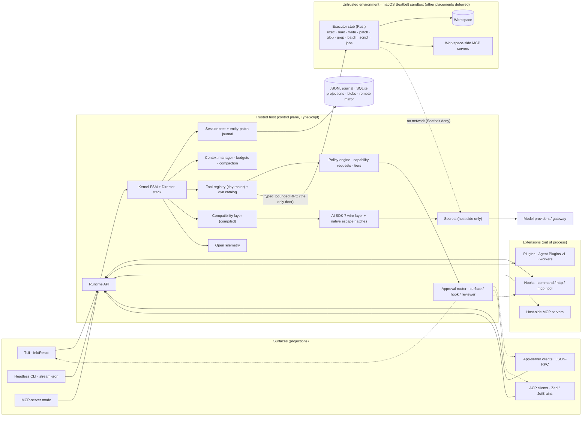
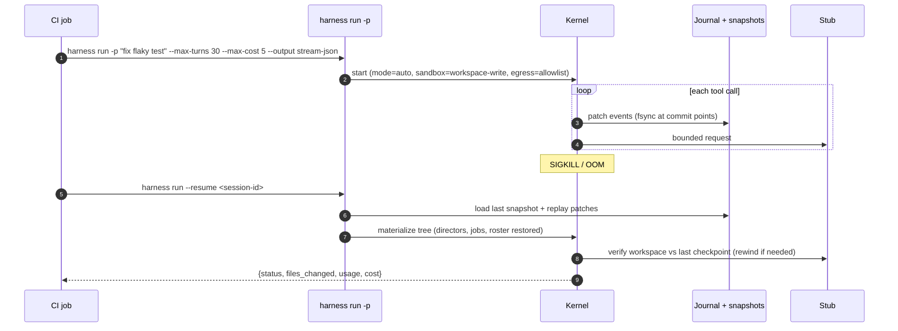
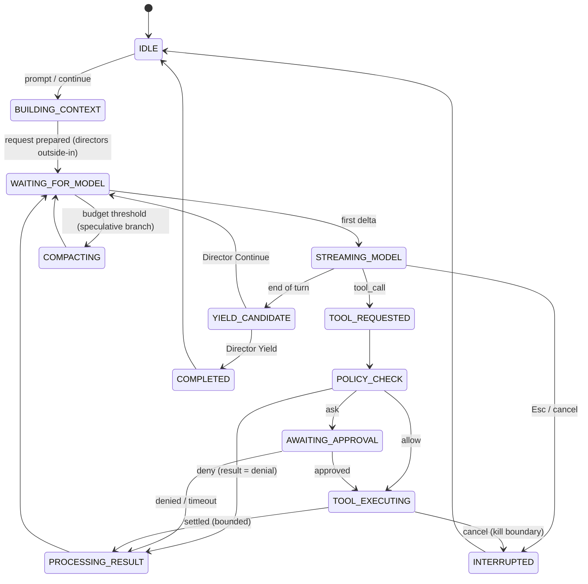
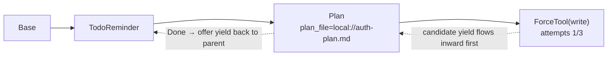

# Building a Production Coding-Agent Harness
## Final Architecture Study and Recommended Stack

**Date:** 2026-09-05 · **Status:** Current (v4 — macOS-only scope)
**Scope:** A terminal-first developer agent comparable to Claude Code, Codex CLI, DeepSeek Harness, Qwen Code, GitHub Copilot (cloud agent + CLI) and OpenCode, **running on macOS only** — the developer's MacBook, with arm64 as the first verified target ([ADR-023](docs/adr/ADR-023-macos-openai-compatible-learning-scope.md)).

---

## 0. How to read this document

This consolidates three earlier work products into one coherent, non-contradictory study:

1. the base study (deliverables A–N with a registry-verified addendum);
2. an independent evaluation of a second model's study on the same brief;
3. a reconciliation with Stencil's *The Harness Playbook* (2026-09-02), which changed two decisions.

Every earlier "supersedes" note has been resolved here; what follows is the current position throughout.

### Platform scope: macOS only

**[R]** Per [ADR-023](docs/adr/ADR-023-macos-openai-compatible-learning-scope.md), the implemented target is **macOS on the developer's MacBook, arm64 verified first**. Intel Mac verification may follow. **Linux, Windows, WSL2, PowerShell/`cmd`, containers, gVisor, microVMs and remote placement are deferred** — not rejected. Three rules keep the deferral honest:

1. **Nothing may assume a non-macOS platform.** No build, test, CI matrix, sandbox backend, shell provider or dependency is added for a deferred platform.
2. **Deferred platforms stay reachable through ports,** not through branches at call sites. The placement driver interface, the stub RPC and the sandbox port are designed so another backend is an added adapter, never a rewrite. Where this document describes a non-macOS mechanism, it is recorded as *design headroom and prior art*, marked **(deferred)**, and is not a commitment.
3. **Claims are scoped to what was run.** A green check on macOS establishes macOS behaviour only. Do not report multi-platform support, and do not claim a platform works until it is actually exercised on that platform.

Sections that previously specified three-OS parity have been narrowed accordingly; §2's landscape table still reports what the *reference agents* do on every OS, because that is documented external fact, not our scope.

**Evidence tags**

- **[F]** documented fact, with a link to the primary source (or a labelled secondary source)
- **[R]** the author's engineering judgment
- **[A]** assumption or item that could not be verified

**Method.** Primary documentation for every reference agent, protocol and platform was read on 2026-09-04; package versions were read directly from the npm registry, crates.io, PyPI and the official Node.js release schedule on 2026-09-04/05. Where a claim is time-sensitive, the date is stated. Nothing here relies on a vendor's marketing page where a specification, README or changelog was available.

**Name resolution used throughout [F]:** "deepseek harness" = DeepSeek Harness (`dsh`, `deepseek-ai/deepseek-harness`); "Owen coder" is interpreted as Qwen Code (`QwenLM/qwen-code`) **[A]**; "GitHub Copilot coding agent" = what GitHub now documents as the *Copilot cloud agent*, distinct from *Copilot CLI* and *Copilot SDK*; "OpenCode" = `anomalyco/opencode` (TypeScript), not the archived Go project.

---

## 1. Executive summary and decision record

### 1.1 The decision in one paragraph

> Build a **TypeScript control plane** on Node.js 24 LTS that owns the session (a typed tree with an entity-patch JSONL journal), the agent kernel (an explicit state machine with a stack of loop-owning *Directors*), policy and approvals, a compiled model-compatibility layer under Vercel AI SDK 7, and all surfaces (Ink TUI, headless CLI, JSON-RPC app-server, ACP agent, MCP-server mode). Pair it with a **Rust executor stub** that is the only component on the untrusted side: it executes shell, builds, tests, reads and writes through one typed, bounded RPC, sandboxed on the MacBook by Anthropic's Apache-2.0 sandbox runtime driving **macOS Seatbelt**. The stub sits behind a placement port, so a container, microVM or remote machine is a later adapter rather than a redesign — but macOS-local is the only placement in scope. Untrusted extensions never run in the runtime's isolate. Every behaviour-affecting state — including plugin, director, job and setting state — is a journaled tree node, so rewind, fork, resume and replication are one implementation. Keep the permanent tool roster tiny and deep; reach MCP and the long tail through a stable in-shell CLI. Bound output and blocking time once, centrally. Use the official MCP v2 SDK, ACP, and Agent Plugins 1.0.0 at the edges; OpenTelemetry as the only telemetry contract; Harbor + Terminal-Bench 2.0 for evaluation.

### 1.2 The ten decisions that matter

| # | Decision | Why (short) | Section |
|---|---|---|---|
| 1 | TypeScript control plane, Rust executor stub (Python only for evals, and evals are deferred) | Ecosystem alignment (4 of 6 reference harnesses are TS; official SDKs; JS plugin lingua franca) plus a stricter compiler where security and correctness are at stake | §6.1, §17 |
| 2 | Host owns truth; sandbox only executes | The trusted host keeps session, policy, secrets, inference; the sandbox receives bounded execution requests through one door; one protocol, so later placements reuse it unchanged | §7.1, §10 |
| 3 | One authoritative session tree with an entity-patch journal | Rewind/fork/resume/replication derive from one journal; plugin state cannot exist outside it | §9 |
| 4 | Kernel as an explicit FSM with a Director stack | Plan, goal, force-tool and verify-before-yield are loop behaviours, not modes or flags | §7.3 |
| 5 | Capability requests as the canonical policy input; `Tool(pattern)` rules as user syntax | Authorize effects, not tool names; keep compatibility with Claude Code/Copilot rule files | §10.4 |
| 6 | Buy the sandbox runtime first; own the stub and the protocol | `@anthropic-ai/sandbox-runtime` gives us working Seatbelt profiles on macOS today; the stub keeps the boundary ours | §10.5 |
| 7 | AI SDK 7 for wire formats; a compiled, declarative compatibility layer for semantics | Provider quirks as structured knowledge with explicit precedence, not branches | §7.4 |
| 8 | Tiny, deep permanent tool roster; long tail via `dyn` CLI and code surfaces | Every schema taxes every turn; roster churn invalidates the prompt cache | §11.5 |
| 9 | Speculative, branch-based compaction plus provider-native compaction | Compaction is scheduled, not triggered; the journal is never rewritten | §11.2 |
| 10 | Sanitize all external text; plugins describe UI semantically; Ink now, measured exit later | String-based rendering compounds cost and is an injection vector | §7.6 |

### 1.3 What changed across revisions (for reviewers of earlier drafts)

- v1 → v2: AI SDK 6→7; Node 22→24; MCP TypeScript SDK v2 ships as `@modelcontextprotocol/client|server|node`; ACP SDK is `@agentclientprotocol/sdk`; Ink 7; TypeScript 7; sandbox runtime now has Windows (alpha) → buy-first; Agent Plugins 1.0.0 adopted; Rust MCP SDK is Tier 1.
- v2 → v3 (after *The Harness Playbook*): trust boundary moved to "host decides, stub executes"; session model moved to a typed tree with entity patches and a no-state-outside-the-journal rule; Directors added; compatibility layer made declarative and compiled; tool-roster policy and `dyn` adopted; central bounding of output/time; interface constraints; larger but bounded Rust footprint.
- v3 → v4 (after [ADR-023](docs/adr/ADR-023-macos-openai-compatible-learning-scope.md)): **platform scope narrowed to macOS on the developer's MacBook (arm64 first)**. Linux, Windows, WSL2, PowerShell/`cmd`, containers, gVisor, microVMs and remote placement became deferred design headroom behind ports; the three-OS CI matrix, escape-suite parity, Windows sandbox work and cross-platform release/signing gates were removed from the plan; Seatbelt is the only sandbox backend; `bash`/`zsh` is the only shell provider. No architectural decision was reversed — the boundary, journal, policy and placement port are unchanged, and each deferred platform re-enters as an added adapter.

---

## 2. Landscape: what the reference agents actually do (documented facts)

This table records what *other* harnesses ship, including on platforms we do not target. It is prior art, not scope: the **Windows** row and the Linux halves of the sandboxing and permissions rows are read here only for what they teach about boundary design. Our own platform commitment is macOS only (§0).

| Dimension | Claude Code | Codex CLI | DeepSeek Harness (dsh) | Qwen Code | GitHub Copilot (cloud agent / CLI) | OpenCode |
|---|---|---|---|---|---|---|
| **Language / runtime** | TypeScript on Bun; React + Ink; native binaries replaced bundled JS in April 2026 ([W16](https://code.claude.com/docs/en/whats-new/2026-w16)); Ink's readme lists Claude Code as a user ([Ink](https://github.com/vadimdemedes/ink)) **[F]** | Rust workspace (`codex-rs`: `core`, `exec`, `tui`, `app-server`, `sandboxing`, `mcp-server`, `state`…); `ratatui`, `rmcp`, `seccompiler` ([Cargo diff](https://github.com/openai/codex/pull/7462/files)); Apache-2.0; npm `@openai/codex` 0.153.3 **[F]** | TypeScript on Node; Cordis plugin kernel; "everything is a plugin" incl. the agent loop; MIT; dev preview with breaking changes promised ([repo](https://github.com/deepseek-ai/deepseek-harness)); `@deepseek-ai/dsh` 0.1.2-rc.1 **[F]** | TypeScript on Node ≥ 22; `packages/cli` + `packages/core` inherited from Gemini CLI ([architecture](https://qwenlm.github.io/qwen-code-docs/en/architecture)); 0.23.0 **[F]** | CLI GA 2026-02-25 for all Copilot subscribers; macOS/Linux/Windows; npm, Homebrew, WinGet, standalone executables ([changelog](https://github.blog/changelog/2026-02-25-github-copilot-cli-is-now-generally-available/)); proprietary licence ([LICENSE](https://github.com/github/copilot-cli/blob/main/LICENSE.md)) **[F]** | TypeScript on Bun; client/server over HTTP; Vercel AI SDK, Hono, SolidJS, Drizzle/SQLite ([Medium, secondary](https://medium.com/@maclarensg_50191/how-opencode-actually-works-an-architecture-guide-backed-by-source-code-939811f0434f)); OpenTUI (Zig core) ([OpenTUI](https://github.com/anomalyco/opentui)); `opencode-ai` 1.18.28 **[F]** |
| **Modes / embedding** | TUI; `-p` headless with `stream-json`; Agent SDK (TS + Python) spawns the `claude` CLI over stdio ([hosting](https://code.claude.com/docs/en/agent-sdk/hosting)) **[F]** | Ratatui TUI; `codex exec`; `codex app-server` bidirectional JSON-RPC (thread/turn/item; server-initiated approvals) ([OpenAI blog](https://openai.com/index/unlocking-the-codex-harness/)); `codex mcp-server` ([MCP interface](https://github.com/openai/codex/blob/main/codex-rs/docs/codex_mcp_interface.md)) **[F]** | Profiles `web` (default UI at 127.0.0.1:3080), `headless`, `sdk` (JSON-RPC), `sdk-minimal`, `acp`; Python SDK wraps the CLI ([architecture.md](https://github.com/deepseek-ai/deepseek-harness/blob/master/docs/architecture.md)) **[F]** | Interactive; `-p`; daemon mode; SDKs; IDE plugins; IM bots ([repo](https://github.com/QwenLM/qwen-code)) **[F]** | Cloud agent from issues/agents panel; CLI `--acp` (stdio or TCP) ([changelog](https://github.blog/changelog/2026-01-28-acp-support-in-copilot-cli-is-now-in-public-preview)); SDK over JSON-RPC to the CLI ([application card](https://docs.github.com/en/copilot/responsible-use/agents)) **[F]** | `opencode serve` / `attach`; TUI, desktop, IDE and SDK are clients of one server ([DataCamp, secondary](https://www.datacamp.com/blog/what-is-opencode)) **[F]** |
| **Sandboxing** | Sandboxed Bash: Seatbelt (macOS), bubblewrap + optional seccomp (Linux/WSL2), proxy with domain allowlist, no TLS inspection; native Windows not supported ([sandboxing](https://code.claude.com/docs/en/sandboxing)); whole-process option via `@anthropic-ai/sandbox-runtime` ([sandbox environments](https://code.claude.com/docs/en/sandbox-environments)) **[F]** | Seatbelt via `sandbox-exec`; bwrap + seccomp by default on Linux; native Windows sandbox: restricted tokens, synthetic SIDs, two sandbox users, firewall rules, elevated one-time setup, four binaries ([approvals & security](https://developers.openai.com/codex/agent-approvals-security), [OpenAI post](https://openai.com/index/building-codex-windows-sandbox)) **[F]** | Sandbox and approval policy are plugins in `dsh-base`; E2B proof of concept ([AGENTS.md](https://github.com/deepseek-ai/deepseek-harness/blob/master/AGENTS.md)) **[F]** | macOS Seatbelt profiles (`permissive-open` default … `restrictive-closed`); Docker/Podman on Linux/Windows ([sandbox docs](https://qwenlm.github.io/qwen-code-docs/en/users/features/sandbox/)) **[F]** | Cloud agent: ephemeral, firewalled GitHub Actions environment ([about](https://docs.github.com/copilot/concepts/agents/coding-agent/about-coding-agent)) **[F]** | No OS-level per-command sandbox documented; CVE-2026-22812: unauthenticated local server with permissive CORS ([Medium, secondary](https://medium.com/@maclarensg_50191/how-opencode-actually-works-an-architecture-guide-backed-by-source-code-939811f0434f)) **[F]** |
| **Permissions** | Modes auto (classifier; default on Pro/Max/Team interactive), manual, acceptEdits, plan, dontAsk, bypass; `Tool(pattern)` rules; managed tier ([how it works](https://code.claude.com/docs/en/how-claude-code-works), [hooks](https://code.claude.com/docs/en/hooks)) **[F]** | `read-only` / `workspace-write` / `danger-full-access`; approvals `untrusted` / `on-request` / `never`; `approvals_reviewer = user | auto_review`; command-prefix rules ([sandboxing concepts](https://developers.openai.com/codex/concepts/sandboxing)) **[F]** | Permission prompt before privileged operations (secondary) **[F]** | Gemini-CLI-style approvals **[A]** | CLI: explicit permission prompts, scoped to cwd ([application card](https://docs.github.com/en/copilot/responsible-use/agents)) **[F]** | Per-tool allow/ask/deny (secondary) **[F]** |
| **Sessions** | Plaintext JSONL under `~/.claude/projects/`; `--continue`, `--resume`, `--fork-session`; file checkpoints; SDK `SessionStore` mirror (dual-write, best-effort) ([how it works](https://code.claude.com/docs/en/how-claude-code-works), [hosting](https://code.claude.com/docs/en/agent-sdk/hosting)) **[F]** | SQLite `state` crate (secondary) plus thread APIs `thread/list`, `thread/read` ([MCP interface](https://github.com/openai/codex/blob/main/codex-rs/docs/codex_mcp_interface.md)) **[F]** | Append-only `SessionEvent` log in `session.vN.jsonl[.zstd]`; invariant "model-visible means logged" asserted at runtime; projection seam; fork at turn boundaries; versioned migrations ([architecture.md](https://github.com/deepseek-ai/deepseek-harness/blob/master/docs/architecture.md)) **[F]** | Inherited from Gemini CLI **[A]** | ACP sessions with custom working directories ([changelog](https://github.blog/changelog/2026-01-28-acp-support-in-copilot-cli-is-now-in-public-preview)) **[F]** | SQLite (Drizzle) + JSON (secondary) **[F]** |
| **MCP** | Client; MCP tool definitions deferred by default, loaded via tool search; hooks may call MCP tools ([how it works](https://code.claude.com/docs/en/how-claude-code-works)) **[F]** | Client via `rmcp`; server mode **[F]** | Client package; plugin bundles can declare servers **[F]** | Client with interactive management; loads Agent Plugins v1 natively ([docs](https://qwenlm.github.io/qwen-code-docs/en/users/extension/agent-plugins/)) **[F]** | Both surfaces ([application card](https://docs.github.com/en/copilot/responsible-use/agents)) **[F]** | Client **[F]** |
| **Hooks / plugins** | 30+ hook events; handler types `command`, `http`, `mcp_tool`, `prompt`, `agent`; plugins bundle skills, agents, hooks, MCP servers; marketplaces ([hooks](https://code.claude.com/docs/en/hooks)) **[F]** | Rules, skills, plugins, notify commands ([app-server README](https://github.com/openai/codex/blob/main/codex-rs/app-server/README.md)) **[F]** | Everything is a plugin incl. `agent-loop`; Cordis bundles ([repo](https://github.com/deepseek-ai/deepseek-harness)) **[F]** | Skills, subagents, agent teams, auto-memory ([repo](https://github.com/QwenLM/qwen-code)) **[F]** | Hooks load policy → user → project → plugins; policy hooks are machine-wide, load first, immune to `disableAllHooks` (CLI only) ([hooks reference](https://docs.github.com/en/copilot/reference/hooks-reference)) **[F]** | Plugins with lifecycle events **[F]** |
| **Editor protocol** | Community ACP adapter **[F]** | ACP adapter on the app server ([codex-acp](https://github.com/zed-industries/codex-acp)) **[F]** | `acp` profile **[F]** | On the ACP registry ([agents](https://agentclientprotocol.com/get-started/agents)) **[F]** | CLI `--acp` public preview **[F]** | On the ACP registry **[F]** |
| **Windows** | Runs without Git Bash since April 2026; PowerShell tool; Bash sandbox needs WSL2 ([W18](https://code.claude.com/docs/en/whats-new/2026-w18), [W13](https://code.claude.com/docs/en/whats-new/2026-w13)) **[F]** | Native Windows sandbox (PowerShell) and Linux sandbox under WSL2 **[F]** | `pwsh` shell provider; shared Win32 subprocess library **[F]** | PowerShell installer; Node ≥ 22 **[F]** | Supported; WinGet ([changelog](https://github.blog/changelog/2026-02-25-github-copilot-cli-is-now-generally-available/)) **[F]** | Native x64 binary; PowerShell on Windows; encoding and PS 5.1-vs-7 issues documented ([#2447](https://github.com/anomalyco/opencode/issues/2447), [#30615](https://github.com/anomalyco/opencode/issues/30615)) **[F]** |

**Adjacent evidence used [F]:** Kilo CLI's runtime is `packages/opencode/` — an OpenCode derivative, so it is not independent evidence ([Kilo docs](https://kilo.ai/docs/contributing/architecture/cli-runtime)). Gemini CLI stopped serving individual/Pro/Ultra requests on 2026-06-18 in favour of a closed-source Antigravity CLI ([The Register, secondary](https://www.theregister.com/ai-ml/2026/05/20/bye-bye-gemini-cli-google-nudges-devs-toward-antigravity/5243605)). Pi's fork *omp* (TypeScript/Bun front end over an ~80k-line Rust core, MIT, 26k+ stars) is the product behind *The Harness Playbook* ([oh-my-pi](https://github.com/can1357/oh-my-pi), [Composio, secondary](https://composio.dev/content/pi-vs-omp)).

**Three lessons every vendor converged on [F]:**
1. *Boundary and prompt are separate controls.* Codex: "the sandbox defines technical boundaries; the approval policy decides when Codex must stop and ask" ([concepts](https://developers.openai.com/codex/concepts/sandboxing)). Claude Code: permission modes decide whether a call runs; isolation restricts what it can reach once it runs ([sandbox environments](https://code.claude.com/docs/en/sandbox-environments)).
2. *The loop lives behind a protocol.* Codex extracted its loop into the App Server after MCP's tool-shaped requests proved a poor fit for streaming diffs and approvals ([OpenAI blog](https://openai.com/index/unlocking-the-codex-harness/)); Claude's Agent SDK drives the CLI over stdio; OpenCode, DeepSeek Harness and Copilot SDK all expose the core over JSON-RPC/HTTP.
3. *Per-command sandboxing is not the boundary.* Anthropic states that with its Bash sandbox, built-in file tools run in the agent process and MCP servers and hooks "run unconstrained on the host"; only whole-process isolation puts them behind one boundary ([sandbox environments](https://code.claude.com/docs/en/sandbox-environments)).

---

## 3. Design envelope and invariants

**[R]** *The Harness Playbook* argues that every subsystem should survive four products at once ([article](https://stencil.so/blog/harness-playbook#the-design-envelope)) **[F]**. Only the first is in scope on a single MacBook. The other three are kept as *shaping constraints* — they decide where an interface goes, so that adopting them later costs an adapter rather than a rewrite — but nothing is built or tested for them:

| Test | Placement | Interaction | Trust | Concurrency | Status |
|---|---|---|---|---|---|
| Multiplexed workspace | local macOS | interactive | mostly trusted | many agents, one folder | **In scope** |
| Remote driver | remote client, local or cloud agent | interactive | split host/client | one or many agents | Deferred — shapes the surface/runtime split (§7.5) |
| Spectator | remote view | observational | untrusted presentation input | many viewers | Deferred — shapes "views are projections" (invariant 5) |
| Software factory | cloud fleet | autonomous | hostile repository and tool input | many jobs | Deferred — shapes the stub boundary (§7.1) |

Keeping the deferred rows as constraints is cheap because each one buys something the local product needs anyway: the surface/runtime split is what makes the headless CLI testable, and the stub boundary is what contains a prompt-injected command on the MacBook itself.

Five invariants follow, and every design decision below is checked against them:

1. **One authoritative session.** Rewind, fork, resume, replication and inspection derive from one journal; state that cannot be replayed is unrepresentable.
2. **A trusted control plane.** Policy, secrets, inference and session ownership stay on the host; the sandbox receives only bounded execution requests.
3. **Bounded work.** Tool calls, subagents and background jobs are cancellable streams with central limits and a real kill boundary.
4. **Explicit compatibility.** Model and provider quirks are structured, compiled knowledge with explicit precedence — never branches at call sites.
5. **Views are projections.** TUI, web, remote and subagent inspectors render the same snapshot and patch stream; none becomes an authority.

---

## 4. A — Product capability decomposition

**[R]** Ten capability domains. Each row names the reference precedent that proves the capability is table stakes and the design consequence adopted here.

| Domain | Capabilities | Precedent [F] | Consequence [R] |
|---|---|---|---|
| **1. Surfaces** | Interactive TUI; headless CLI (`run -p`, `json`/`stream-json`, exit codes, max turns, output schema); JSON-RPC app-server (thread/turn/item, server-initiated approvals); ACP agent; MCP-server mode; SDK client | Claude `-p`/`stream-json`; Codex `exec` + app-server; Copilot `--acp`; DeepSeek `sdk`/`acp` profiles | All surfaces are clients of one runtime API; none owns state |
| **2. Kernel** | Turn/step lifecycle as an explicit FSM; Director stack (plan, goal, force-tool, verify-before-yield); interrupts and steering queue; subagents and jobs | Claude Code plan mode and `/goal`; Codex `turn/interrupt`; Playbook Directors | Loop behaviours are journaled Directors, not flags |
| **3. Model layer** | Provider adapters (Anthropic, OpenAI Responses, Google, OpenAI-compatible: DeepSeek, Qwen, vLLM, Ollama; gateways); streaming text/tool-arg/reasoning deltas; usage and cache metrics; model routing (main/advisor/fast); compiled compatibility knowledge; forced-tool policy; argument repair; corrective inference | OpenCode on AI SDK; Claude advisor/fast modes; omp's KDL taxonomy | AI SDK 7 for wire; compatibility layer for semantics |
| **4. Workspace intelligence** | Git root/worktrees/monorepo package detection; ignore rules; instruction files (`AGENTS.md`, `CLAUDE.md`); deep `read` (ranges, structural summaries, notebooks, PDFs, SQLite, archives, URLs, internal `artifact://`/`agent://`/`mcp://` schemes); ripgrep/glob; tree-sitter outline; LSP diagnostics | Claude Code bundles ripgrep; OpenCode/Qwen Code LSP; omp deep Read | Search and read run stub-side; results bounded |
| **5. Action tools** | `edit` (str_replace), `patch` (V4A for OpenAI models), hashline anchoring (candidate), `write`, `bash`/`zsh` (foreground/background, persistent), web fetch/search, `task` (subagent), `ask`, todo/state | Anthropic text editor tool; OpenAI `apply_patch`; omp hashline | Permanent roster ≤ 8; long tail via `dyn` CLI and code surfaces. One POSIX shell provider; `pwsh`/`cmd` deferred with Windows |
| **6. Policy and approvals** | Modes; capability requests; `Tool(pattern)` rules in tiers; approval routing (surface, hook, reviewer agent); escalations; config-path protection | Claude modes/rules/managed tier; Codex sandbox-mode × approval-policy × `auto_review`; Copilot policy hooks | Capability request is canonical; rules compile to predicates |
| **7. Execution** | Executor stub protocol (exec/read/write/patch/glob/grep/stat/batch/script); macOS Seatbelt backend; job control; host-only secrets (no egress proxy — the stub has no network, D-01) | Anthropic sandbox runtime (Seatbelt); Playbook stub; Codex's four-binary Windows split as boundary-design prior art only | Host decides, stub executes; one protocol, so a later placement adds a driver and changes no tool |
| **8. Extensibility** | Hooks (Claude-Code-style events; command/http/mcp_tool/in-process handlers); plugins (Agent Plugins 1.0.0 + reverse-domain extras); skills; MCP client/server; ACP | Claude hooks/plugins; Agent Plugins spec; Qwen native loader; Copilot precedence | Extensions out of process; managed tier un-overridable |
| **9. Durability** | Session tree; entity-patch journal; snapshots; checkpoints (file snapshots, restore); fork/resume/branch; remote mirror | Claude JSONL + SessionStore; DeepSeek JSONL + projections | JSONL journal + SQLite projections + blob store |
| **10. Observability & evaluation** | OTel traces/metrics/logs with GenAI conventions; cost per session; local trace viewer; two replay modes; Harbor/Terminal-Bench 2.0; edit-reliability corpus; AutoQA tool | Claude OTel export; Langfuse OTLP; Harbor | OTel is the only telemetry contract |

The non-negotiable pipeline for every side effect:

```
model decision → tool request → capability request → policy (allow/ask/deny)
→ human/hook/reviewer approval (if ask) → bounded execution request → executor stub
→ OS sandbox → side effect → bounded result stream → journal
```

---

## 5. B — Functional and non-functional requirements

### 5.1 Functional requirements

| ID | Requirement | Acceptance signal |
|---|---|---|
| FR-01 | Interactive TUI: streaming text, tool cards, diff review, permission prompts, mode cycling, slash commands, `/resume` picker, `/context`, transcript search | Manual matrix on Terminal.app, iTerm2, tmux and the VS Code terminal, on macOS |
| FR-02 | Headless `harness run -p` with `json` and `stream-json`, `--max-turns`, `--max-cost`, `--output-schema`, deterministic exit codes, fail-closed on `ask` with a resumable "needs approval" result | CI golden task with schema-validated output |
| FR-03 | JSON-RPC 2.0 app-server over stdio and token-authenticated WebSocket: thread/turn/item lifecycle, patch stream, server→client approval requests | Conformance suite; reference TS SDK client |
| FR-04 | ACP agent mode (`initialize`, `session/new`, `session/prompt`, `session/update`, `session/request_permission`, cancel) | Works in Zed and JetBrains without custom glue |
| FR-05 | Providers: Anthropic, OpenAI Responses, Google, OpenAI-compatible; streaming; tool calls; usage/cache metrics; mid-session model switch; compatibility layer answers `unknown` when it has no rule | Per-provider contract tests with recorded fixtures |
| FR-06 | Built-in roster: `read`, `edit`, `patch`, `write`, `bash` (POSIX shell on macOS), `grep`/`glob`, `task`, `ask`, todo/state; `dyn` CLI for MCP and long tail; intent argument and version on every tool | Each tool has schema, capability plan, tests |
| FR-07 | Repository discovery: git root, worktrees, ignore rules, instruction files, package detection | Fixture repos incl. monorepos and submodules |
| FR-08 | Reliable editing: uniqueness check, tolerant fallback, encoding/CRLF/BOM preservation, atomic writes, checkpoint before edit, LSP diagnostics after edit; per-model edit format (str_replace / V4A / whole-file / hashline) | Edit-reliability corpus ≥ 98% apply rate |
| FR-09 | Permission modes plan / manual / accept_edits / auto / bypass; capability requests; `Tool(pattern)` rules in managed > user > project > local > session tiers; managed tier un-overridable | Policy unit tests; managed enforcement tests |
| FR-10 | Executor stub with typed RPC; local macOS Seatbelt sandbox behind a placement port; **network denied outright to the stub** (D-01) rather than proxied; config-path deny-writes. Non-macOS backends and container/microVM/remote placements are **deferred**; the port must admit them without changing tools or the RPC | macOS escape-test suite (arm64); a placement-port contract test that the stub passes with the sandbox driver swapped for a no-op fake |
| FR-11 | Session tree + entity-patch journal; plugin state only through journaled nodes; snapshots; rewind = tree diff; fork; resume; export; remote mirror | Kill -9 mid-turn and resume; rewind/fork property tests |
| FR-12 | Context management: accounting per component, tool-output bounding with blob spill, eviction, speculative compaction with structured summary, provider-native compaction, thrash guard, deferred long-tail tools | 200k-token soak session |
| FR-13 | MCP client (stdio, Streamable HTTP, OAuth) and MCP-server mode on the 2026-07-28 spec with 2025-11-25 compatibility | Interop against reference servers and legacy servers |
| FR-14 | Hooks (SessionStart, UserPromptSubmit, PreToolUse, PermissionRequest, PostToolUse, PostToolUseFailure, PostToolBatch, Stop, SubagentStart/Stop, PreCompact, PostCompact, ConfigChange, SessionEnd) with allow/deny/ask/defer, `updatedInput`, `additionalContext`; plugins as Agent Plugins 1.0.0 | Hook conformance tests; plugin install from dir/git/zip/URL |
| FR-15 | Directors: built-in plan, goal, force-tool, verify-before-yield; extension-pushed Directors; journaled stack | Rewind pops, resume restores; composition tests |
| FR-16 | Jobs: one primitive for background shell, subagent, daemon and over-budget call (stdin/stdout/exit/signal); central output and time bounds; kill boundary | Cancellation kills within 1 s; output caps enforced |
| FR-17 | Telemetry: OTel spans per turn/model call/tool; metrics; cost; content capture off by default; local trace viewer; `replay` (journal) and `rerun` (provider) commands | Every tool call has a span; replay reproduces tool sequence |
| FR-18 | Evaluation: Harbor adapter; Terminal-Bench 2.0 subset; SWE-bench Verified sample; edit corpus; roster-size/wall-clock experiment; AutoQA reports | Nightly CI runs with trend dashboards |
| FR-19 | macOS first-class and the only supported platform: arm64 verified, Intel Mac best-effort until exercised. The build refuses to start on a non-macOS host with a clear "not supported yet" message rather than failing obscurely | Single-target CI on macOS arm64; a startup-guard test asserting the refusal message |

### 5.2 Non-functional requirements (architecture invariants)

| ID | Invariant | Target / mechanism |
|---|---|---|
| NFR-01 Startup | TUI cold start | ≤ 300 ms native binary; ≤ 800 ms via npm |
| NFR-02 Streaming | Token-to-screen overhead | ≤ 50 ms; stream pacing smooths provider cadence |
| NFR-03 Durability | Committed journal events survive SIGKILL; a crash never corrupts the tree | fsync at commit points; snapshot + patch replay |
| NFR-04 Security | The model cannot bypass policy; credentials never enter the sandbox; **the stub has no network at all**; no unauthenticated listeners (none exist in scope) | Stub boundary; host-only credentials; Seatbelt network deny |
| NFR-05 Boundedness | Every tool call, job and subagent has byte, time, depth and cost limits enforced centrally | Runtime library, not per tool |
| NFR-06 Portability | macOS arm64 is the supported target. Portability is preserved as *substitutability*, not as shipped platforms: no OS-specific call sites outside the stub and the placement driver | Architectural lint forbids platform branching in `packages/**`; placement-port contract test |
| NFR-07 Observability | Every model and tool call is a span with usage/cost; pinned GenAI attribute names | OTel SDK; semconv pinned |
| NFR-08 Replay honesty | `replay(journal) == original` for everything the model saw and every behaviour-affecting state | No state outside the tree; instruction content journaled by hash |
| NFR-09 Maintainability | Provider types never leak into the kernel; sandbox APIs never leak into tools; TUI never owns state; schema versions explicit; plugin API versioned | Architectural lint; contract tests |
| NFR-10 Supply chain | Reproducible builds; signed binaries; no source maps in published artifacts; SBOM | Release gates |
| NFR-11 Multi-tenant hygiene | Per-tenant config dir, cwd, egress policy in hosted mode | Isolation tests (Claude Agent SDK documents the same controls ([hosting](https://code.claude.com/docs/en/agent-sdk/hosting))) **[F]** |
| NFR-12 Accessibility | Screen-reader mode, reduced motion, colourblind themes, ASCII/Unicode/Nerd-font icon policy | Renderer owns presentation policy |

---

## 6. C — Technology comparison matrix

### 6.1 Primary language (TypeScript vs Python vs Rust)

Scores 1–5 are **[R]**; evidence is **[F]**.

| Criterion | TS | Py | Rust | Evidence |
|---|---|---|---|---|
| Ecosystem fit for coding-agent harnesses | 5 | 3 | 3 | Claude Code, OpenCode, Qwen Code, DeepSeek Harness (and Gemini CLI) are TS; Codex is Rust; no reference agent has a Python core; omp keeps a TS front end over a Rust core **[F]** |
| Official model-provider SDKs | 5 | 5 | 2 | Anthropic: Python, TypeScript, C#, Go, Java, PHP, Ruby, CLI — no Rust ([SDK overview](https://platform.claude.com/docs/en/cli-sdks-libraries/overview), [issue #1559](https://github.com/anthropics/anthropic-sdk-python/issues/1559)); community Rust crates only ([rust-genai](https://github.com/jeremychone/rust-genai)) **[F]** |
| Multi-provider abstraction | 5 | 4 | 3 | AI SDK 7 (2026-06-25): agents, approvals, reasoning control ([changelog](https://vercel.com/changelog/ai-sdk-7)); Pydantic AI v2, OpenAI Agents SDK in Python **[F]** |
| MCP SDK tier | 5 | 5 | 5 | Official page: TypeScript, Python, C#, Go and Rust are Tier 1; Java/Ruby Tier 2 ([MCP SDKs](https://modelcontextprotocol.io/docs/2026-07-28/sdk)) **[F]** |
| TUI frameworks | 4 | 3 | 5 | Ink (Claude Code, Copilot CLI, Gemini CLI per Ink's readme); OpenTUI; Ratatui (Codex); Textual **[F]** |
| OS-level sandboxing from the language | 2 | 2 | 5 | Codex and omp implement sandbox/exec cores in Rust; Anthropic's TS runtime shells out to `bwrap`/`sandbox-exec` and bundles `srt-win.exe` ([README](https://github.com/anthropic-experimental/sandbox-runtime)) **[F]** |
| Single-binary distribution | 4 | 2 | 5 | Claude Code ships Bun-compiled native binaries **[F]** |
| Plugin ecosystem for users | 5 | 4 | 2 | JS is the plugin language of every TS harness **[R]** |
| Consistency of agent-written code | 2 | 3 | 4 | *Playbook*: permissive languages multiply local styles; Rust's compiler constrains ([article](https://stencil.so/blog/harness-playbook#the-stack)) **[F]** |
| Evaluation tooling | 3 | 5 | 2 | Harbor/Terminal-Bench 2.0 are Python ([tbench.ai](https://www.tbench.ai/news/announcement-2-0)) **[F]** |

**Verdict [R]:** TypeScript control plane and surfaces; Rust for the executor stub, sandbox backend, PTY/job control, search and patch engine. Python would be for evals only — and since the evaluation programme is deferred, the working project has two toolchains, not three. The *Playbook*'s argument against TypeScript is real but its conclusion does not transfer: the largest shipping harnesses are TS, the official Anthropic SDK has no Rust edition, and omp itself keeps a TS front end. The mitigation is discipline as a deliverable (§12) and a larger, bounded Rust footprint.

### 6.2 Terminal UI

| Option | Fact | Fit |
|---|---|---|
| Ink 7.1.1 + React 19.2 | Ink's readme lists Claude Code, Gemini CLI and GitHub Copilot CLI as users; Node ≥ 22 ([Ink](https://github.com/vadimdemedes/ink)) **[F]**; Claude Code added a fullscreen mode for flicker and memory in long sessions ([index](https://code.claude.com/docs/llms.txt)) **[F]** | **Primary**, with the constraints in §7.6 |
| OpenTUI 0.5.10 | Zig core + TS bindings; powers OpenCode in production; Bun 1.3+ and Zig to build ([OpenTUI](https://github.com/anomalyco/opentui)) **[F]** | Measured fallback |
| Ratatui 0.30 + crossterm 0.29 | Codex TUI ([Cargo diff](https://github.com/openai/codex/pull/7462/files)) **[F]** | Only if the core moves to Rust |
| Custom one-pass RichText renderer | omp² reports 267 s → 90 ms render time after abandoning `string[]` contracts ([article](https://stencil.so/blog/harness-playbook#the-interface)) **[F]** | Design constraints adopted; implementation later if needed |

### 6.3 Provider layer

| Option | Fact | Fit |
|---|---|---|
| `ai@7` + `@ai-sdk/*` | Node ≥ 22, ESM-only; approvals, `WorkflowAgent`, provider-agnostic reasoning ([changelog](https://vercel.com/changelog/ai-sdk-7)); OpenCode runs on the AI SDK **[F]** | **Wire layer** |
| `@anthropic-ai/sdk` 0.123, `openai` 7.10, `@google/genai` 2.21 | Server-side compaction `compact_20260112`, context editing, memory tool, text editor ([compaction](https://platform.claude.com/docs/en/build-with-claude/compaction), [context editing](https://platform.claude.com/docs/en/build-with-claude/context-editing)); Responses `apply_patch` ([guide](https://developers.openai.com/api/docs/guides/tools-apply-patch)) **[F]** | **Native escape hatches** |
| Compiled compatibility knowledge (taxonomy/classes/providers) | omp replaced 880 + 977 + 1,776 lines of provider branches with declarative rules whose compiler errors on ambiguity and returns `unknown` when no rule matches ([article](https://stencil.so/blog/harness-playbook#the-inference)) **[F]** | **Semantic layer** (own code) |
| Vendor agent SDKs (Claude Agent SDK, OpenAI Agents SDK) | Claude Agent SDK spawns the vendor CLI with its own on-disk state ([hosting](https://code.claude.com/docs/en/agent-sdk/hosting)) **[F]** | Not the kernel; optional backends |
| Gateways (Vercel AI Gateway, LiteLLM, OpenRouter, Claude apps gateway) | Anthropic documents gateway spend limits and field-stripping degradation ([index](https://code.claude.com/docs/llms.txt)) **[F]** | Deployment option |

### 6.4 Protocol SDKs

| Option | Fact |
|---|---|
| `@modelcontextprotocol/client` / `server` / `node` 2.0.0 | v2 is the stable line for 2026-07-28 (stateless core, MRTR, header routing); v1.x gets fixes ≥ 6 months; the legacy `@modelcontextprotocol/sdk` has no 2.x ([README](https://github.com/modelcontextprotocol/typescript-sdk), [MCP blog](https://blog.modelcontextprotocol.io/posts/2026-07-28/)) **[F]** |
| `rmcp` 3.2.0 | Official Rust SDK, Tier 1 ([MCP SDKs](https://modelcontextprotocol.io/docs/2026-07-28/sdk)) **[F]** |
| `@agentclientprotocol/sdk` 1.4.0; Rust `agent-client-protocol` 2.1.0 | Official ACP SDKs; the older `@zed-industries/*` package is stale ([ACP README](https://github.com/agentclientprotocol/agent-client-protocol)) **[F]** |
| Agent Plugins 1.0.0 | `plugin.json` + `skills/` + `mcp.json`; maintainers from Amazon, Cursor, Microsoft, OpenAI, Vercel, Google; clients ChatGPT, Codex, Cursor, Copilot, Kiro, VS Code; no permission/sandbox/signing model in v1 ([spec](https://github.com/agentplugins/agent-plugins-spec), [Google](https://developers.googleblog.com/agent-plugins-package-your-skills-tools-and-more/)) **[F]** |

### 6.5 Sandboxing technologies

| Technology | OS | Status | Used by | Limits [F] |
|---|---|---|---|---|
| Seatbelt (`sandbox-exec`) | macOS | **In scope — the backend** | Claude Code, Codex, Qwen Code, sandbox runtime | Apple-deprecated but universally used; proxies don't inspect TLS. Its deprecation is the one platform risk we cannot mitigate by staying on macOS (§19) |
| `@anthropic-ai/sandbox-runtime` 0.0.75 (Apache-2.0) | macOS (also Linux/Windows) | **In scope, macOS profiles only** | Anthropic (beta) | Config may change; we consume only its Seatbelt path |
| bubblewrap + seccomp (+ Landlock) | Linux/WSL2 | Deferred | Claude Code, Codex, sandbox runtime | Needs unprivileged user namespaces; Ubuntu AppArmor profile ([Codex docs](https://developers.openai.com/codex/concepts/sandboxing)); nested containers need weaker `/proc` |
| Restricted tokens + synthetic SIDs + sandbox users + firewall/WFP | Windows | Deferred | Codex (four binaries, elevated setup) ([OpenAI post](https://openai.com/index/building-codex-windows-sandbox)); sandbox runtime `srt-win.exe` (alpha) ([README](https://github.com/anthropic-experimental/sandbox-runtime)) | Elevation; per-user tool installs unreachable; DNS not fenced; schannel revocation |
| Containers / dev containers | all (Docker) | Deferred | Qwen Code default on Linux/Windows; Claude dev container with default-deny iptables | Docker dependency |
| gVisor, Firecracker, Docker Sandboxes, E2B/Daytona/Modal | hosted | Deferred | Claude web sessions (VMs); Harbor evals | Cold start, cost; Firecracker needs KVM **[A]** |

Rows marked Deferred are recorded so the placement port is designed against real mechanisms, not an imagined one. None of them is implemented, configured or tested in this scope.

### 6.6 Session storage

| Option | Used by [F] | Verdict [R] |
|---|---|---|
| JSONL journal | Claude Code; DeepSeek Harness (`session.vN.jsonl[.zstd]`, projections, migrations) | **Journal** |
| SQLite | Codex `state`; OpenCode | **Projections / index**; becomes the journal only if concurrent writers are required |
| Remote mirror | Claude `SessionStore` (dual-write, `mirror_error`) | Adapter |

### 6.7 Observability and evaluation

| Option | Fact |
|---|---|
| OpenTelemetry JS | Traces and metrics stable; logs in development ([status](https://opentelemetry.io/docs/languages/js)) **[F]** |
| GenAI semantic conventions | `invoke_agent` / `chat` / `execute_tool` span tree; all `gen_ai.*` still "Development" ([agent spans](https://www.opentelemetry.io/docs/specs/semconv/gen-ai/gen-ai-agent-spans/)) **[F]** |
| Langfuse (or any OTLP backend) | OTLP over HTTP at `/api/public/otel`; `gen_ai.*` spans become generations ([docs](https://langfuse.com/docs/opentelemetry/get-started)) **[F]** |
| Harbor 0.22 + Terminal-Bench 2.0 | 89 human-verified tasks; runs any container-installable agent on Docker/Modal/Daytona/E2B; Harbor needs Python ≥ 3.12 ([tbench.ai](https://www.tbench.ai/news/announcement-2-0)) **[F]** |

---

## 7. D — Recommended production architecture

### 7.1 Trust model: the host decides, the stub executes

**[R]** Two process classes, one door between them.

**Host runtime (trusted control plane; TypeScript).** Owns the session tree and journal, the kernel FSM and Director stack, policy and approvals, secrets, inference and the compatibility layer, tool routing, budgets, telemetry and audit. Runs on the developer's MacBook. (A trusted control-plane container is the natural cloud shape later; it is not built here.) Surfaces attach to it; extensions talk to it from separate processes.

**Executor stub (untrusted environment side; Rust).** A small, obedient process exposing `exec`, `read`, `write`, `patch`, `glob`, `grep`, `stat`, `watch`, `batch`, `script` and job control (`spawn`, `signal`, `attach`) over a typed JSON-RPC 2.0 stream with a per-request byte and time budget. On the MacBook it runs under Seatbelt (workspace-write; **no network whatsoever**; config paths denied) — the only placement in scope. Because the stub's contract is the RPC and not the machine it sits on, a container, microVM or remote host would later run the identical binary with no protocol change; that is design headroom, not a shipped mode. If the sandbox is popped, the attacker holds a stub, a shell and a read-only mirror of the repo — not the session, the prompts, the keys or the policy.

**Why this placement [F/R].** Anthropic documents that per-command sandboxing leaves file tools, MCP servers and hooks unconstrained on the host and that only whole-process isolation puts them behind one boundary ([sandbox environments](https://code.claude.com/docs/en/sandbox-environments)) **[F]**. *The Harness Playbook* shows why the answer is not "put the whole driver in the VM" (prompts and source leak; the session store becomes writable from the untrusted side; a duplex host-tool gateway becomes a DoS surface) but "put one obedient stub in the VM and keep everything else out" ([article](https://stencil.so/blog/harness-playbook#the-runtime)) **[F]**. Codex reached the same conclusion independently on a platform we do not target: its harness stays a normal unelevated process while a separate runner owns the restricted-token work ([OpenAI post](https://openai.com/index/building-codex-windows-sandbox)) **[F]** — evidence that the split is a property of the boundary, not of one OS. Claude Code's web sessions keep the GitHub token in a proxy outside the sandbox and issue scoped credentials inside ([sandbox environments](https://code.claude.com/docs/en/sandbox-environments)) **[F]**.

**Extensions never run in the runtime's isolate.** Hooks are subprocesses or HTTP endpoints; plugins run in a worker/subprocess with a capability-scoped API; MCP servers are separate processes, placed host-side by default and workspace-side (inside the sandbox) when they must touch the repo. Signed first-party plugins may opt into in-process loading. This is the *Playbook*'s kill-boundary rule ([article](https://stencil.so/blog/harness-playbook#the-runtime)) **[F]** and it is what makes "host is trusted" a true statement.

**Defense in depth.** In hardened deployments the host runtime itself also runs under the sandbox runtime's whole-process mode (state directory writable; egress to providers only). Optional; the stub boundary is mandatory.

**Cost accepted.** File operations are RPCs. The `batch` and `script` operations let multi-step edits and code-mode evaluation run stub-side (the TypeScript analogue of omp²'s Python `@remote`), with host callbacks rate-limited.

### 7.2 Process and placement model

| Placement | Host runtime | Stub | Sandbox mechanism | Status |
|---|---|---|---|---|
| **Local interactive (macOS)** | MacBook | same machine | `@anthropic-ai/sandbox-runtime` wraps the stub in a Seatbelt profile | **The only supported placement.** Defaults to `manual` approvals |
| Local unattended (`bypass`/`auto`) | MacBook | container or VM | dev container with default-deny egress, or a VM | **Deferred with containers.** Until a stronger placement exists, unattended modes stay off by default and `bypass` is refused as root (Claude Code precedent) **[F]** |
| Remote driver | developer machine or cloud | wherever the repo is | as above | Deferred |
| Cloud / factory | control-plane container | gVisor pod or microVM | provider egress rules | Deferred; Harbor's providers (Docker, Modal, Daytona, E2B) fit this shape when it is picked up **[F]** |

The consequence to state plainly: with only a Seatbelt placement available, **hostile or untrusted repositories are out of scope.** Seatbelt confines workspace writes and egress on a machine the developer already trusts; it is not the isolation you would want for a repository that may attack the host. Cloning something untrusted is a reason to reach for a VM, which means expanding scope first.

### 7.3 Kernel: state machine and Directors

**[R]** The loop is an explicit FSM, not a `while(true)` with flags:

```
IDLE → BUILDING_CONTEXT → WAITING_FOR_MODEL → STREAMING_MODEL
     → TOOL_REQUESTED → POLICY_CHECK → (AWAITING_APPROVAL) → TOOL_EXECUTING → PROCESSING_RESULT
     → WAITING_FOR_MODEL … → YIELD_CANDIDATE → COMPLETED
side states: INTERRUPTED · CANCELLED · FAILED · COMPACTING · CHECKPOINTING
```

A **Director stack** owns the yield decision. `prepare_inference` walks outside-in so the innermost behaviour refines the request; `on_yield` walks inside-out and each Director returns Pass, Continue, Yield, Push, Done or Fail ([article](https://stencil.so/blog/harness-playbook#the-control-plane)) **[F]**. Built-ins: `TodoReminder`, `Plan` (force a plan file and a proposal before yielding), `Goal` (keep working until a condition holds; Claude Code's `/goal` is the precedent ([index](https://code.claude.com/docs/llms.txt)) **[F]**), `ForceTool` (soft prompt → native `tool_choice` only if free → bounded escalation), `VerifyBeforeYield`. Extensions push Directors through the same API. The stack is a subtree of the session, so rewind pops and resume restores.

Hooks remain single-point observers/editors of one inference or turn; Directors keep control across turns. Both exist; they are not the same primitive.

### 7.4 Inference and compatibility layer

**[R]** Two layers under the kernel:

1. **Wire layer — AI SDK 7.** Streaming, tool calls, structured output, provider registry, MCP glue. Native SDKs are used directly for features the AI SDK lacks (Anthropic server-side compaction and context editing; OpenAI `apply_patch`).
2. **Semantic layer — compiled compatibility knowledge.** A declarative knowledge base with three axes — *taxonomy* ("what model is this string?"), *classes* ("what is true of this lineage/revision?"), *providers* ("what does this host change?") — compiled so that an unknown directive is an error, two equally specific conflicting rules are an error, and no matching rule yields `unknown` rather than `false` ([article](https://stencil.so/blog/harness-playbook#the-inference)) **[F]**. It answers: thinking mode, forced-tool support and cost, strict-schema budget and grammar dialect, edit format, context-window tier, cache behaviour, native compaction availability.

Policies implemented on top of that knowledge:
- **Forced tool calls:** always inject a soft prompt; set the native flag only when side-effect-free; on non-compliance retry a bounded number of times and only then set the flag despite its cost (Anthropic can turn a forced call into a cache miss) ([article](https://stencil.so/blog/harness-playbook#the-inference)) **[F]**.
- **Validate and repair tool arguments:** strict about the semantic contract, charitable about dialect (`paths: "a,b"` → list when unambiguous; otherwise a structured, retryable error).
- **Strict sampling budgets:** strict-schema slots are a per-provider budget with priorities; grammar dialects normalized per provider; client-side repair on failure.
- **Corrective inference:** JSON repair, repetition-loop detection, and parsing of leaked tool-call/thinking dialects into canonical blocks — required for OpenAI-compatible and local models.
- **Edit format per model:** `str_replace` default; V4A `apply_patch` for OpenAI models (their models are trained on it and the API exposes it ([guide](https://developers.openai.com/api/docs/guides/tools-apply-patch)) **[F]**); whole-file rewrite for small/open models; hashline anchoring as a measured candidate (§11.6).
- **Small local model (optional):** titles, classification, sentiment, TTS/STT — never a second agent.

### 7.5 Surfaces

All surfaces consume the same snapshot + patch stream and submit the same commands:

- **TUI** (Ink) attaches in-process for local use or over the app-server for remote use.
- **Headless CLI** prints `json`/`stream-json`; exit codes and a resumable "needs approval" result for CI.
- **App-server**: JSON-RPC 2.0 over stdio by default; WebSocket only with a per-session token; no wildcard CORS (the OpenCode CVE class) **[F]**. Method shape modelled on Codex: `thread/start`, `turn/start`, `turn/interrupt`, `thread/list`, item events, server→client approval requests ([MCP interface](https://github.com/openai/codex/blob/main/codex-rs/docs/codex_mcp_interface.md)) **[F]**.
- **ACP agent** via `@agentclientprotocol/sdk`: JetBrains and Zed ship native clients; Copilot CLI, Codex (adapter), OpenCode, Qwen Code and DeepSeek Harness already expose ACP ([ACP agents](https://agentclientprotocol.com/get-started/agents)) **[F]**.
- **MCP-server mode**: exposes the harness as tools to other agents (Codex `mcp-server` precedent) **[F]**.

### 7.6 Interface constraints (why Ink is acceptable and what it must obey)

*The Harness Playbook* documents string-based render contracts compounding cost (267 s → 90 ms after moving to a one-pass pipeline; 13% of CPU in one `.includes`; 98.7 s in `wrapAnsi`), leaking ANSI escapes from fetched content into the UI, and inconsistent plugin styling ([article](https://stencil.so/blog/harness-playbook#the-interface)) **[F]**. Ink is a component model with a layout engine, not a `string[]` contract, so it is retained for the MVP under four constraints **[R]**:

1. All external text (tool output, web content, MCP results) is decomposed and escape-stripped before any component sees it.
2. Plugins describe UI as declarative markup/JSON with semantic tokens (`info`, `error`, `<icon>`); they never emit ANSI strings. The renderer owns icons, borders, colours, truncation and stream pacing.
3. A headless layout-dump and synthetic-input debug protocol ships with the TUI so agents can verify UI without redefining success.
4. The transcript uses explicit block lifecycles (mutable → finalized → committed; append-only heads may commit early; native scrollback is append-only; resize policy is explicit) — the same class of problem Claude Code's fullscreen mode addresses **[F]**.

Render CPU is measured in the soak test; the exit is OpenTUI or a Rust renderer, never a string pipeline.

### 7.7 Component allocation

| Component | Language | MVP | Hardening |
|---|---|---|---|
| Kernel, session tree/journal, policy, Directors, compatibility layer, tool routing, surfaces, SDK | TypeScript | — | — |
| Executor stub (exec/read/write/patch/glob/grep/stat/batch/script/jobs) | Rust | ripgrep library crates, `portable-pty`, patch engine | bash interpreter spike (`brush-core`) |
| Sandbox backend | vendor (TS + bundled native helpers) | `@anthropic-ai/sandbox-runtime`, Seatbelt profile only, behind a placement port | replace only under §18 conditions; non-macOS backends are deferred, not planned |
| Network for tools | **none — denied in the Seatbelt profile** (D-01) | — | An egress proxy with a hostname allowlist, if and when a tool needs the network. ADR-023's point stands: a proxy cannot inject credentials into an opaque TLS tunnel, so that design has to be done properly rather than assumed |
| Extensions | out of process (any language via hooks/MCP; JS plugins in workers) | — | — |
| Evals | Python | **deferred** — no Python toolchain in the working project | Harbor adapter and golden tasks if the evaluation programme returns |

---

## 8. E — Diagrams

### 8.1 Component and trust-boundary diagram



### 8.2 Sequence: interactive tool call with approval and sandboxed execution

```mermaid
sequenceDiagram
  autonumber
  participant U as User (TUI)
  participant K as Kernel FSM
  participant D as Directors
  participant H as Hooks
  participant P as Policy
  participant M as Model (via AI SDK + compat)
  participant S as Executor stub (sandboxed)
  participant J as Journal

  U->>K: prompt
  K->>H: UserPromptSubmit
  K->>J: patch: user message
  K->>D: prepare_inference (outside-in)
  K->>M: stream(request)
  M-->>K: text deltas, tool_call(bash "npm test", i="run tests")
  K->>J: patch: tool_call entity (status=proposed, streaming input)
  K->>H: PreToolUse
  K->>P: evaluate(CapabilityRequest{process npm test, fs write ./node_modules, net none})
  alt allow (rule / inside boundary)
    P-->>K: allow(rule_id)
  else ask
    P-->>K: ask(reason)
    K->>U: prompt (effect summary, rule that "allow always" would write)
    U-->>K: allow once
    K->>J: patch: permission decision
  end
  K->>S: exec(bounded request: bytes, time, cwd, env-scrubbed)
  S-->>K: streaming result (capped; spill → blob)
  K->>J: patch: tool_call status=completed, result, diag, usage
  K->>H: PostToolUse
  K->>M: continue with result
  M-->>K: final text (candidate yield)
  K->>D: on_yield (inside-out)
  D-->>K: Yield
  K->>H: Stop
  K->>J: patch: turn_end (usage, cost)
  K-->>U: render from tree snapshot
```

### 8.3 Sequence: headless run, crash, resume from the journal



### 8.4 Kernel state machine



### 8.5 Director stack (journaled subtree)



---

## 9. F — Data model

### 9.1 Principles

1. **One tree, one journal.** The session is a typed tree; the journal is the ordered stream of entity-level patches to it. Everything that affects behaviour across turns — messages, tool calls, todos, jobs, subagents, Directors, session-scoped settings, loaded instructions (by content hash), the active tool roster and MCP roster — is a node. The runtime may cache or index, never own, a second copy of truth.
2. **Model-visible means logged** (DeepSeek Harness's runtime-asserted invariant ([architecture.md](https://github.com/deepseek-ai/deepseek-harness/blob/master/docs/architecture.md)) **[F]**): anything that reaches a model request is reconstructable from the journal.
3. **Non-replayable state is unrepresentable** (*Playbook*): plugins get state only via `session.state.declare(...)`, which allocates a journaled node; module-level variables have no API.
4. **Projections are derived.** SQLite tables, FTS, cost dashboards and every UI are folds over the journal and can be rebuilt.
5. **Compaction never rewrites the journal.** It appends a `compaction` entity with a structured summary; request rendering folds entries per the compaction record.

### 9.2 Journal envelope (JSONL, one patch per line)

```ts
type Patch = {
  v: 1;                         // envelope version
  id: string;                   // UUIDv7 / ULID, monotonic
  session_id: string;
  seq: number;                  // strictly increasing within the session
  ts: string;                   // RFC 3339
  by: string;                   // actor: user | model | tool:<id> | director:<id> | plugin:<id> | system
  turn_id?: string;
  ops: Op[];                    // atomic group
  sha256: string;               // hash of ops for integrity
  trace?: { trace_id: string; span_id: string };
};

type Op =
  | { op: "create"; path: NodePath; node: Node }
  | { op: "set";    path: NodePath; field: string; value: unknown }
  | { op: "append"; path: NodePath; field: string; chunk: string }   // streaming text/results
  | { op: "delete"; path: NodePath }
  | { op: "snapshot"; ref: string };                                  // materialized tree checkpoint
```

Materialization = fold from the last `snapshot` forward. Snapshots are written at turn boundaries (configurable), stored as blobs, and are what `--resume` loads first.

### 9.3 Session tree (TypeScript types)

```ts
interface SessionTree {
  meta: SessionMeta;
  settings: Record<string, SettingValue>;      // SESSION-flagged convars only
  instructions: InstructionRef[];              // {path, sha256, blob_ref, loaded_at}
  roster: { tools: ToolRef[]; mcp: McpServerRef[] };
  directors: DirectorNode[];                   // stack, innermost last
  jobs: JobNode[];
  subagents: SubagentNode[];
  todos: TodoNode[];
  body: Entry[];                               // ordered chain
  queues: { steering: string[]; prompts: string[] };
  plugins: Record<string, unknown>;            // declared plugin state nodes
}

interface SessionMeta {
  id: string; name?: string; parent_session_id?: string; fork_seq?: number;
  project_root: string; cwd: string; worktree?: string;
  created_at: string; updated_at: string;
  status: "active" | "idle" | "ended";
  mode: "plan" | "manual" | "accept_edits" | "auto" | "bypass";
  model: ModelRef; sandbox_profile: string; tags: string[];
}

type Entry = UserMessage | AssistantMessage | ToolCall | Compaction | SystemInjection;

interface AssistantMessage {
  kind: "assistant"; id: string; turn_id: string;
  content: ContentBlock[];                     // text | thinking | tool_use refs | image
  model: ModelRef; provider_response_id?: string;
  usage: Usage; stop_reason?: string;
  fold?: FoldRef;                              // how this entry renders into requests after compaction
}

interface ToolCall {
  kind: "tool_call"; id: string; turn_id: string; parent_id?: string;
  tool: string; version: string; intent?: string;         // `i` argument
  input: unknown;                               // streams while arguments arrive
  capability: CapabilityRequest;                // produced by plan()
  status: "proposed" | "pending" | "allowed" | "denied" | "running" | "completed" | "failed" | "cancelled";
  result?: { preview: string; blob_ref?: string; truncated: boolean; bytes: number };
  diag: Array<{ severity: "info" | "warn" | "error"; msg: string }>;
  usage: { elapsed_ms: number; tokens?: number; exit_code?: number };
  permission?: PermissionRecord;
  job_id?: string;                              // when backgrounded or over budget
  agent_id?: string;                            // when run by a subagent
}

interface CapabilityRequest {
  process?: { program: string; argv: string[]; cwd: string; shell?: "bash" | "zsh" };   // POSIX only; `pwsh`/`cmd` arrive with Windows
  filesystem?: { read: string[]; write: string[]; delete?: string[] };
  network?: { connect: string[] };              // host:port patterns
  secrets?: string[];                           // named credentials requested
  risk_class: "read" | "write_workspace" | "write_outside" | "exec" | "network" | "destructive";
}

interface PermissionRecord {
  requested_at: string; reason: string; rule_id?: string;
  decision: "allow" | "deny"; scope: "once" | "turn" | "session" | "project" | "user" | "org";
  decided_by: "user" | "rule" | "hook" | "classifier" | "reviewer_agent" | "timeout";
  updated_input?: unknown; rule_written?: PermissionRule; decided_at: string;
}

interface PermissionRule {
  id: string; tier: "managed" | "user" | "project" | "local" | "session";
  effect: "allow" | "ask" | "deny"; pattern: string;    // "Bash(git *)", "Edit(src/**)", "mcp__github__*"
  compiled: CapabilityPredicate; source: string;
}

interface DirectorNode { id: string; type: string; state: Record<string, unknown>; children: DirectorNode[] }

interface JobNode {
  id: string; kind: "shell" | "subagent" | "daemon" | "overbudget_call" | "remote";
  status: "running" | "exited" | "killed"; exit_code?: number;
  stdout_blob?: string; stderr_blob?: string; started_at: string; ended_at?: string;
  budget: { max_bytes: number; max_ms: number };
}

interface Compaction {
  kind: "compaction"; id: string; turn_id: string;
  trigger: "speculative" | "manual" | "provider";
  strategy: "evict_tool_results" | "summarize" | "handoff" | "provider_compaction";
  tokens_before: number; tokens_after: number; attempts: number;
  summary: StructuredSummary;                   // goal, decisions, constraints, changed_files, tests, failed_attempts, approved_permissions, open_questions, next_steps, important_symbols
  covers: { from_seq: number; to_seq: number };
  provider_state_ref?: string;                  // opaque blob for provider-native compaction
}

interface Checkpoint {
  id: string; turn_id: string; reason: "pre_edit" | "pre_shell" | "manual" | "turn_boundary";
  files: Array<{ path: string; before_hash: string | null; blob_ref: string | null; mode?: number }>;
  git_head?: string; restorable: boolean;       // false if symlinks/hardlinks were skipped (Claude Code caveat) [F]
}
```

### 9.4 SQLite projections (rebuildable)

```sql
CREATE TABLE sessions (id TEXT PRIMARY KEY, name TEXT, project_root TEXT NOT NULL, cwd TEXT NOT NULL,
  parent_session_id TEXT, created_at TEXT NOT NULL, updated_at TEXT NOT NULL, status TEXT NOT NULL,
  mode TEXT NOT NULL, provider TEXT, model TEXT, summary TEXT, journal_path TEXT NOT NULL,
  last_seq INTEGER NOT NULL, last_snapshot_ref TEXT);
CREATE INDEX sessions_project ON sessions(project_root, updated_at DESC);

CREATE TABLE turns (id TEXT PRIMARY KEY, session_id TEXT NOT NULL, idx INTEGER NOT NULL, status TEXT NOT NULL,
  started_at TEXT, ended_at TEXT, input_tokens INTEGER, output_tokens INTEGER,
  cache_read_tokens INTEGER, cache_write_tokens INTEGER, cost_usd REAL);

CREATE TABLE tool_calls (id TEXT PRIMARY KEY, session_id TEXT NOT NULL, turn_id TEXT NOT NULL,
  tool TEXT NOT NULL, version TEXT, intent TEXT, risk_class TEXT NOT NULL, status TEXT NOT NULL,
  exit_code INTEGER, elapsed_ms INTEGER, bytes INTEGER, truncated INTEGER, started_at TEXT, ended_at TEXT, agent_id TEXT);
CREATE INDEX tool_calls_session ON tool_calls(session_id, started_at);

CREATE TABLE permissions (id TEXT PRIMARY KEY, session_id TEXT NOT NULL, tool_call_id TEXT,
  decision TEXT, scope TEXT, decided_by TEXT, rule_id TEXT, pattern TEXT, tier TEXT, at TEXT NOT NULL);

CREATE TABLE jobs (id TEXT PRIMARY KEY, session_id TEXT NOT NULL, kind TEXT NOT NULL, status TEXT NOT NULL,
  exit_code INTEGER, started_at TEXT, ended_at TEXT);

CREATE TABLE checkpoints (id TEXT PRIMARY KEY, session_id TEXT NOT NULL, turn_id TEXT NOT NULL,
  reason TEXT NOT NULL, created_at TEXT NOT NULL, file_count INTEGER, restorable INTEGER);
CREATE TABLE checkpoint_files (checkpoint_id TEXT NOT NULL, path TEXT NOT NULL, before_hash TEXT,
  blob_ref TEXT, mode INTEGER, PRIMARY KEY (checkpoint_id, path));

CREATE VIRTUAL TABLE transcript_fts USING fts5(session_id, turn_id, role, text);
```

### 9.5 Storage layout

```
~/.harness/
  config.json                        # ARCHIVE settings (user tier)
  projects/<root-hash>/
    sessions/<id>.v1.jsonl[.zst]     # patch journal, single writer (the runtime)
    snapshots/<id>/<seq>.json.zst    # materialized tree at turn boundaries
    checkpoints/blobs/sha256/ab/…    # file snapshots
    blobs/sha256/ab/…                # large tool outputs, patches, provider compaction state
    memory/MEMORY.md                 # optional auto-memory (disabled in multi-tenant hosting)
  index.sqlite                       # projections + FTS (rebuildable)
  logs/
<project>/.harness/
  settings.json / settings.local.json
  hooks/ skills/ agents/ plugins/
```

Remote mirror: a `SessionStore` adapter forwards journal batches to S3/Postgres, best-effort with `mirror_error` events, as the Claude Agent SDK does ([hosting](https://code.claude.com/docs/en/agent-sdk/hosting)) **[F]**. Multi-writer sessions (agent teams sharing one session) are the one condition under which SQLite/WAL would replace JSONL as the journal.

---

## 10. G — Tool-execution security model

### 10.1 Threat model

| # | Threat | Vector | Primary control |
|---|---|---|---|
| T1 | Prompt injection from repository, web, MCP or tool output | Model is instructed to exfiltrate or destroy | Boundary, not prompt: stub executes only bounded requests; egress allowlist; destructive class always `ask`/`deny`; reviewer hooks |
| T2 | Sandbox persistence | Agent writes hook/MCP/settings files so unsandboxed code runs next launch | Config paths deny-write inside the sandbox; `ConfigChange` is a journaled, blockable event. Anthropic's runtime denies `.git/hooks`, `.git/config`, `.mcp.json`, `.claude/commands`, `.claude/agents` and shell startup files by default ([sandbox environments](https://code.claude.com/docs/en/sandbox-environments)) **[F]** |
| T3 | Data exfiltration over the network | curl, git push, DNS, raw sockets | **The Seatbelt profile denies the stub all network access** (D-01) — the simplest control available, and the one that needs no allowlist to maintain. The cost is that no tool can reach the network, including `git fetch`; when that changes, an egress proxy with a hostname allowlist replaces this, and vendor proxies do not terminate TLS by default ([sandboxing](https://code.claude.com/docs/en/sandboxing)) **[F]**. Syscall-level filtering (seccomp) is Linux-only and unavailable to us |
| T4 | Local network attack surface | Browser reaches an unauthenticated local server via CORS | stdio by default; WebSocket requires a per-session token; no wildcard CORS (OpenCode CVE-2026-22812 precedent) **[F]** |
| T5 | Malicious or buggy extension | Plugin, skill, hook or MCP server | Extensions run out of process behind a capability-scoped API and a kill boundary; signed manifests; pinned versions; managed allowlist; workspace-trust gate before project hooks run (Claude Code added this in v2.1.218) **[F]** |
| T6 | Credential leakage | Tool prints a token; env inherited into subprocesses | Secrets never enter the stub environment — the stub gets an explicit env allowlist, and only the host authenticates its own inference requests; redaction pass on results before anything is journaled |
| T7 | Unbounded run / runaway cost | No session timeout; compaction thrash; recursive subagents | Central caps: turns, wall-clock, cost, bytes, subagent depth and fan-out; compaction attempt cap. The Claude Agent SDK documents "no top-level session timeout" as a limitation to design around ([hosting](https://code.claude.com/docs/en/agent-sdk/hosting)) **[F]** |
| T8 | Host compromise from untrusted repos | Postinstall scripts, build tooling | **Accepted limitation, not mitigated.** The container/microVM placement this needs is deferred (§7.2), so untrusted repositories are out of scope; the harness is for repositories the developer already trusts on a machine they own. Seatbelt still confines workspace writes and egress, and `bypass` as root is refused (Claude Code precedent) **[F]** |
| T9 | Path escape and TOCTOU | `../`, symlinks, junctions, case folding, Unicode normalization | Stub resolves by handle: canonicalize → verify inside root → open → re-verify → atomic write; property tests |
| T10 | Supply chain of our own release | Source maps, unsigned binaries | Release gate asserts no `.map` files (the Claude Code npm source-map exposure of 2026-03-31, widely reported) **[F]**; signed, notarized binaries; SBOM |

### 10.2 Control layers

```
L0  Provider-side model refusals ........................ not relied upon
L1  Policy engine: capability request → allow / ask / deny (modes, rules, tiers)
L2  Hooks: PreToolUse / PermissionRequest → deny · ask · defer · updatedInput
L3  Bounded request contract: bytes, wall-clock, cwd, argv, env, network set
L4  Executor stub re-validation: canonical paths, root containment, argv, budgets
L5  OS sandbox: macOS Seatbelt (the only backend in scope)
L6  Placement isolation: deferred — no container/microVM/remote layer exists yet, so L5 is the outermost boundary
L7  Audit: every decision and result is a journaled patch and an OTel span
```

L4 is where the second model's "validate twice" idea belongs: the stub independently re-checks what the host asked for, so a host-side policy bug cannot widen what actually executes.

### 10.3 Permission classes by mode

| Capability class | plan | manual | accept_edits | auto | bypass |
|---|---|---|---|---|---|
| read (inside root) | allow | allow | allow | allow | allow |
| write_workspace | deny | ask | allow | allow (classifier/reviewer may block) | allow |
| write_outside | deny | ask | ask | ask | allow |
| exec inside boundary | read-only cmds | ask unless rule | ask unless rule; common fs cmds allowed | allow inside boundary | allow |
| exec escalation (network, outside write, sudo) | deny | ask | ask | ask / reviewer | allow |
| destructive (`rm -rf`, force push, DROP, deploy) | deny | ask | ask | deny unless explicit rule | allow |
| network (new domain, web fetch) | ask | ask | ask | ask (allowlist) | allow |
| MCP tools | ask by server trust | ask | ask | allow read-class; ask write-class | allow |
| secrets request | deny | ask | ask | ask | allow |

This blends Claude Code's mode semantics ([how it works](https://code.claude.com/docs/en/how-claude-code-works)) **[F]** with Codex's separation of sandbox mode, approval policy and escalation ([concepts](https://developers.openai.com/codex/concepts/sandboxing)) **[F]**.

### 10.4 Policy language: capabilities inside, patterns outside

Every tool implements `plan(input, ctx) → CapabilityRequest` before `execute`. The policy engine evaluates capabilities, never tool names. User-facing rules keep the familiar `Tool(pattern)` syntax so Claude Code and Copilot rule files import cleanly; they compile to capability predicates. Precedence: `deny` > `ask` > `allow`, and managed > user > project > local > session, with the managed tier un-overridable (Copilot's policy hooks and Claude Code's `allowManagedHooksOnly` are the precedents) **[F]**.

Shell commands are decomposed per subcommand (`&&`, `|`, `;`, `$()`, backticks; leading `VAR=value` stripped) into separate effects. Claude Code documents that this extraction is best-effort and tells users to enforce hard rules through permissions rather than hook matching ([hooks reference](https://code.claude.com/docs/en/hooks)) **[F]** — so in this design uncertainty escalates to `ask` and destructive denies are enforced by the sandbox, not by regex. The in-process bash interpreter (§11.7) is the path to removing this weakness entirely.

### 10.5 Sandbox implementation and placement

**In scope:** the stub runs under `@anthropic-ai/sandbox-runtime` 0.0.75 (Apache-2.0), using its **macOS Seatbelt profiles only** ([README](https://github.com/anthropic-experimental/sandbox-runtime)) **[F]**. The profile grants read across the workspace, write to the workspace minus the denied config paths of T2, and **no outbound network at all** (D-01). The runtime's Linux (bubblewrap, network namespaces, seccomp) and Windows (`srt-win.exe`) backends exist but are not configured, wrapped or tested here.

**Hardening:** replace the Seatbelt backend with our own Rust implementation only under the §18 conditions. Codex's `codex-rs/sandboxing` is an Apache-2.0 reference for profile generation.

**Unattended and hostile work: deferred.** The correct answer is a container or VM — Anthropic recommends a dedicated VM for untrusted repositories and documents Docker Sandboxes as a microVM option ([sandbox environments](https://code.claude.com/docs/en/sandbox-environments)) **[F]** — and none of those placements is in scope. Until one is, unattended runs against untrusted input are not a supported use of this harness, and the docs must say so rather than implying Seatbelt covers it.

### 10.6 Approvals and human checkpoints

1. **Interactive:** the prompt shows the tool, the capability summary (what it will read, write, execute, reach), a diff preview, the reason from the policy engine, and the exact rule "allow always" would write.
2. **Remote surfaces:** the app-server and ACP relay `permission_requested` as server→client requests and block the call until answered (Codex `execCommandApproval` / `applyPatchApproval`; ACP `session/request_permission`) **[F]**.
3. **Hook reviewers:** `PreToolUse` command/http/in-process hooks return allow, deny, ask or defer.
4. **Reviewer agent (optional):** a separate model reviews only escalations. Codex documents that automatic review does not change the sandbox boundary — it is one possible `approvals_reviewer` ([concepts](https://developers.openai.com/codex/concepts/sandboxing)) **[F]**.
5. **Non-interactive:** fail closed. `harness run` returns a machine-readable "needs approval" result plus a session id, so a human decision can resume the same journal.

### 10.7 Secrets

Credentials live in the OS keychain or the host's environment, never in the journal, never in the stub's environment — which the host passes as an explicit allowlist rather than inheriting. In this scope only the host makes authenticated requests (to the inference endpoint), so there is no credential to broker into a tool and no `SecretBroker` to build.

When tool networking eventually arrives, the pattern to copy is the one Anthropic documents for hosted agents: the credential is injected by a proxy outside the sandbox, and scoped, short-lived tokens are issued inside ([sandbox environments](https://code.claude.com/docs/en/sandbox-environments)) **[F]**. ADR-023 raises the honest objection to a naive version — a proxy cannot add headers to an opaque TLS tunnel — so that design needs terminating the connection or handing the tool a pre-scoped token, decided at the time rather than assumed now.

---

## 11. H — Context-management strategy

### 11.1 Budget accounting

Track tokens per component every turn — system prompt, project instructions, loaded skills, tool definitions (permanent vs deferred), memory file, conversation, tool results by age, reserved output — and expose it both as a `/context` view and as an OTel metric. Design thresholds **[R]**: normal below 55%; selective retrieval 55–70%; evict and start speculative compaction 70–80%; force rebuild above 80%.

### 11.2 Reduction pipeline

1. **Do not load what can be deferred.** MCP tool definitions are deferred and discovered on demand (Claude Code defers them by default ([how it works](https://code.claude.com/docs/en/how-claude-code-works))) **[F]**; skills load descriptions only; the memory file is capped (Claude Code loads the first 200 lines or 25 KB of `MEMORY.md`) **[F]**.
2. **Bound output once, centrally.** The runtime — not each tool — truncates, records a structured `diag` notice and spills the full result to a blob, with `notrunc` as an explicit opt-out. Truncating inside tool implementations breaks code mode, because the agent then has to parse harness notices out of data it evaluates ([article](https://stencil.so/blog/harness-playbook#the-runtime)) **[F]**. Claude Code applies the same shape at 10,000 characters for hook output **[F]**.
3. **Evict oldest tool results first,** replaced by placeholders. The Anthropic API offers this server-side as `clear_tool_uses_20250919` with trigger/keep parameters ([context editing](https://platform.claude.com/docs/en/build-with-claude/context-editing)) **[F]**.
4. **Speculative compaction.** Start the summary roughly 10% before the limit on a parallel branch while the user and model keep working, then splice the result back so the model keeps its momentum instead of resuming from a handoff message alone ([article](https://stencil.so/blog/harness-playbook#the-inference)) **[F]**. The naive design blocks the user with the largest request of the session at the worst moment.
5. **Prefer provider-native compaction.** Anthropic recommends server-side compaction for long-running agentic workflows and warns that the summarizer may call a tool unless instructed otherwise ([compaction](https://platform.claude.com/docs/en/build-with-claude/compaction)) **[F]**. The compatibility layer selects native compaction where available, client-side otherwise. Alternatives to keep in the strategy set: handoff prompts, and "shake" (drop heavy tool results locally).
6. **Fold, don't delete.** Each entry carries a `fold` describing how it renders into a request after compaction, so the UI can keep full history while the model sees the compacted form.
7. **Thrash guard.** After K failed attempts (one huge file refilling context immediately), stop auto-compacting and surface an error — Claude Code's documented behaviour ([how it works](https://code.claude.com/docs/en/how-claude-code-works)) **[F]**.
8. **Isolate with subagents.** Children get a fresh (or forked) context; their tool calls never enter the parent's; only a summary returns **[F]**.

### 11.3 Structured summary schema

Compaction produces a structured object, not only prose:

```yaml
goal:
decisions: []
constraints: []
changed_files: []
tests: { passing: [], failing: [] }
failed_attempts: []
approved_permissions: []
open_questions: []
next_steps: []
important_symbols: []
```

Prompts read this from the tree as a projection (`{{ count(select("todo[status!=completed]")) }}`-style), so there is no hundred-field state object threaded through templates.

### 11.4 Prompt-cache discipline

Keep a stable prefix (system prompt, tool definitions, instructions) and append-only history. Claude Code documents that a model switch triggers an uncached turn, that `/compact` has a cost, and that CLAUDE.md edits do not apply mid-session ([index](https://code.claude.com/docs/llms.txt)) **[F]**. Record `cache_read_tokens` per turn and alert on cache-hit-rate regressions. This is also why roster churn matters: dynamic tool discovery invalidates the cache whenever the roster changes ([article](https://stencil.so/blog/harness-playbook#the-tool-surface)) **[F]**.

### 11.5 Tool-surface policy

Keep the permanent roster at eight or fewer deep tools. The *Playbook* measured, on one task with six runs each, omp at 86.2 s wall-clock with 23 tool definitions versus 36.6 s with five, against Codex CLI at 42.2 s (3 tools) and Pi at 37.0 s ([article](https://stencil.so/blog/harness-playbook#the-tool-surface)) **[F]** — tool grammar affects generation, not just prefix tokens. The long tail (MCP servers, web, LSP operations, image generation) is reachable through:

- **`dyn`, a stable in-shell CLI** synthesized from JSON Schema: `dyn --q github`, `dyn github/create_pr --help`, `dyn database/query @query.sql`, stdin via `-`, image results re-attached through the terminal image protocol **[F]**;
- **code surfaces** for open-ended APIs (browser: `open`/`run`/`close` against a persistent tab; computer: `desktop`/`wait`/`assert`), so many operations compose inside one call.

Rule of thumb: bounded operation set → schema; open-ended operation set → code surface. Claude Code's deferred-definition tool search stays available for models trained with it. We validate the roster-size effect on our own tasks in P2 (§13).

### 11.6 Edit reliability

Published evidence **[F]**: on a benchmark that isolates diff format, search/replace performs best for stronger models with unified-diff variants competitive, GPT-4.1-class models emit V4A by default, and smaller open models fall well short ([Diff-XYZ](https://arxiv.org/html/2510.12487v1)); Aider documents whole-file as easiest but most expensive and picks a per-model default ([Aider](https://aider.chat/docs/llms/editing-format.html)); a multi-turn study found search/replace can exhaust reflection attempts on weak models while whole-file rewriting stayed more stable ([arXiv 2510.13859](https://arxiv.org/pdf/2510.13859)).

Design: `str_replace` default with uniqueness check and whitespace-tolerant fallback (never silent fuzzy apply); V4A `apply_patch` when the active model is an OpenAI model, with the harness owning the parser and returning `completed`/`failed` per operation as the API requires **[F]**; whole-file rewrite for small/open models; **hashline anchoring** (short per-line content hashes returned by `read` and referenced by edits, as omp does) as a fourth candidate in the corpus ([Composio, secondary](https://composio.dev/content/pi-vs-omp)) **[F]**. After every edit: bounded LSP diagnostics appended to the result. Always: checkpoint before edit, atomic write, preserve line endings/BOM, refuse binaries.

### 11.7 The `bash` question

omp ships a complete bash parser, interpreter and coreutils in-process, which buys three things: the model keeps its shell muscle memory while `grep` is routed to the built-in engine; Windows works natively without WSL or Git Bash; and approval happens at the capability boundary that matters — the interpreter can ask at the moment execution reaches `ln`, when everything before it was read-only ([article](https://stencil.so/blog/harness-playbook#the-tool-surface)) **[F]**.

Note that macOS-only scope removes one of those three motivations entirely: we have a real POSIX shell, so the Windows argument does not apply to us. What remains is the one that matters most — it fixes §10.4's best-effort command-parsing weakness, which is a security property, not a portability convenience.

**Decision [R]:** deferred, not rejected. In scope, the stub runs the real macOS shell (`bash`/`zsh`) inside Seatbelt with per-subcommand effect extraction. The hardening roadmap keeps a spike to embed a bash interpreter in the Rust stub (`brush-core` 0.5.0 is a reusable POSIX/bash core; it is also what omp vendors) and measure compatibility against the golden-task corpus. If it clears ≥ 95%, capability-level approvals replace string-pattern approvals for common commands.

---

## 12. I — Monorepo structure

pnpm workspaces + Turborepo for TypeScript and a Cargo workspace for the stub. One repository, two toolchains, explicit boundaries. (Python and `uv` left with the deferred evaluation programme.)

**This is the full architecture's layout, not the learning release's.** The packages the learning release actually builds are the subset listed in [the blueprint](om-code-master-delivery-blueprint.md) §6: `protocol`, `kernel`, `session`, `storage`, `policy`, `providers`, `context`, `tools`, `stub-client`, `sandbox`, `cli`, plus `native/om-stub`, `native/om-stub-protocol` and `native/om-patch`. Everything else below — `dyn`, `mcp`, `acp`, `app-server`, `hooks`, `plugins`, `telemetry`, `tui`, `sdk`, `replay` — belongs to a deferred feature and gets created with that feature, not before.

```
om-code/
├── package.json · pnpm-workspace.yaml · turbo.json · tsconfig.base.json · biome.json
├── Cargo.toml                      # Rust workspace (native/)
├── AGENTS.md                       # style contract: naming, schema lib, error type, module shape
├── .github/workflows/              # ci.yml (macos-arm64 only) · escape-tests.yml (macOS)
│
├── packages/
│   ├── protocol/                   # Zod schemas: patches, tree nodes, capability requests, JSON-RPC methods,
│   │                               # stub RPC, ACP mapping; JSON Schema codegen; versioned
│   ├── kernel/                     # FSM, turns, Directors, steering queue, subagents, jobs — pure, port-driven
│   ├── session/                    # tree types, patch apply/diff, snapshots, fork/rewind/resume, projections
│   ├── policy/                     # capability evaluation, rule parser/compiler, tiers, approval routing
│   ├── providers/                  # AI SDK wire layer + native escape hatches
│   ├── compat/                     # taxonomy / classes / providers knowledge base + compiler + query API
│   ├── context/                    # budgets, eviction, speculative compaction, folds, memory
│   ├── tools/                      # built-in roster; each tool: schema + plan() + execute() via stub port
│   ├── dyn/                        # long-tail catalog: schema → CLI synthesis, discovery, help
│   ├── stub-client/                # typed client for the Rust stub (spawn, placement, budgets, streams)
│   ├── sandbox/                    # placement port + the one driver: sandbox-runtime/Seatbelt
│   ├── mcp/                        # MCP client (stdio, Streamable HTTP, OAuth) + server mode + tool search
│   ├── acp/                        # ACP agent implementation
│   ├── app-server/                 # JSON-RPC 2.0 (stdio + token WS): thread/turn/item, patches, approvals
│   ├── hooks/                      # event bus, handler types, decision protocol, managed tier
│   ├── plugins/                    # Agent Plugins v1 loader, worker host, capability-scoped API, signing
│   ├── storage/                    # JSONL journal, snapshots, SQLite projections, blob store, remote mirror
│   ├── telemetry/                  # OTel setup, GenAI attributes (pinned), cost model, redaction
│   ├── config/                     # settings declarations (flags), tiers, file loading, migration
│   ├── tui/                        # Ink app: components, keymap, themes, screen-reader mode, debug protocol
│   ├── cli/                        # `harness`: interactive, run, resume, serve, acp, mcp-server, plugin, doctor
│   ├── sdk/                        # published TS client for the app-server
│   └── replay/                     # trace viewer, journal replay, rerun, diffing runs
│
├── native/
│   ├── om-stub/                  # the executor stub: RPC, exec, fs, patch, search, jobs, PTY, budgets
│   ├── om-stub-protocol/         # shared wire types (mirrored into packages/protocol by codegen)
│   ├── om-patch/                 # str_replace engine (V4A / whole-file / hashline only if they re-enter scope)
│   └── om-sandbox/               # (hardening, only under §18) our own Seatbelt profile generation
│
├── plugins/                        # first-party: code-intelligence, security-review, git-workflows
├── skills/                         # first-party SKILL.md set
│
├── tests/
│   ├── fixtures/                   # fixture repos, expected diffs, edit cases
│   └── escape/                     # sandbox escape and policy bypass, macOS
│                                   # (evals/ — Harbor adapter, corpora, experiments — deferred with the research programme)
│
├── docs/                           # ADRs, protocol specs, threat model, plugin SDK
└── scripts/                        # release, sign, notarize, sbom, no-source-map gate
```

**Dependency direction:** `protocol` ← {`session`, `policy`, `compat`} ← `kernel` ← {`providers`, `tools`, `dyn`, `stub-client`, `sandbox`, `mcp`, `storage`, `telemetry`, `config`, `hooks`, `plugins`} ← {`tui`, `cli`, `app-server`, `acp`, `sdk`, `replay`}. Enforced by `dependency-cruiser` in CI. `kernel` depends only on ports; every adapter is outside it.

---

## 13. J — MVP implementation plan

**[R]** Seven phases, roughly 16 weeks with 3–4 engineers (one with Rust/OS-security depth). Each phase exits on a test, not a demo. Build headless before the TUI: it makes everything debuggable.

| Phase | Weeks | Scope | Exit gate |
|---|---|---|---|
| **P0 Foundations** | 1–2 | Monorepo and toolchains; `protocol` schemas (patches, tree, capability requests, stub RPC); JSONL journal + snapshots + SQLite projections; OTel skeleton; CI on macOS arm64; replay test harness before anything can edit | Kill -9 during a synthetic session; resume with zero committed-patch loss; `replay(journal) == materialized tree` property test |
| **P1 Stub + boundary** | 3–5 | Rust stub (exec, read, write, glob, grep, stat, jobs, budgets, streaming) with the typed RPC; `stub-client`; the placement port with its one Seatbelt driver; network denied in the profile; env allowlisting | Escape-test suite green on macOS arm64 (writes outside root, egress to non-allowlisted host, config-path writes, symlink/TOCTOU); budgets enforced under load |
| **P2 Kernel + providers** | 5–7 | FSM, streaming, parallel tool calls, usage/cost; AI SDK 7 wire layer for Anthropic, OpenAI, OpenAI-compatible; first compatibility rules; headless `run -p` with `stream-json` | Golden task passes on two providers; provider contract tests from recorded fixtures; compatibility compiler rejects ambiguous rules |
| **P3 Tools + editing** | 7–9 | `read` (ranges, structural summary, common formats), `edit`/`patch` engines (str_replace, V4A, whole-file), `write`, `bash`, `grep`/`glob`, checkpoints, repository discovery, instruction files | ≥ 98% apply rate on the edit corpus; checkpoint restore round-trips; edit-format matrix recorded per model |
| **P4 Policy + Directors** | 9–11 | Capability planning per tool; policy engine, rules, tiers, modes; approval routing; hooks (command/http/in-process); Directors (plan, goal, force-tool); jobs surface | Policy unit tests; managed-tier enforcement; rewind pops Directors and resume restores them; approval latency and audit tests |
| **P5 TUI + context** | 11–14 | Ink TUI (streaming, tool cards, diff review, approvals, mode cycling, `/resume`, `/context`, transcript search), sanitization layer, debug protocol, transcript block lifecycle; context budgets, bounding, eviction, speculative compaction, thrash guard | 200k-token soak stays responsive; render CPU within budget; screen-reader mode; ANSI-injection test suite passes |
| **P6 Protocols + eval** | 14–16 | MCP client (stdio + Streamable HTTP, deferred defs, tool search) and `dyn` catalog; ACP agent mode; app-server + TS SDK; Agent Plugins loader; Harbor adapter; Terminal-Bench 2.0 baseline; trace viewer | Works in Zed via ACP; a plugin installs from a directory, git and zip; TB2 baseline recorded; every turn and tool call has a span |

**Out of scope, deliberately:** every non-macOS platform and every non-Seatbelt placement (§0); plugin marketplace; reviewer-agent auto-approval; classifier-based auto mode; remote `SessionStore`; agent teams; in-process bash interpreter; hashline as default edit format; web UI.

**Team shape [R]:** one engineer owns the stub and sandbox end to end (Rust + OS security); one owns kernel/session/policy; one owns providers/compat/context; one owns surfaces (TUI, app-server, ACP) and moves to evals in P6.

---

## 14. K — Production-hardening roadmap

| Quarter | Theme | Items |
|---|---|---|
| **Deferred (no quarter assigned)** | Platform and isolation expansion | Only if the user expands scope (§18): a second OS backend behind the placement port; container/microVM placements to make unattended and untrusted-repo work safe; a non-POSIX shell provider. Each lands with its own escape suite and CI target — a platform is not supported until it is exercised |
| **Q+1** | Unattended safety | Reviewer-agent approvals for escalations; cost, turn and wall-clock budgets; fail-closed non-interactive mode with resumable "needs approval"; denial-retry semantics; recursive subagent depth and fan-out limits. These bound *runaway cost and looping* on trusted repositories; they do not substitute for the isolation an untrusted input would need (§7.2) |
| **Q+2** | Extensibility and trust | Agent Plugins marketplace with signed manifests, version constraints and a managed allowlist; HTTP-hook URL allowlists; workspace-trust gate; plugin capability manifests; `dyn` catalog for third-party MCP servers |
| **Q+2** | Context and cost | Provider-native compaction across providers; handoff and shake strategies; tool-search index; cache-hit dashboards; per-tenant spend limits through a gateway |
| **Q+2** | Bash interpreter spike | Embed `brush-core` in the stub; measure compatibility on the golden corpus; if ≥ 95%, switch to capability-level approvals (§10.4) |
| **Q+3** | Hosting and multi-tenancy | Remote `SessionStore` (S3/Postgres) with mirror-failure alerts; per-tenant config dir, cwd and egress policy; app-server over authenticated WebSocket; remote driver and spectator surfaces; consistent-hash session pinning |
| **Q+3** | Assurance | Third-party review of the stub and sandbox; fuzzing of the rule parser, V4A parser and patch engines; property tests for shell decomposition and path handling; TLA+ or model-based check of the transcript block protocol; SBOM, signing, notarization, incident runbooks |
| **Ongoing** | Evaluation | Nightly Terminal-Bench 2.0 subset and SWE-bench Verified sample per provider; edit-reliability regressions; roster-size wall-clock tracking; AutoQA triage; trace-based tool-misuse detectors |

---

## 15. L — Build versus buy

| Capability | Decision | Rationale | Revisit when |
|---|---|---|---|
| Agent loop and kernel | **Build** | Multi-provider control, journaling at every step, policy interposition; vendor SDKs own loop semantics and (Claude's) run the vendor CLI with its own on-disk state **[F]** | Product becomes single-vendor |
| Session tree, journal, replay | **Build** | This is the product's correctness core; no library offers the invariants in §9.1 | Never |
| Policy, approvals, capability model | **Build** | Security semantics must be ours and auditable | Never |
| Directors | **Build** | No shipping harness exposes a composable loop-owning primitive **[F]** | An ecosystem standard emerges |
| Compatibility knowledge base | **Build** (data), **buy** the wire layer | Provider quirks are our operational knowledge; AI SDK handles transport | — |
| Provider transport | **Buy — AI SDK 7** | Production use by OpenCode; agents, approvals, reasoning control **[F]** | Native feature lag > 1 release for a needed capability |
| MCP client/server | **Buy — official v2 SDK** | Tier 1; 2026-07-28 **[F]** | Never |
| ACP | **Buy — official SDK** | Editor reach through one protocol **[F]** | Never |
| Plugin packaging | **Buy — Agent Plugins 1.0.0**, add our own signing/permissions | Vendor-neutral; already loaded natively by Qwen Code; v1 defines no permission model, sandboxing or signing **[F]** | Spec adds trust primitives |
| Per-command/process sandbox | **Buy first — `@anthropic-ai/sandbox-runtime`** (Seatbelt path) behind a port | Apache-2.0, same primitives as Codex, per-command wrapping with violation attribution **[F]**; the port is what keeps the purchase reversible | Config churn, or the Seatbelt profiles we need are unexposed |
| Executor stub | **Build (Rust)** | The boundary and its protocol are the architecture; must be small and auditable | Never |
| Environment isolation (container, gVisor, microVM, sandbox services) | **Deferred** — buy when scope expands | Commodity; Harbor already targets these providers **[F]**, so this stays cheap to adopt later | Untrusted repositories or unattended runs enter scope |
| Code search | **Buy** — ripgrep crates (`grep-searcher`, `ignore`, `globset`) in the stub | Claude Code bundles ripgrep; library use avoids a separate binary **[F]** | — |
| Diagnostics | **Buy** LSP servers, **build** the client | OpenCode/Qwen Code precedent **[F]** | — |
| Terminal UI | **Buy — Ink**, constrained | Ecosystem depth; used by Claude Code, Copilot CLI, Gemini CLI **[F]** | Measured render bottleneck → OpenTUI or Rust renderer |
| Bash execution | **Buy (the real macOS shell) now; build (interpreter) later** | Interpreter buys capability-level approvals **[F]** at high cost; its portability benefit is irrelevant while scope is macOS | Spike ≥ 95% compatibility |
| Storage | **Build** on SQLite + JSONL + blobs | Simple, crash-safe, replayable; both patterns proven **[F]** | Concurrent writers per session |
| Observability backend | **Buy any OTLP backend**, build instrumentation | Langfuse and peers ingest `gen_ai.*` **[F]** | Never make a vendor trace API canonical |
| Evaluation | **Buy — Harbor + Terminal-Bench 2.0**, build golden tasks | Standard, container-native, agent-agnostic **[F]** | — |
| Auto-approval classifier | **Defer**; rules + hooks + reviewer agent first | Claude's auto mode is a hosted classifier; Codex's `auto_review` is a reviewer agent **[F]** | Unattended volume justifies training and evaluating one |

---

## 16. M — Risks and mitigations

| # | Risk | L×I | Mitigation | Early-warning signal |
|---|---|---|---|---|
| R1 | Prompt injection causes destructive or exfiltrating action | H×H | Boundary over prompt; destructive class never auto-approved; egress allowlist; reviewer hooks; capability summaries in prompts | Escape-test failures; unexpected `write_outside` requests in traces |
| R2 | Sandbox persistence through config files | M×H | Config-path deny-writes; `ConfigChange` blockable; post-run review of writable paths | Journal shows writes near `.git/hooks`, `.mcp.json`, settings |
| R3 | Local server exposure | M×H | stdio default; token-auth WS; no wildcard CORS; regression test for the OpenCode CVE class **[F]** | Any listener bound without a token in CI |
| R4 | Trust boundary erodes over time (a "small" host-side exec creeps in) | M×H | The stub RPC is the only exec path; architectural lint forbids `child_process` outside `stub-client`; code-owner review on `native/` and `packages/stub-client` | Lint violations; PRs adding host-side spawn |
| R5 | Vendor/protocol churn (MCP majors, AI SDK majors, auto-mode semantics, a CLI retirement) | H×M | Protocol-level dependencies only; versioned `protocol` package; adapter contract tests; interop tests against 2025-11-25 and 2026-07-28 servers; Gemini CLI's retirement is the cautionary precedent **[F]** | Upstream RC announcements; deprecation notices |
| R6 | OTel GenAI attribute renames (all still "Development") **[F]** | H×L | Attribute names centralized in `telemetry`; dual-emission flag | Semconv release notes |
| R7 | macOS-only scope hides platform assumptions until a port is attempted, and a Seatbelt-only boundary means untrusted repos and unattended runs have no safe placement | M×M | Architectural lint keeps OS-specific code inside the stub and the placement driver; the placement port has a fake-driver contract test; the untrusted-repo limitation is documented, not implied away (§7.2, §10.5) | Platform branching appearing in `packages/**`; a request to run an untrusted repository or an unattended job |
| R8 | Runaway cost or compaction thrash | M×M | Central budgets; attempt caps; speculative compaction; cost alerts | Cost per session distribution; compaction attempt counter |
| R9 | Edit failures on real code | M×M | Per-model edit format; corpus in CI; diagnostics after edit; bounded retry with correction signal | Apply-rate regression in nightly corpus |
| R10 | Release hygiene / source exposure (the Claude Code npm source-map incident) **[F]** | L×H | No-source-map gate; build-time feature stripping; signed, notarized artifacts; SBOM | Release-gate failures |
| R11 | Plugin/skill supply chain | M×H | Out-of-process execution; signed manifests; pinned versions; workspace-trust gate; managed allowlist | Unsigned plugin install attempts |
| R12 | Journal/tree schema migration pain | M×M | `schemaVersion` per node type; adjacent `vN → vN+1` migrators; committed generations never renamed (DeepSeek pattern) **[F]**; migration tests over recorded sessions | Sessions failing to open after upgrade |
| R13 | Stub RPC becomes a performance bottleneck | M×M | `batch` and `script` ops; local fast path; measure in the soak test | Latency percentiles per tool call |
| R14 | Agent-written TypeScript drifts into many local styles (*Playbook*'s language critique) **[F]** | H×M | Locked Biome rules, one tsconfig, `AGENTS.md` style contract, architectural lint, review agents | Lint/architecture violations per PR |
| R15 | Team capacity across three toolchains | M×M | Rust surface is one small, well-specified binary; Python confined to `evals/`; everything product-facing is TypeScript | Cycle time on `native/` PRs |
| R16 | Non-deterministic "replay" confusion | M×M | Two named commands: `replay` (journal, deterministic) and `rerun` (calls providers, not deterministic) | Support questions conflating them |

---

## 17. N — Final opinionated stack

All versions verified from the npm registry, crates.io, PyPI or the official release schedule on 2026-09-04/05 **[F]**. For each item: purpose · why · limitation · alternative · what would change it.

### 17.1 Language and runtime

| Item | Version | Purpose · Why · Limitation · Alternative · Change trigger |
|---|---|---|
| **TypeScript** (native compiler) | 7.0.2 (2026-07-08; 6.0.3 is the last JS-based line) | Control plane and surfaces · ecosystem alignment, official SDKs, plugin lingua franca · permissive language → style drift, no OS security APIs · Rust core · team is Rust-native, or product becomes an embeddable daemon |
| **Node.js** | 24 LTS (Active; maintenance 2026-10-20; EOL 2028-04-30) | Runtime contract, ESM · AI SDK 7 requires ≥ 22 and is tested on 22/24/26 **[F]** · runtime dependency · Bun-only · single-binary distribution dominates |
| **Bun** | 1.4.1 | `build --compile` platform binaries only · Claude Code ships native binaries this way **[F]** · native-addon edge cases · pkg/SEA · Node's SEA matures |
| **Rust** (stable) | — | Executor stub, patch engines, search, PTY, (later) our own Seatbelt backend · precise OS control, memory safety, static binaries; Codex and omp prove the allocation **[F]** · slower iteration, second toolchain · Go · never for this scope |
| **Python** | — | **Not used.** Evaluation is deferred, so no Python toolchain is installed. If Harbor returns it needs ≥ 3.12 with `uv` **[F]** | — |

### 17.2 TypeScript dependencies

| Package | Version | Role and notes |
|---|---|---|
| `ai` | 7.0.92 (Apache-2.0, node ≥ 22) | Wire layer: streaming, tools, structured output, approvals, agent primitives |
| `@ai-sdk/anthropic` / `openai` / `google` / `openai-compatible` | 4.0.49 / 4.0.58 / 4.0.63 / 3.0.43 | Provider adapters |
| `@anthropic-ai/sdk` | 0.123.0 | Native: server-side compaction `compact_20260112`, context editing, memory tool, text editor **[F]** |
| `openai` | 7.10.0 | Native: Responses `apply_patch` **[F]** |
| `@google/genai` | 2.21.0 | Native Gemini features |
| `@modelcontextprotocol/client` · `server` · `node` | 2.0.0 (2026-07-27, MIT) | MCP v2; do not start on the legacy `@modelcontextprotocol/sdk@1.30.0` **[F]** |
| `@agentclientprotocol/sdk` | 1.4.0 (Apache-2.0) | ACP agent mode; the `@zed-industries/*` package is stale (0.4.5, 2025-10-02) **[F]** |
| `zod` | 4.5.4 | One schema library across tools, config, protocol, MCP (the style contract forbids a second) |
| `ink` + `react` | 7.1.1 (node ≥ 22) + 19.2.8 | TUI under the §7.6 constraints |
| `vscode-jsonrpc` | 9.0.2 | Framing for app-server and stub RPC |
| `vscode-languageserver-protocol` | 3.18.3 | LSP client for diagnostics |
| `better-sqlite3` | 13.0.3 (node ≥ 22) | Projections + FTS5 |
| `kysely` | 0.29.5 | Typed SQL without an ORM |
| `commander` | 15.0.0 (node ≥ 22.12) | CLI parsing |
| `pino` | 10.3.1 | Structured local logs (separate from OTel) |
| `@opentelemetry/sdk-node` · `exporter-trace-otlp-http` | 0.222.0 | Traces and metrics stable in JS; logs still development **[F]** |
| `@opentelemetry/semantic-conventions` | 1.43.0 | GenAI attribute names, pinned |
| `uuid` (v7) | 14.0.2 | Monotonic ids for patches |
| `zstd-napi` | 0.0.13 | Journal and snapshot compression |
| `vitest` + `fast-check` | 5.0.0 + 4.9.0 | Unit, contract and property tests |
| `tsdown` | 0.23.0 | Bundling (`tsup`'s last release was 2025-11-12) |
| `turbo` · `@biomejs/biome` · `dependency-cruiser` | 2.10.12 · 2.5.12 · 18.2.0 | Task graph, lint/format, architectural lint |
| `@anthropic-ai/sandbox-runtime` | 0.0.75 (Apache-2.0) | Sandbox placement for the stub — **macOS Seatbelt profiles only**; its Linux and Windows backends are present in the package but unused **[F]** |

### 17.3 Rust crates (stub and native)

| Crate | Version | Role |
|---|---|---|
| `tokio` | 1.53.1 | Async runtime for the stub |
| `serde` / `serde_json` | current | Wire types |
| `grep-searcher` · `ignore` · `globset` | 0.1.17 · 0.4.33 · 0.4.20 | ripgrep engine as a library (no separate binary) |
| `portable-pty` | 0.9.0 | Interactive shells and jobs |
| `similar` | 3.2.0 | Diffs for previews and patch verification |
| `nix` | 0.31.3 | POSIX APIs (process, signals, fds). The `windows` crate is not a dependency in this scope |
| `seccompiler` · `landlock` | — | **Not used.** Both are Linux-only; listed so the Linux port has a starting point — `seccompiler` is what Codex uses **[F]** |
| `brush-core` | 0.5.0 | (Spike) reusable POSIX/bash core for the in-process interpreter |
| `rmcp` | 3.2.0 | Only if MCP moves into the stub; Tier 1 **[F]** |
| `proptest` | 1.11.0 | Property tests for path handling, shell decomposition, patch engines |
| `cargo-dist` | 0.32.0 | Stub releases for macOS arm64; cross-platform targets stay unconfigured until a platform is added |

### 17.4 Python (evals only)

`harbor` 0.22.0 (Python ≥ 3.12) · `inspect-ai` 0.3.263 (optional scoring) · `anthropic` 1.3.0 / `openai` 3.8.0 for judges · `uv` 0.12.9.

### 17.5 What was deliberately not chosen

| Not chosen | Why **[R]** |
|---|---|
| Claude Agent SDK as the kernel | Excellent single-vendor option (hooks, permissions, sessions, checkpoints, OTel out of the box **[F]**), but it spawns the vendor CLI with its own on-disk state and conflicts with multi-provider ownership |
| OpenAI Agents SDK / LangGraph / LangChain as the kernel | They own loop, tool and session semantics that must be ours |
| Forking OpenCode, Qwen Code or omp | Fast start, inherited architecture debt (server-first security surface; a frozen upstream; a design mid-rewrite) |
| DeepSeek Harness as the base | The most radical extensibility model **[F]**, but a developer preview with promised breaking changes and a web-first UI |
| `ToolLoopAgent` as the kernel | We need policy, approval, journaling and Director interposition at every step |
| Provider SDKs executing tools directly | Removes the capability boundary |
| One unrestricted Bash tool with inherited environment | The single biggest security anti-pattern in this class of software |
| Transcript JSON files as the only database, or a telemetry vendor as the source of truth | Both make the journal non-authoritative |
| Repo-wide embeddings at startup | Cost and staleness; ripgrep + LSP + structural summaries outperform for code navigation |
| Python-only extensions | Agent Plugins is language-neutral; hooks and MCP already cross languages; the `@remote` ergonomics are delivered by the stub's `script` op |

### 17.6 Interfaces to freeze first

These five contracts determine whether the system stays maintainable; write them in `packages/protocol` in P0 and version them.

```ts
interface ModelProvider {
  capabilities(model: ModelRef): ModelCapabilities;             // answered by the compat layer
  stream(req: ModelRequest, signal: AbortSignal): AsyncIterable<ModelEvent>;
}

interface Tool {
  descriptor(): ToolDescriptor;                                  // name, version, schema, class
  plan(input: unknown, ctx: ToolContext): Promise<CapabilityRequest>;
  execute(input: unknown, io: StubClient, ctx: ToolContext): AsyncIterable<ToolEvent>;  // streams, cancellable
}

interface PolicyEngine {
  evaluate(req: CapabilityRequest, ctx: PolicyContext): Promise<PolicyDecision>;
}
type PolicyDecision =
  | { effect: "allow"; ruleId: string }
  | { effect: "ask"; reason: string; scopes: ApprovalScope[] }
  | { effect: "deny"; reason: string; ruleId?: string };

interface SessionStore {                                          // the journal, not a cache
  append(patch: Patch): Promise<void>;
  read(sessionId: string, fromSeq?: number): AsyncIterable<Patch>;
  snapshot(sessionId: string, seq: number, tree: SessionTree): Promise<string>;
}

interface Director {
  prepareInference(req: ModelRequest): ModelRequest;              // outside-in
  onYield(turn: Turn, agent: AgentHandle): Promise<DirectorDecision>;  // inside-out
}
type DirectorDecision = Pass | Continue | Yield | Push | Done | Fail;
```

---

## 18. Conditions that would change these decisions

| If… | Then… |
|---|---|
| The team is Rust-native and the product is primarily an embeddable daemon rather than a TUI-first tool | Rust core with a TypeScript client SDK (Codex's shape); the stub and kernel merge |
| Agent-written TypeScript cannot be held to one style despite the discipline package | Move kernel and journal to Rust; keep TS only for surfaces (omp²'s allocation) |
| `@anthropic-ai/sandbox-runtime`'s config churns, or its Seatbelt profiles cannot express a policy we need | Build `native/om-sandbox` with our own Seatbelt profile generation, borrowing from Codex's Apache-2.0 crates |
| The bash-interpreter spike reaches ≥ 95% compatibility on the golden corpus | Make capability-level approvals the default, replacing string-pattern matching for common commands |
| Roster-size experiments do not reproduce the wall-clock effect on our tasks | Keep deferred tool definitions and tool search as the primary long-tail mechanism instead of `dyn` |
| A needed provider-native feature lags in the AI SDK for more than one release | Promote the native adapter to primary for that provider behind the same port |
| Ink's render cost exceeds the NFR-02 budget in the soak test | Swap the renderer to OpenTUI or a Rust one-pass pipeline behind the same component contract |
| The user wants a second platform (Linux, or Windows) | Add one placement driver and one shell provider behind the existing ports, plus that platform's escape suite and a CI target. Nothing in the kernel, journal, policy or tool layer should need to change — if it does, the port leaked, and that is the bug to fix first |
| An untrusted repository or an unattended run enters scope | A container or microVM placement comes first; Seatbelt alone is not the boundary for that work (§7.2, §10.5) |
| A single session must accept concurrent writers (agent teams) | SQLite/WAL becomes the journal; JSONL becomes the export format |
| Anthropic ships an official Rust SDK and the plugin story moves to WASM | The all-Rust core becomes viable for a v2 |
| The product becomes single-vendor | Reconsider the Claude Agent SDK as the kernel; most of §10 and §11 come free |
| Agent Plugins v1 gains permissions, signing and provenance | Drop our parallel trust layer and adopt the spec's |

---

## 19. Open questions and unverified items

| # | Item | Status |
|---|---|---|
| 1 | Whether Apple will remove or restrict `sandbox-exec`. Both Anthropic and OpenAI depend on it today, but macOS-only scope makes this our single point of failure rather than one backend of three | **[A]** monitor; if it breaks, §18's own-backend row and a container placement are the two exits |
| 2 | Whether the Seatbelt profile behaves identically on Intel Macs; only arm64 is verified | **[A]** verify if an Intel Mac enters scope; do not claim it works until then |
| 3 | Head-to-head apply rates for str_replace vs V4A vs whole-file vs hashline on current frontier models | **[A]** no public 2026 study found; the P3 corpus produces our own numbers |
| 4 | Whether the *Playbook*'s roster-size wall-clock effect reproduces on our task mix | **[A]** P2/P3 experiment |
| 5 | gVisor and Firecracker specifics were not re-verified in this pass | **[A]** moot while placements are deferred; confirm before any container/VM work |
| 6 | Qwen Code's hook surface and DeepSeek Harness's permission semantics beyond the README/architecture docs | **[A]** low impact on our design |
| 7 | Langfuse dataset/evaluator features (only OTLP ingestion was verified) | **[A]** verify at selection time |
| 8 | omp²'s proposed subsystems are a design, partly unshipped; only its postmortem evidence is treated as fact | **[F/A]** noted throughout |

---

## 20. Sources

All URLs fetched 2026-09-04 or 2026-09-05. Secondary sources are labelled.

**Anthropic / Claude Code**
Docs index https://code.claude.com/docs/llms.txt · How Claude Code works https://code.claude.com/docs/en/how-claude-code-works · Hooks reference https://code.claude.com/docs/en/hooks · Sandboxed Bash tool https://code.claude.com/docs/en/sandboxing · Choose a sandbox environment https://code.claude.com/docs/en/sandbox-environments · Hosting the Agent SDK https://code.claude.com/docs/en/agent-sdk/hosting · What's new W13/W16/W18/W32 https://code.claude.com/docs/en/whats-new/2026-w13 · https://code.claude.com/docs/en/whats-new/2026-w16 · https://code.claude.com/docs/en/whats-new/2026-w18 · https://code.claude.com/docs/en/whats-new/2026-w32 · Compaction https://platform.claude.com/docs/en/build-with-claude/compaction · Context editing https://platform.claude.com/docs/en/build-with-claude/context-editing · Memory tool https://platform.claude.com/docs/en/agents-and-tools/tool-use/memory-tool · Text editor tool https://platform.claude.com/docs/en/agents-and-tools/tool-use/text-editor-tool · CLI, SDKs and libraries https://platform.claude.com/docs/en/cli-sdks-libraries/overview · TypeScript SDK https://github.com/anthropics/anthropic-sdk-typescript · Rust SDK request https://github.com/anthropics/anthropic-sdk-python/issues/1559 · Sandbox runtime https://github.com/anthropic-experimental/sandbox-runtime · Open-source packages behind Claude Code (secondary) https://www.star-history.com/blog/open-source-projects-power-claude-code/

**OpenAI / Codex**
Sandbox concepts https://developers.openai.com/codex/concepts/sandboxing · Agent approvals and security https://developers.openai.com/codex/agent-approvals-security · App server https://developers.openai.com/codex/app-server · Unlocking the Codex harness https://openai.com/index/unlocking-the-codex-harness/ · Building a safe, effective sandbox on Windows https://openai.com/index/building-codex-windows-sandbox · MCP interface doc https://github.com/openai/codex/blob/main/codex-rs/docs/codex_mcp_interface.md · App-server README https://github.com/openai/codex/blob/main/codex-rs/app-server/README.md · Cargo.toml diff https://github.com/openai/codex/pull/7462/files · `codex exec` discussion https://github.com/openai/codex/discussions/1315 · apply_patch guide https://developers.openai.com/api/docs/guides/tools-apply-patch · Crate layout (secondary) https://zread.ai/openai/codex/33-app-server-api-development

**DeepSeek Harness**
Repository https://github.com/deepseek-ai/deepseek-harness · Architecture https://github.com/deepseek-ai/deepseek-harness/blob/master/docs/architecture.md · AGENTS.md https://github.com/deepseek-ai/deepseek-harness/blob/master/AGENTS.md · Setup review (secondary) https://dev.to/owen_fox/deepseek-harness-dsh-setup-run-any-model-in-it-2026-c1j

**Qwen Code / Gemini CLI**
Repository https://github.com/QwenLM/qwen-code · Architecture https://qwenlm.github.io/qwen-code-docs/en/architecture · Sandbox https://qwenlm.github.io/qwen-code-docs/en/users/features/sandbox/ · Agent Plugins support https://qwenlm.github.io/qwen-code-docs/en/users/extension/agent-plugins/ · Gemini CLI retirement (secondary) https://www.theregister.com/ai-ml/2026/05/20/bye-bye-gemini-cli-google-nudges-devs-toward-antigravity/5243605

**GitHub Copilot**
Application card https://docs.github.com/en/copilot/responsible-use/agents · About the cloud agent https://docs.github.com/copilot/concepts/agents/coding-agent/about-coding-agent · Hooks reference https://docs.github.com/en/copilot/reference/hooks-reference · About hooks https://docs.github.com/en/copilot/concepts/agents/hooks · CLI GA https://github.blog/changelog/2026-02-25-github-copilot-cli-is-now-generally-available/ · ACP preview https://github.blog/changelog/2026-01-28-acp-support-in-copilot-cli-is-now-in-public-preview · CLI licence https://github.com/github/copilot-cli/blob/main/LICENSE.md

**OpenCode, OpenTUI, Kilo, omp**
anomalyco repositories https://github.com/orgs/anomalyco/repositories · OpenTUI https://github.com/anomalyco/opentui · Windows issues https://github.com/anomalyco/opencode/issues/2447 · https://github.com/anomalyco/opencode/issues/30615 · Architecture and CVE analysis (secondary) https://medium.com/@maclarensg_50191/how-opencode-actually-works-an-architecture-guide-backed-by-source-code-939811f0434f · Overview (secondary) https://www.datacamp.com/blog/what-is-opencode · Kilo CLI runtime https://kilo.ai/docs/contributing/architecture/cli-runtime · Kilo CLI reference https://kilo.ai/docs/code-with-ai/platforms/cli · oh-my-pi (omp) https://github.com/can1357/oh-my-pi · Pi vs omp (secondary) https://composio.dev/content/pi-vs-omp

**Protocols and standards**
MCP 2026-07-28 release https://blog.modelcontextprotocol.io/posts/2026-07-28/ · SDK betas https://blog.modelcontextprotocol.io/posts/sdk-betas-2026-07-28/ · Official SDK list and tiers https://modelcontextprotocol.io/docs/2026-07-28/sdk · Tiering system https://modelcontextprotocol.io/community/sdk-tiers · TypeScript SDK https://github.com/modelcontextprotocol/typescript-sdk · Rust SDK https://github.com/modelcontextprotocol/rust-sdk · ACP repository https://github.com/agentclientprotocol/agent-client-protocol · ACP agents registry https://agentclientprotocol.com/get-started/agents · Zed ACP https://zed.dev/acp · Codex ACP adapter https://github.com/zed-industries/codex-acp · Agent Plugins spec https://github.com/agentplugins/agent-plugins-spec · Vercel announcement https://vercel.com/blog/introducing-agent-plugins · Google announcement https://developers.googleblog.com/agent-plugins-package-your-skills-tools-and-more/ · eesel analysis (secondary) https://www.eesel.ai/blog/agent-plugins

**Frameworks, SDKs, runtimes**
AI SDK 7 changelog https://vercel.com/changelog/ai-sdk-7 · v7 migration guide https://ai-sdk.dev/docs/migration-guides/migration-guide-7-0 · AI SDK 6 announcement https://vercel.com/blog/ai-sdk-6 · AI SDK docs https://vercel.com/docs/ai-sdk · Ink https://github.com/vadimdemedes/ink · Node.js release schedule https://raw.githubusercontent.com/nodejs/Release/main/schedule.json · npm registry, crates.io and PyPI APIs (queried directly for every version in §17)

**Observability and evaluation**
OpenTelemetry JS status https://opentelemetry.io/docs/languages/js · GenAI agent spans https://www.opentelemetry.io/docs/specs/semconv/gen-ai/gen-ai-agent-spans/ · semantic-conventions-genai https://github.com/open-telemetry/semantic-conventions-genai/blob/main/docs/gen-ai/gen-ai-agent-spans.md · Semconv stability review (secondary) https://dev.to/azena-ai/opentelemetrys-genai-semantic-conventions-are-not-stable-yet-heres-what-actually-shipped-in-2026-3mke · Langfuse OTLP https://langfuse.com/docs/opentelemetry/get-started · Terminal-Bench 2.0 and Harbor https://www.tbench.ai/news/announcement-2-0 · Harbor usage example (secondary) https://www.langchain.com/blog/evaluating-deepagents-cli-on-terminal-bench-2-0

**Editing-format research**
Diff-XYZ https://arxiv.org/html/2510.12487v1 · Multi-turn code generation benchmark https://arxiv.org/pdf/2510.13859 · Cascaded code editing https://arxiv.org/pdf/2604.19201 · Aider editing formats https://aider.chat/docs/llms/editing-format.html · https://aider.chat/docs/more/edit-formats.html

**Design essay**
Can Bölük, *The Harness Playbook*, Stencil, 2026-09-02 https://stencil.so/blog/harness-playbook

---

*End of study. Companion documents (the evaluation of the second model's study, and the registry-verification addendum) remain available for audit, but this document is the authoritative version of every decision.*
